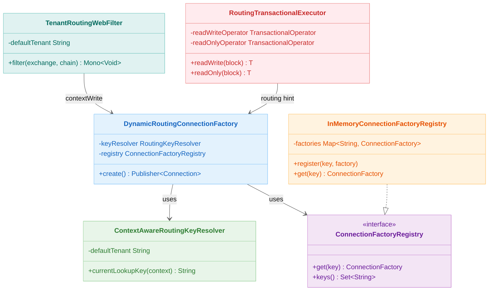
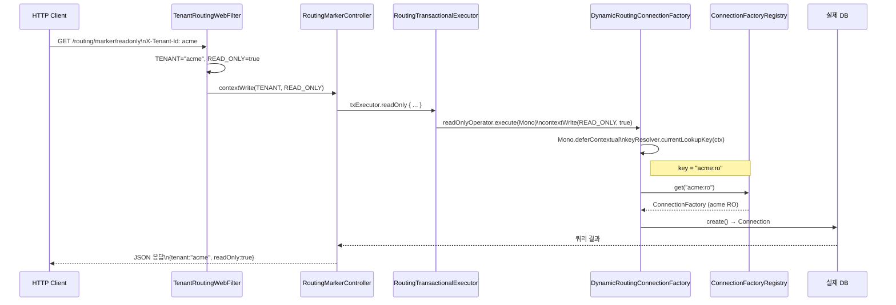
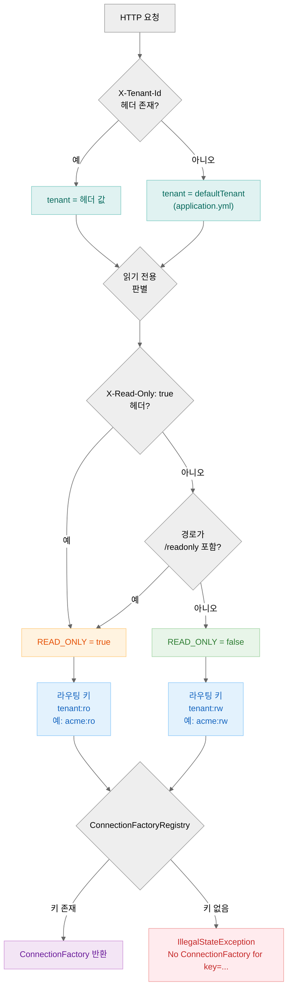

> English version: [README.md](README.md)

# 03 Routing DataSource (Exposed R2DBC + Spring WebFlux)

`exposed-workshop`의 `03-routing-datasource` 설계를 바탕으로, Exposed R2DBC + Spring WebFlux 환경에서
**테넌트(multi-tenant) + 읽기/쓰기(read/write) 분리 라우팅**을 구현한 예제입니다.

하나의 애플리케이션에서 여러 테넌트의 데이터베이스를 분리 관리하고, 읽기 요청은 읽기 전용 DB로,
쓰기 요청은 읽기/쓰기 DB로 자동 라우팅하는 방법을 학습합니다.

---

## 아키텍처

```
HTTP Request
    │
    ▼
TenantRoutingWebFilter          ← X-Tenant-Id 헤더, /readonly 경로 감지
    │  contextWrite(TENANT, READ_ONLY)
    ▼
RoutingMarkerController         ← suspend 핸들러
    │  txExecutor.readWrite() / txExecutor.readOnly()
    ▼
RoutingTransactionalExecutor    ← TransactionalOperator + READ_ONLY 힌트를 Reactor Context에 추가
    │
    ▼
DynamicRoutingConnectionFactory ← Mono.deferContextual { keyResolver.currentLookupKey(ctx) }
    │  키 예: "acme:ro", "default:rw"
    ▼
ConnectionFactoryRegistry       ← 키 → ConnectionFactory 매핑
    │
    ▼
실제 DB (H2 / PostgreSQL 등)
```

---

## 클래스 다이어그램



## 요청→라우팅→DB 선택 흐름 (sequenceDiagram)



## 라우팅 키 결정 흐름 (flowchart)



## 핵심 구성 요소

### 1. `DynamicRoutingConnectionFactory`

`ConnectionFactory` 인터페이스를 구현하며, `Mono.deferContextual`을 통해 **Reactor Context에서 라우팅 키를 읽어** 대상 `ConnectionFactory`로 위임합니다.

```kotlin
override fun create(): Publisher<out Connection> =
    Mono.deferContextual { context ->
        val key = keyResolver.currentLookupKey(context)
        val target = registry.get(key)
            ?: error("No ConnectionFactory for key=$key. keys=${registry.keys().sorted()}")
        Mono.from(target.create())
    }
```

### 2. `ContextAwareRoutingKeyResolver`

Reactor Context에서 `TENANT`와 `READ_ONLY` 값을 읽어 `<tenant>:<rw|ro>` 형태의 라우팅 키를 계산합니다.

```kotlin
override fun currentLookupKey(context: ContextView): String {
    val tenant = context.getOrDefault(RoutingContextKeys.TENANT, defaultTenant).toString()
    val readOnly = context.getOrDefault(RoutingContextKeys.READ_ONLY, false)
        .toString().toBooleanStrictOrNull() ?: false
    val mode = if (readOnly) "ro" else "rw"
    return "$tenant:$mode"
}
```

### 3. `TenantRoutingWebFilter`

모든 요청에 대해 다음 두 정보를 Reactor Context에 적재합니다.

| 소스                             | Context 키              | 설명                                |
|----------------------------------|------------------------|-------------------------------------|
| `X-Tenant-Id` 헤더               | `RoutingContextKeys.TENANT`    | 테넌트 ID (기본값: `"default"`)   |
| `X-Read-Only: true` 헤더 또는 `/readonly` 경로 | `RoutingContextKeys.READ_ONLY` | 읽기 전용 여부 |

```kotlin
override fun filter(exchange: ServerWebExchange, chain: WebFilterChain): Mono<Void> = mono {
    val tenant = exchange.request.headers.getFirst(TENANT_HEADER)
        ?.takeIf { it.isNotBlank() } ?: defaultTenant

    val readOnly = exchange.request.headers.getFirst(READ_ONLY_HEADER)
        ?.toBooleanStrictOrNull()
        ?: exchange.request.path.value().endsWith("/readonly")

    chain.filter(exchange)
        .contextWrite {
            it.put(RoutingContextKeys.TENANT, tenant)
              .put(RoutingContextKeys.READ_ONLY, readOnly)
        }
        .awaitSingleOrNull()
}
```

### 4. `RoutingTransactionalExecutor`

`TransactionalOperator`와 라우팅 힌트(`READ_ONLY`)를 Reactor Context에 함께 적용하는 실행기입니다.
서비스 레이어에서 `readWrite { }` / `readOnly { }` 블록으로 명시적 라우팅을 제어합니다.

```kotlin
// read-write 트랜잭션
suspend fun <T: Any> readWrite(block: suspend () -> T): T =
    execute(readOnly = false, operator = readWriteOperator, block = block)

// read-only 트랜잭션
suspend fun <T: Any> readOnly(block: suspend () -> T): T =
    execute(readOnly = true, operator = readOnlyOperator, block = block)
```

### 5. `ConnectionFactoryRegistry`

라우팅 키(`<tenant>:<rw|ro>`)와 `ConnectionFactory`를 등록/조회하는 레지스트리입니다.
`InMemoryConnectionFactoryRegistry`가 기본 구현체로 제공됩니다.

### 6. `RoutingR2dbcConfig`

`application.yml`의 `routing.r2dbc.*` 설정을 읽어 다음을 구성합니다:

- 테넌트별 `ConnectionFactory` 쌍(`rw`, `ro`) → `ConnectionFactoryRegistry`에 등록
- `DynamicRoutingConnectionFactory`를 `@Primary` Bean으로 등록
- Exposed `R2dbcDatabase` 연결 구성

---

## 설정 (`application.yml`)

```yaml
routing:
  r2dbc:
    default-tenant: default
    tenants:
      default:
        rw: r2dbc:h2:mem:///default-rw?options=DB_CLOSE_DELAY=-1;DB_CLOSE_ON_EXIT=FALSE
        ro: r2dbc:h2:mem:///default-ro?options=DB_CLOSE_DELAY=-1;DB_CLOSE_ON_EXIT=FALSE
      acme:
        rw: r2dbc:h2:mem:///acme-rw?options=DB_CLOSE_DELAY=-1;DB_CLOSE_ON_EXIT=FALSE
        ro: r2dbc:h2:mem:///acme-ro?options=DB_CLOSE_DELAY=-1;DB_CLOSE_ON_EXIT=FALSE
```

`ro`를 생략하면 `rw` URL을 재사용합니다.

---

## 라우팅 규칙

| 조건                                             | 라우팅 키       | 연결 대상          |
|--------------------------------------------------|----------------|--------------------|
| 헤더·경로 없음                                    | `default:rw`   | 기본 테넌트 RW DB  |
| `X-Tenant-Id: acme`                              | `acme:rw`      | acme 테넌트 RW DB  |
| `X-Tenant-Id: acme` + `/readonly` 경로           | `acme:ro`      | acme 테넌트 RO DB  |
| `X-Tenant-Id: acme` + `X-Read-Only: true` 헤더   | `acme:ro`      | acme 테넌트 RO DB  |

---

## API 엔드포인트

| 메서드  | 경로                        | 라우팅  | 설명                          |
|--------|-----------------------------|--------|-------------------------------|
| `GET`  | `/routing/marker`           | RW     | 현재 테넌트의 read-write 마커 조회 |
| `GET`  | `/routing/marker/readonly`  | RO     | 현재 테넌트의 read-only 마커 조회  |
| `PATCH`| `/routing/marker`           | RW     | 현재 테넌트의 read-write 마커 갱신 |

응답 예시:

```json
{
  "tenant": "acme",
  "readOnly": true,
  "marker": "acme-ro"
}
```

---

## 테스트 케이스

| 테스트                                    | 검증 내용                                             |
|-------------------------------------------|------------------------------------------------------|
| 기본 tenant의 read-write 마커를 조회한다   | 헤더 없이 GET → `tenant="default"`, `readOnly=false`  |
| acme tenant의 read-only 마커를 조회한다   | `X-Tenant-Id: acme` + `/readonly` → `acme:ro` 라우팅 |
| tenant 헤더 미지정은 기본 tenant와 동일하다 | 헤더 없음 ≡ `X-Tenant-Id: default`                   |
| 마커 갱신 후 같은 tenant RW에서 변경값 조회 | PATCH → GET으로 갱신 결과 확인                         |

테스트는 `@SpringBootTest(webEnvironment = RANDOM_PORT)` + `WebTestClient`로 실제 HTTP 통신을 검증합니다.

---

## 테스트 실행

```bash
./gradlew :03-routing-datasource:test
```

---

## Read/Write 라우팅 아키텍처 상세

### 컨텍스트 전파 체인

HTTP 요청에서 실제 DB 커넥션까지 라우팅 정보가 전달되는 전체 흐름입니다.

```
HTTP Request
    │  X-Tenant-Id: acme
    │  X-Read-Only: true  (또는 /readonly 경로)
    ▼
TenantRoutingWebFilter
    │  contextWrite {
    │      TENANT    = "acme"
    │      READ_ONLY = true
    │  }
    ▼
RoutingMarkerController (suspend fun)
    │  txExecutor.readOnly { ... }
    ▼
RoutingTransactionalExecutor
    │  readOnlyOperator.execute(Mono) {   ← Spring TransactionalOperator
    │      contextWrite(READ_ONLY, true)  ← Context에 힌트 추가
    │  }
    ▼
DynamicRoutingConnectionFactory.create()
    │  Mono.deferContextual { ctx ->
    │      key = keyResolver.currentLookupKey(ctx)  // "acme:ro"
    │      registry.get("acme:ro")
    │  }
    ▼
ConnectionFactoryRegistry["acme:ro"]
    │
    ▼
acme 테넌트의 읽기 전용 DB 인스턴스
```

### 테넌트 × 읽기/쓰기 커넥션 구성

```
ConnectionFactoryRegistry
├── "default:rw"  →  H2 / PostgreSQL RW (default 테넌트 읽기+쓰기)
├── "default:ro"  →  H2 / PostgreSQL RO (default 테넌트 읽기 전용)
├── "acme:rw"     →  H2 / PostgreSQL RW (acme 테넌트 읽기+쓰기)
└── "acme:ro"     →  H2 / PostgreSQL RO (acme 테넌트 읽기 전용)
```

`ro` URL을 생략하면 `rw` URL이 읽기 전용 커넥션으로도 재사용됩니다.

### RoutingTransactionalExecutor 사용 패턴

서비스/컨트롤러에서 `readWrite { }` / `readOnly { }` 블록으로 명시적으로 라우팅을 제어합니다.

```kotlin
// 읽기 전용 DB로 라우팅 (acme:ro)
suspend fun getMarker(): RoutingMarkerRecord =
    txExecutor.readOnly {
        markerRepository.findByTenant(tenant)
    }

// 읽기-쓰기 DB로 라우팅 (acme:rw)
suspend fun updateMarker(value: String): RoutingMarkerRecord =
    txExecutor.readWrite {
        markerRepository.upsert(tenant, value)
    }
```

이 방식은 `@Transactional(readOnly = true)` 어노테이션을 사용하는 Spring MVC 패턴을
Reactive/Coroutines 환경에서 구현한 것입니다.

## 참고 자료

- [Spring WebFlux - Reactor Context](https://projectreactor.io/docs/core/release/reference/#context)
- [R2DBC Connection Factory](https://r2dbc.io/spec/1.0.0.RELEASE/spec/html/)
- [Spring Reactive Transactions](https://docs.spring.io/spring-framework/docs/current/reference/html/data-access.html#tx-prog-operator)
