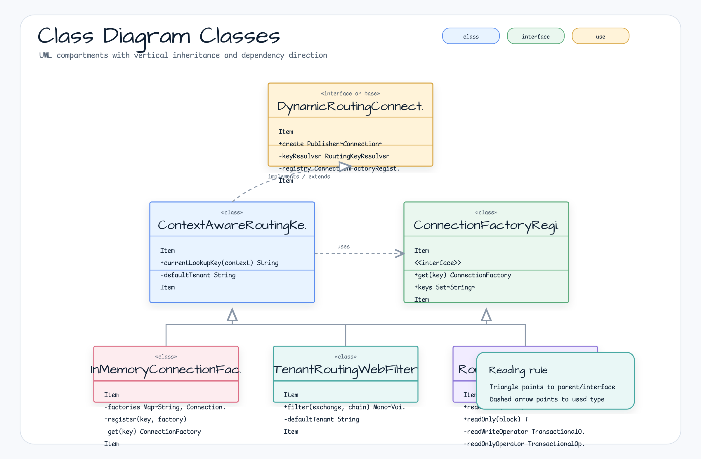
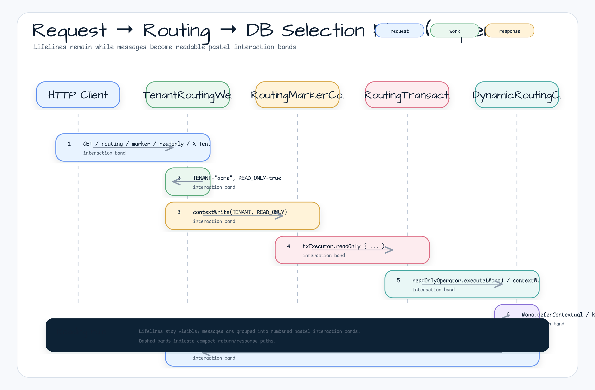
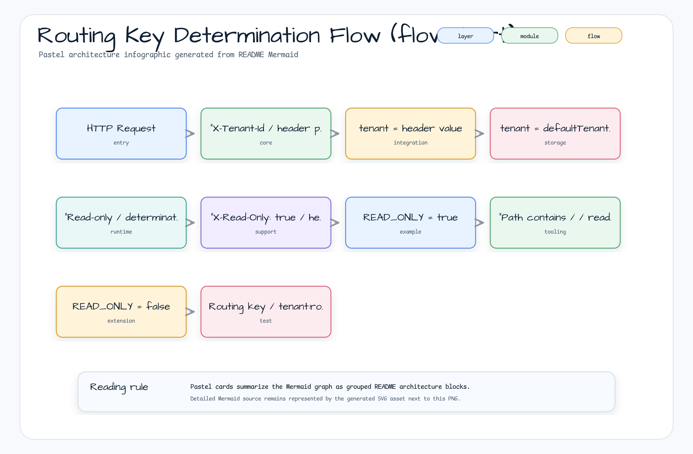

> 한국어 버전: [README.ko.md](README.ko.md)

# 03 Routing DataSource (Exposed R2DBC + Spring WebFlux)

Based on the `03-routing-datasource` design from `exposed-workshop`, this example implements
**tenant (multi-tenant) + read/write separation routing** in an Exposed R2DBC + Spring WebFlux environment.

It demonstrates how to manage separate databases for multiple tenants within a single application,
automatically routing read requests to read-only DBs and write requests to read/write DBs.

---

## Architecture

```
HTTP Request
    │
    ▼
TenantRoutingWebFilter          ← Detects X-Tenant-Id header, /readonly path
    │  contextWrite(TENANT, READ_ONLY)
    ▼
RoutingMarkerController         ← suspend handler
    │  txExecutor.readWrite() / txExecutor.readOnly()
    ▼
RoutingTransactionalExecutor    ← Adds TransactionalOperator + READ_ONLY hint to Reactor Context
    │
    ▼
DynamicRoutingConnectionFactory ← Mono.deferContextual { keyResolver.currentLookupKey(ctx) }
    │  Key examples: "acme:ro", "default:rw"
    ▼
ConnectionFactoryRegistry       ← key → ConnectionFactory mapping
    │
    ▼
Actual DB (H2 / PostgreSQL, etc.)
```

---

## Class Diagram



## Request → Routing → DB Selection Flow (sequenceDiagram)



## Routing Key Determination Flow (flowchart)



## Key Components

### 1. `DynamicRoutingConnectionFactory`

Implements the `ConnectionFactory` interface and delegates to the target `ConnectionFactory` by **reading the routing key from the Reactor Context** via `Mono.deferContextual`.

```kotlin
override fun create(): Publisher<out Connection> =
    Mono.deferContextual { context ->
        val key = keyResolver.currentLookupKey(context)
        val target = registry.get(key)
            ?: error("No ConnectionFactory for key=$key. keys=${registry.keys().sorted()}")
        Mono.from(target.create())
    }
```

### 2. `ContextAwareRoutingKeyResolver`

Reads `TENANT` and `READ_ONLY` values from the Reactor Context to compute a routing key in the form `<tenant>:<rw|ro>`.

```kotlin
override fun currentLookupKey(context: ContextView): String {
    val tenant = context.getOrDefault(RoutingContextKeys.TENANT, defaultTenant).toString()
    val readOnly = context.getOrDefault(RoutingContextKeys.READ_ONLY, false)
        .toString().toBooleanStrictOrNull() ?: false
    val mode = if (readOnly) "ro" else "rw"
    return "$tenant:$mode"
}
```

### 3. `TenantRoutingWebFilter`

Loads the following two pieces of information into the Reactor Context for every request.

| Source                                          | Context Key                    | Description                          |
|-------------------------------------------------|-------------------------------|--------------------------------------|
| `X-Tenant-Id` header                           | `RoutingContextKeys.TENANT`   | Tenant ID (default: `"default"`)     |
| `X-Read-Only: true` header or `/readonly` path | `RoutingContextKeys.READ_ONLY` | Whether read-only                   |

```kotlin
override fun filter(exchange: ServerWebExchange, chain: WebFilterChain): Mono<Void> {
    val tenant = exchange.request.headers.getFirst(TENANT_HEADER)
        ?.takeIf { it.isNotBlank() }
        ?: defaultTenant

    val readOnly = exchange.request.headers.getFirst(READ_ONLY_HEADER)
        ?.toBooleanStrictOrNull()
        ?: exchange.request.path.value().endsWith("/readonly")

    return chain.filter(exchange)
        .contextWrite {
            it.put(RoutingContextKeys.TENANT, tenant)
                .put(RoutingContextKeys.READ_ONLY, readOnly)
        }
}
```

### 4. `RoutingTransactionalExecutor`

An executor that applies both `TransactionalOperator` and the routing hint (`READ_ONLY`) to the Reactor Context.
The service layer uses `readWrite { }` / `readOnly { }` blocks for explicit routing control.

```kotlin
// read-write transaction
suspend fun <T: Any> readWrite(block: suspend () -> T): T =
    execute(readOnly = false, operator = readWriteOperator, block = block)

// read-only transaction
suspend fun <T: Any> readOnly(block: suspend () -> T): T =
    execute(readOnly = true, operator = readOnlyOperator, block = block)
```

### 5. `ConnectionFactoryRegistry`

A registry for registering and looking up `ConnectionFactory` instances by routing key (`<tenant>:<rw|ro>`).
`InMemoryConnectionFactoryRegistry` is provided as the default implementation.

### 6. `RoutingR2dbcConfig`

Reads `routing.r2dbc.*` settings from `application.yml` to configure:

- Per-tenant `ConnectionFactory` pair (`rw`, `ro`) → registered in `ConnectionFactoryRegistry`
- `DynamicRoutingConnectionFactory` registered as the `@Primary` Bean
- Exposed `R2dbcDatabase` connection setup

---

## Configuration (`application.yml`)

```yaml
routing:
  r2dbc:
    default-tenant: default
    tenants:
      default:
        rw: r2dbc:h2:mem:///default-rw?options=DB_CLOSE_DELAY=-1;DB_CLOSE_ON_EXIT=FALSE
        ro: r2dbc:h2:mem:///default-ro?options=DB_CLOSE_DELAY=-1;DB_CLOSE_ON_EXIT=FALSE
      acme:
        rw: r2dbc:h2:mem:///acme-rw?options=DB_CLOSE_DELAY=-1;DB_CLOSE_ON_EXIT=FALSE
        ro: r2dbc:h2:mem:///acme-ro?options=DB_CLOSE_DELAY=-1;DB_CLOSE_ON_EXIT=FALSE
```

If `ro` is omitted, the `rw` URL is reused.

---

## Routing Rules

| Condition                                             | Routing Key  | Connection Target       |
|-------------------------------------------------------|--------------|-------------------------|
| No header or path                                     | `default:rw` | Default tenant RW DB    |
| `X-Tenant-Id: acme`                                   | `acme:rw`    | acme tenant RW DB       |
| `X-Tenant-Id: acme` + `/readonly` path               | `acme:ro`    | acme tenant RO DB       |
| `X-Tenant-Id: acme` + `X-Read-Only: true` header     | `acme:ro`    | acme tenant RO DB       |

---

## API Endpoints

| Method  | Path                        | Routing | Description                              |
|---------|-----------------------------|---------|------------------------------------------|
| `GET`   | `/routing/marker`           | RW      | Get current tenant's read-write marker   |
| `GET`   | `/routing/marker/readonly`  | RO      | Get current tenant's read-only marker    |
| `PATCH` | `/routing/marker`           | RW      | Update current tenant's read-write marker |

Response example:

```json
{
  "tenant": "acme",
  "readOnly": true,
  "marker": "acme-ro"
}
```

---

## Test Cases

| Test                                          | Verification                                                |
|-----------------------------------------------|-------------------------------------------------------------|
| Get read-write marker for default tenant      | GET without header → `tenant="default"`, `readOnly=false`   |
| Get read-only marker for acme tenant          | `X-Tenant-Id: acme` + `/readonly` → `acme:ro` routing      |
| Missing tenant header equals default tenant  | No header ≡ `X-Tenant-Id: default`                         |
| Get updated value from same tenant RW after update | PATCH → GET to verify update result                   |

Tests use `@SpringBootTest(webEnvironment = RANDOM_PORT)` + `WebTestClient` to verify real HTTP communication.

---

## Running Tests

```bash
./gradlew :03-routing-datasource:test
```

---

## Read/Write Routing Architecture Details

### Context Propagation Chain

The complete flow of routing information from the HTTP request to the actual DB connection.

```
HTTP Request
    │  X-Tenant-Id: acme
    │  X-Read-Only: true  (or /readonly path)
    ▼
TenantRoutingWebFilter
    │  contextWrite {
    │      TENANT    = "acme"
    │      READ_ONLY = true
    │  }
    ▼
RoutingMarkerController (suspend fun)
    │  txExecutor.readOnly { ... }
    ▼
RoutingTransactionalExecutor
    │  readOnlyOperator.execute(Mono) {   ← Spring TransactionalOperator
    │      contextWrite(READ_ONLY, true)  ← Add hint to Context
    │  }
    ▼
DynamicRoutingConnectionFactory.create()
    │  Mono.deferContextual { ctx ->
    │      key = keyResolver.currentLookupKey(ctx)  // "acme:ro"
    │      registry.get("acme:ro")
    │  }
    ▼
ConnectionFactoryRegistry["acme:ro"]
    │
    ▼
Read-only DB instance for acme tenant
```

### Tenant × Read/Write Connection Configuration

```
ConnectionFactoryRegistry
├── "default:rw"  →  H2 / PostgreSQL RW (default tenant read+write)
├── "default:ro"  →  H2 / PostgreSQL RO (default tenant read-only)
├── "acme:rw"     →  H2 / PostgreSQL RW (acme tenant read+write)
└── "acme:ro"     →  H2 / PostgreSQL RO (acme tenant read-only)
```

If the `ro` URL is omitted, the `rw` URL is also reused for read-only connections.

### RoutingTransactionalExecutor Usage Pattern

The service/controller explicitly controls routing using `readWrite { }` / `readOnly { }` blocks.

```kotlin
// Route to read-only DB (acme:ro)
@GetMapping("/marker/readonly")
suspend fun getReadOnlyMarker(): RoutingMarkerResponse =
    txExecutor.readOnly {
        RoutingMarkerResponse(
            tenant = currentTenant(),
            readOnly = true,
            marker = markerRepository.findCurrentMarker(),
        )
    }

// Route to read-write DB (acme:rw)
@PatchMapping("/marker")
suspend fun updateMarker(@RequestBody request: UpdateMarkerRequest): RoutingMarkerResponse =
    txExecutor.readWrite {
        markerRepository.resetAndInsert(request.marker)
        RoutingMarkerResponse(
            tenant = currentTenant(),
            readOnly = false,
            marker = markerRepository.findCurrentMarker(),
        )
    }
```

This approach is the Reactive/Coroutines equivalent of using the `@Transactional(readOnly = true)` annotation in Spring MVC patterns.

## References

- [Spring WebFlux - Reactor Context](https://projectreactor.io/docs/core/release/reference/#context)
- [R2DBC Connection Factory](https://r2dbc.io/spec/1.0.0.RELEASE/spec/html/)
- [Spring Reactive Transactions](https://docs.spring.io/spring-framework/docs/current/reference/html/data-access.html#tx-prog-operator)
