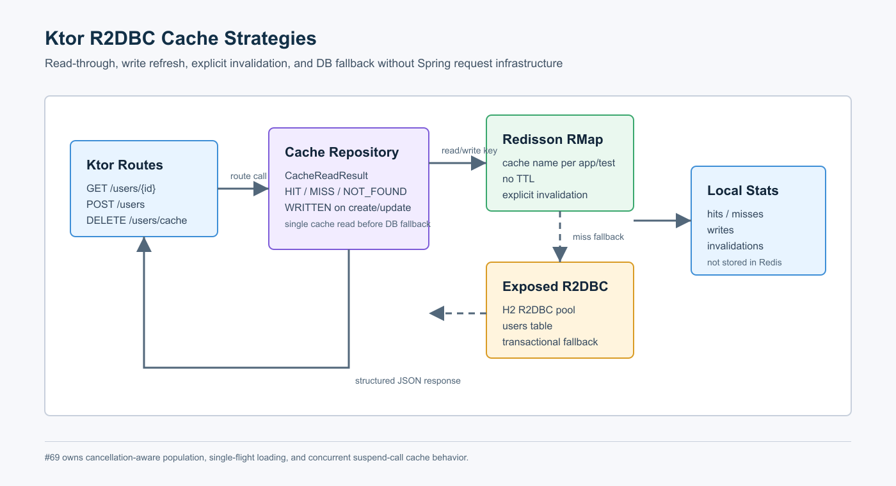

# 04-cache-strategies-ktor-r2dbc

[English](./README.md)

11장의 Ktor + Exposed R2DBC 캐시 전략 예제입니다.
`02-cache-strategies-r2dbc`의 일반 캐시 전략 주제를 Spring WebFlux 컨트롤러
대신 Ktor 라우트로 관찰할 수 있게 구성했습니다.

## 아키텍처



## 이 모듈에서 다루는 내용

| 영역 | 결정 |
|---|---|
| 캐시 백엔드 | 명시적 cache name을 쓰는 Redisson `RMap` |
| DB 접근 | H2 R2DBC pool 위의 Exposed R2DBC transaction |
| 읽기 경로 | `GET /users/{id}`가 `HIT`, `MISS`, `NOT_FOUND` 반환 |
| 쓰기 경로 | `POST /users`, `PUT /users/{id}`가 DB를 쓰고 캐시를 갱신 |
| 무효화 | 단일 키 또는 모듈 cache name 전체 삭제; DB row는 유지 |
| 통계 | 애플리케이션 로컬 카운터이며 Redis/Micrometer 기반 운영 지표가 아님 |

목록 조회(`GET /users`)는 DB를 직접 읽습니다. 단일 row 캐시의 hit/miss 흐름을
명확히 보여주기 위한 선택입니다. 이 예제의 캐시 엔트리는 TTL이 없으며 명시적
무효화나 전체 clear 전까지 유지됩니다. JSON 요청 본문은 strict 모드라 알 수 없는
필드는 거부됩니다.

## 엔드포인트

| Method | Path | 설명 |
|---|---|---|
| `GET` | `/users` | seed user를 DB에서 직접 조회 |
| `GET` | `/users/{id}` | 캐시를 먼저 읽고 없으면 DB fallback |
| `POST` | `/users` | user 생성 후 캐시에 반영 |
| `PUT` | `/users/{id}` | user 수정 후 캐시 갱신 |
| `DELETE` | `/users/{id}/cache` | 단일 캐시 키 무효화 |
| `DELETE` | `/users/cache` | 이 모듈 cache name의 모든 키 삭제 |
| `GET` | `/cache/stats` | 로컬 hit/miss/write/invalidation 카운터 조회 |

## 테스트 실행

```bash
repo-test-summary -- ./gradlew :04-cache-strategies-ktor-r2dbc:test -PuseDB=H2 --continue --console=plain
```

테스트는 최초 read-through population, 두 번째 read hit, invalidation 후 DB
fallback, create/update cache refresh, clear 후 DB fallback, DB-direct list read,
structured error response를 검증합니다.

## #69와의 관계

이 모듈은 cancellation-safe cache population, single-flight loading,
compare-and-set cache refresh, concurrent suspend-call 동작을 다루지 않습니다.
그런 coroutine-specific 캐시 주제는 #69에서 별도로 진행합니다.
