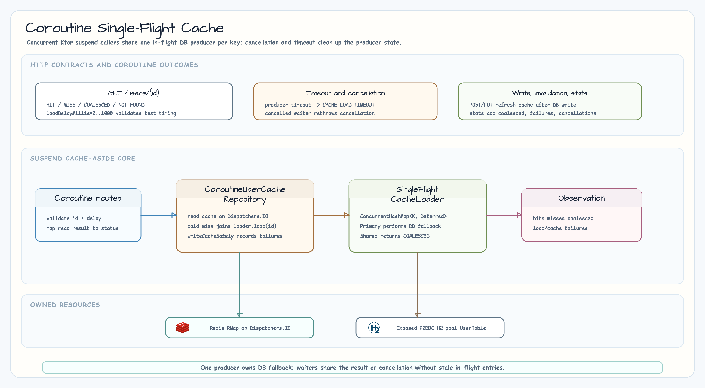

# 05-cache-strategies-ktor-r2dbc-coroutines

[Korean](./README.ko.md)

Ktor + Exposed R2DBC example for coroutine-oriented cache access in chapter 11.
This module focuses on concurrent suspend callers, request cancellation, and
single-flight database fallback. It is intentionally separate from
`04-cache-strategies-ktor-r2dbc`, which covers general route-visible cache
hit/miss behavior.

## Architecture



## What This Module Shows

| Area | Decision |
|---|---|
| Cache backend | Redisson `RMap` with blocking Redis calls isolated on `Dispatchers.IO` |
| DB access | Exposed R2DBC transactions over an H2 R2DBC pool |
| Cold read | One producer performs DB fallback; concurrent callers return `COALESCED` |
| Cancellation | Cancelled waiters rethrow cancellation and do not poison the shared producer |
| Timeout | Producer timeout returns `503 CACHE_LOAD_TIMEOUT` and clears in-flight state |
| Diagnostics | Per-process AtomicFU counters; not Redis-, cluster-, or Micrometer-backed metrics |

## Difference from `04-cache-strategies-ktor-r2dbc`

| Topic | `04-cache-strategies-ktor-r2dbc` | This module |
|---|---|---|
| Intended lesson | General cache hit/miss, invalidation, DB fallback | Coroutine single-flight, cancellation, timeout, concurrent suspend callers |
| Cache backend | Redisson `RMap` | Redisson `RMap` |
| Single-flight | No | Yes, one in-flight `Deferred` per key |
| Cancellation behavior | Not the focus | Cancelled waiters rethrow and failed/cancelled deferreds are removed |
| Read statuses | `HIT`, `MISS`, `NOT_FOUND`, `WRITTEN` | Adds `COALESCED` |
| Stats | Local hit/miss/write/invalidation counters | Adds coalesced, cancellation, load failure, cache write failure counters |

## Endpoints

| Method | Path | Description |
|---|---|---|
| `GET` | `/users` | List seeded users directly from DB |
| `GET` | `/users/{id}` | Read one user through cache with single-flight DB fallback |
| `POST` | `/users` | Create one user and populate cache |
| `PUT` | `/users/{id}` | Update one user and refresh cache |
| `DELETE` | `/users/{id}/cache` | Invalidate one cache key |
| `DELETE` | `/users/cache` | Clear all keys for this module cache name |
| `GET` | `/cache/stats` | Read local coroutine/cache counters |

`GET /users/{id}` accepts `loadDelayMillis=0..1000` for deterministic workshop
tests. Out-of-range values return `400 INVALID_REQUEST`.

## Limitations

This is a demo-only workshop module. It has no auth, rate limiting, TTL, maximum
cache size, or distributed metric aggregation. The in-flight map can grow
transiently with distinct concurrent cold-key loads, but entries are removed on
success, failure, cancellation, or the five-second producer timeout.
Startup data initialization is fail-fast and not retried; production services
should add retry/backoff or readiness orchestration around that step.

## Run Tests

```bash
repo-test-summary -- ./gradlew :05-cache-strategies-ktor-r2dbc-coroutines:test -PuseDB=H2 --continue --console=plain
```

The tests cover hit/miss behavior, coalesced concurrent reads, waiter
cancellation, producer timeout, cache write failure diagnostics, invalidation,
write refresh, DB-direct list reads, and structured errors.
