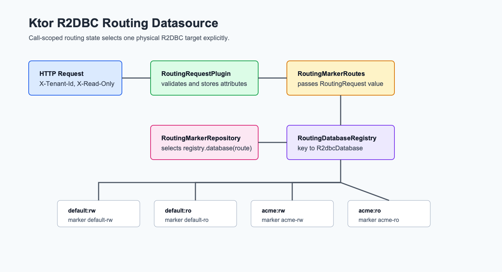

> English version: [README.md](README.md)

# 06 Routing Datasource Ktor R2DBC

이 모듈은 [`03-routing-datasource`](../03-routing-datasource/README.ko.md)의
Ktor 대응 예제입니다. Spring WebFlux, Reactor Context, Spring transaction
infrastructure 없이 tenant + read/write R2DBC routing을 보여줍니다.

## 아키텍처



## 학습 포인트

| 주제 | Ktor 구현 |
|---|---|
| Tenant routing | `X-Tenant-Id`로 `default` 또는 `acme` 선택 |
| Read/write routing | `X-Read-Only: true` 또는 `/readonly`가 read-only target 선택 |
| Coroutine safety | 검증된 `RoutingRequest`를 Ktor call attributes에 저장하고 명시적으로 전달 |
| DB target 증명 | 네 개 H2 R2DBC pool이 `default-rw`, `default-ro`, `acme-rw`, `acme-ro` marker row 저장 |

`X-Tenant-Id`는 optional입니다. 누락되거나 blank이면 Spring WebFlux 예제와
같이 `default`로 fallback합니다. `X-Read-Only`는 값이 있으면 반드시 `true`
또는 `false`여야 하며, 잘못된 값은 `400 INVALID_ROUTING_REQUEST`를
반환합니다.

## Routes

| Method | Path | Routing behavior |
|---|---|---|
| `GET` | `/routing/marker` | 선택된 tenant의 `rw` 또는 `ro` target에서 조회 |
| `GET` | `/routing/marker/readonly` | `ro` target 강제 |
| `PATCH` | `/routing/marker` | 선택된 tenant의 `rw` target 갱신 |

`PATCH /routing/marker`는 `X-Read-Only: true`를 조용히 무시하지 않고
거부합니다.

## 제한사항

이 모듈은 workshop 예제입니다. Header 기반 routing은 인증이나 권한 부여가
아닙니다. 운영 시스템은 tenant와 read/write 정책을 인증된 principal,
서명된 claim, 신뢰할 수 있는 gateway context에 연결해야 합니다. Pool disposal
전 graceful request draining도 이 모듈 범위 밖입니다. Demo는 `maxPoolSize=4`인
작은 pool 네 개를 만들며, 운영 sizing은 실제 target 수와 traffic을 기준으로
정해야 합니다.

## 테스트 실행

```bash
repo-test-summary -- ./gradlew :06-routing-datasource-ktor-r2dbc:test -PuseDB=H2 --continue --console=plain
```
