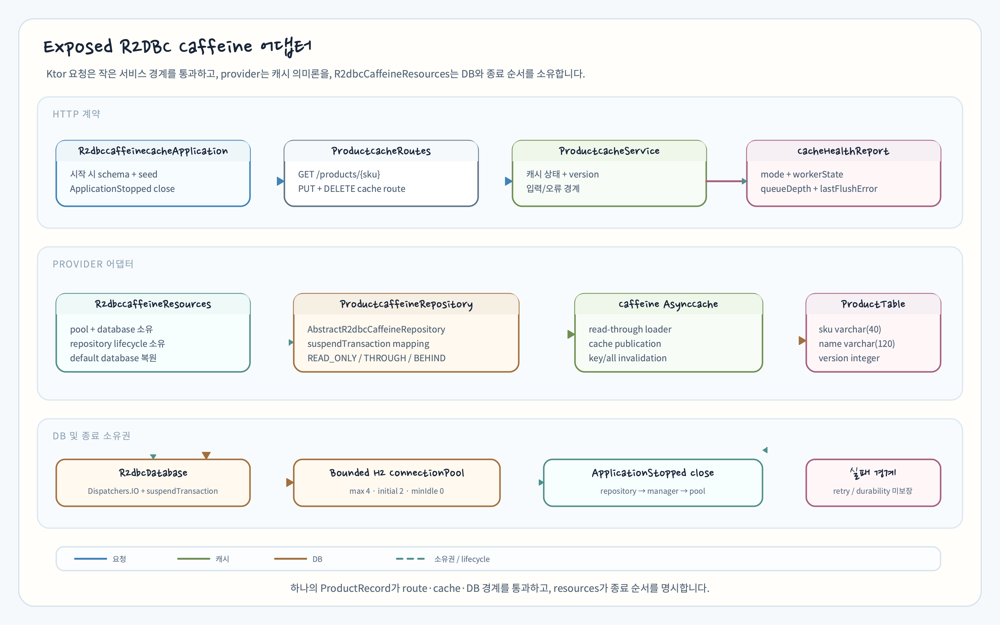
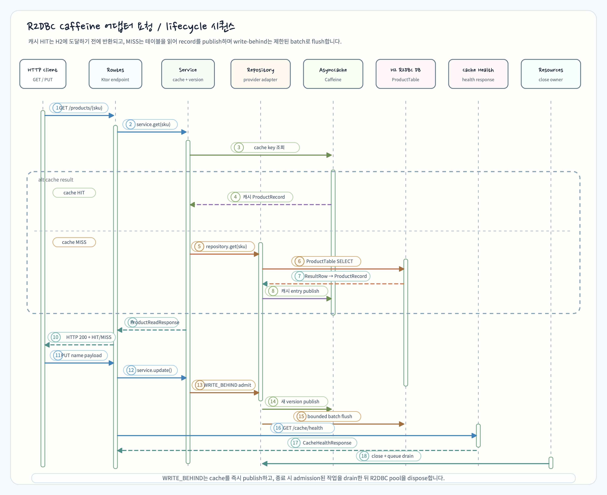

> English version: [README.md](README.md)

# Exposed R2DBC Caffeine cache adapter

Chapter 11의 새 sibling 예제입니다. `bluetape4k-exposed-r2dbc-caffeine`의
`AbstractR2dbcCaffeineRepository`를 상품 SKU 저장소에 연결하고, Ktor에서
`READ_ONLY`, `WRITE_THROUGH`, `WRITE_BEHIND` 세 가지 `CacheWriteMode`를
관찰합니다. 캐시 값과 DB 행은 같은 `ProductRecord`를 사용합니다.

## 학습 목표

- Exposed R2DBC `suspendTransaction`과 Caffeine `AsyncCache`를 한 repository에
  연결합니다.
- cache hit/miss, 직접 DB 조회, key/all invalidation을 HTTP 응답으로 비교합니다.
- write-behind bounded queue, flush health, `CancellationException` 전파와 종료
  순서를 provider 계약 그대로 확인합니다.

## 실행

```bash
# 모듈 등록 이름 확인
./gradlew projects --no-configuration-cache --console=plain

# H2 전용 결정적 테스트
./gradlew :07-cache-strategies-r2dbc-caffeine:test -PuseDB=H2 --no-configuration-cache --console=plain
```

`main`은 `127.0.0.1:8080`에서 Netty를 시작합니다. 기본 `application.conf`는
`R2dbcCaffeineCacheApplicationKt.r2dbcCaffeineCacheModule`을 로드합니다. 테스트와
예제는 각 실행마다 고유한 H2 R2DBC in-memory database를 만들며 외부 DB 자격
증명서를 요구하지 않습니다.

## 구성 요소와 동일한 값

```text
R2dbcCaffeineCacheApplication
  └─ R2dbcCaffeineResources
       ├─ bounded ConnectionPool → R2dbcDatabase
       ├─ ProductCaffeineRepository → Caffeine AsyncCache
       └─ ProductDataInitializer → ProductTable
```



`ProductRecord`는 DB 행, cache value, JSON 응답이 공유합니다.

| 필드 | 타입 | 제약/의미 |
|---|---|---|
| `sku` | `String` | `ProductTable.id`, 최대 40자, 기본 키 |
| `name` | `String` | 최대 120자, 빈 문자열/공백만인 값은 거부 |
| `version` | `Int` | PUT마다 현재 DB 값에서 1 증가 |

`ProductCaffeineRepository`는 provider의 `table`, `ResultRow.toEntity`,
`UpdateStatement.updateEntity`, `BatchInsertStatement.insertEntity`,
`extractId` mapping만 구현합니다. 모든 DB 접근은 Exposed R2DBC
`suspendTransaction` 경계를 사용합니다.

## CacheWriteMode 비교

| 모드 | PUT 시 cache | PUT 시 DB | 관찰 포인트 |
|---|---|---|---|
| `READ_ONLY` | 즉시 갱신 | 갱신하지 않음 | cache 응답과 직접 DB 조회가 다를 수 있음 |
| `WRITE_THROUGH` | 갱신 | 같은 호출에서 즉시 반영 | cache와 DB가 갱신된 `ProductRecord`를 가짐 |
| `WRITE_BEHIND` | bounded queue admission 뒤 즉시 발행 | 백그라운드 batch flush | `queueDepth == 0` 및 `lastFlushError == null`이면 drain 성공 |

read-through는 `GET /products/{sku}`의 첫 요청에서 DB를 읽고 cache에 적재하며,
두 번째 요청은 `HIT`를 반환합니다. `GET /products`는 의도적으로 cache를 우회해
DB 원본을 보여줍니다.

## HTTP API

| Method | Path | 응답/의미 |
|---|---|---|
| `GET` | `/` | 예제 이름 텍스트 |
| `GET` | `/products` | cache를 우회한 `List<ProductRecord>` |
| `GET` | `/products/{sku}` | `ProductReadResponse(product, cache)`; `cache`는 `HIT`/`MISS` |
| `PUT` | `/products/{sku}` | `{"name":"..."}`를 받아 version을 증가한 `ProductRecord` |
| `DELETE` | `/products/{sku}/cache` | 한 SKU cache key를 무효화하고 `204` |
| `DELETE` | `/products/cache` | 이 예제의 모든 cache key를 지우고 `204` |
| `GET` | `/cache/health` | `mode`, `queueDepth`, `workerState`, `lastFlushError` |

알 수 없는 SKU는 `404 {"code":"NOT_FOUND",...}`, 잘못된 SKU/name은
`400 {"code":"INVALID_REQUEST",...}`를 반환합니다. JSON 변환 오류는
`INVALID_JSON`, 그 밖의 예외는 stack trace를 노출하지 않는 `INTERNAL_ERROR`로
응답합니다.

## 요청 흐름과 종료 순서



`R2dbcCaffeineResources`가 pool, `R2dbcDatabase`, repository의 소유자입니다.
startup에서 schema/seed가 끝나기 전에는 route를 설치하지 않습니다. 초기화가
실패하면 resources를 즉시 닫고 예외를 다시 던집니다. 정상 종료 순서는 다음과
같습니다.

1. repository의 write-behind final flush와 cache를 종료합니다.
2. `TransactionManager.closeAndUnregister(database)`로 Exposed manager를 해제하고
   이전 default database를 복원합니다.
3. `ConnectionPool.dispose()`를 호출합니다.

`close()`는 `AtomicBoolean`으로 idempotent합니다. `CancellationException`은 일반
오류로 변환하지 않고 다시 던집니다. write-behind admission 또는 cache publication이
실패하면 provider가 queue depth와 cache를 rollback합니다.

flush 자체가 실패하면 provider는 `lastFlushError`와 실패 batch의 non-zero
`queueDepth`를 유지합니다. 이 예제는 자동 retry, crash durability, exactly-once를
제공한다고 주장하지 않습니다. 운영자가 실패 repository를 닫고 새 repository에서
유효한 값을 다시 쓰는 선택만 문서화합니다.

## Snapshot cache 경계

provider에는 별도 `R2dbcCaffeineSnapshotCache` 타입도 있지만, 이는 상품 기준
데이터 캐시를 위한 opt-in 계약입니다. 이 예제는
`AbstractR2dbcCaffeineRepository`만 사용하며 기준 데이터 캐시를 구현하거나
그 일관성/내구성 보장을 암시하지 않습니다.

## 테스트 범위

```text
R2dbcCaffeineCacheApplicationTest
  - read-through MISS → HIT, unknown SKU 404
  - single/all invalidation과 DB-direct list
  - READ_ONLY, WRITE_THROUGH, WRITE_BEHIND의 cache/DB 차이
  - 입력 오류와 구조화된 오류 응답

R2dbcCaffeineRepositoryLifecycleTest
  - 취소 시 CancellationException 보존
  - write-behind drain과 idempotent close
  - flush 오류 health, DB 원본, 실패 batch 보존
  - close 후 put admission rollback
```
