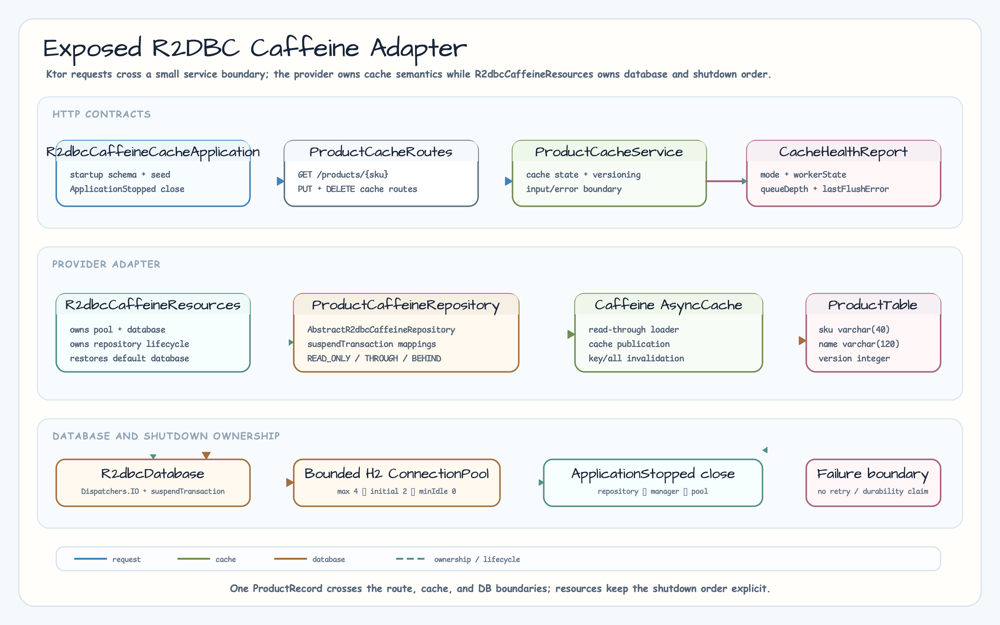
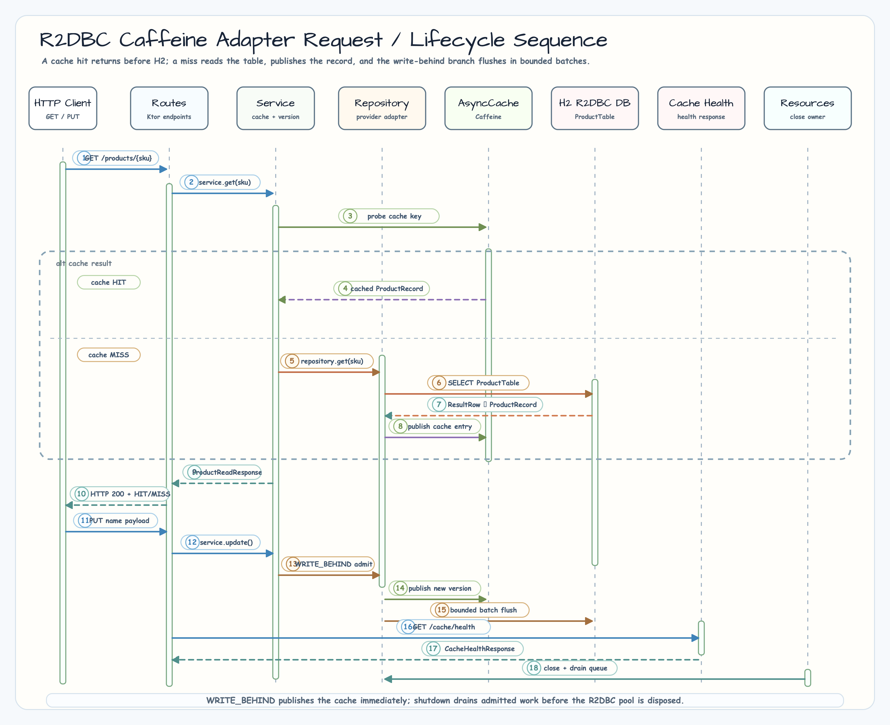

> 한국어 버전: [README.ko.md](README.ko.md)

# Exposed R2DBC Caffeine cache adapter

This is the new sibling example in Chapter 11. It connects
`bluetape4k-exposed-r2dbc-caffeine`'s `AbstractR2dbcCaffeineRepository` to a
product-SKU repository and exposes the three `CacheWriteMode` values—`READ_ONLY`,
`WRITE_THROUGH`, and `WRITE_BEHIND`—through Ktor. The cache value and database row
share the same `ProductRecord`.

## Learning goals

- Connect Exposed R2DBC `suspendTransaction` and Caffeine `AsyncCache` in one
  repository.
- Compare cache hit/miss, direct database reads, and single/all-key invalidation
  through HTTP responses.
- Observe the provider's bounded write-behind queue, flush health,
  `CancellationException` propagation, and shutdown order without adding stronger
  guarantees.

## Run

```bash
# Confirm the module registration name
./gradlew projects --no-configuration-cache --console=plain

# Deterministic H2-only tests
./gradlew :07-cache-strategies-r2dbc-caffeine:test -PuseDB=H2 --no-configuration-cache --console=plain
```

`main` starts Netty on `127.0.0.1:8080`. The default `application.conf` loads
`R2dbcCaffeineCacheApplicationKt.r2dbcCaffeineCacheModule`. Each test/example run
creates a unique H2 R2DBC in-memory database and requires no external database
credentials.

## Components and the shared value

```text
R2dbcCaffeineCacheApplication
  └─ R2dbcCaffeineResources
       ├─ bounded ConnectionPool → R2dbcDatabase
       ├─ ProductCaffeineRepository → Caffeine AsyncCache
       └─ ProductDataInitializer → ProductTable
```



`ProductRecord` is shared by the database row, cache value, and JSON response.

| Field | Type | Constraint/meaning |
|---|---|---|
| `sku` | `String` | `ProductTable.id`, at most 40 characters, primary key |
| `name` | `String` | at most 120 characters; blank/whitespace-only values are rejected |
| `version` | `Int` | incremented from the current DB value for every PUT |

`ProductCaffeineRepository` implements only the provider mappings for `table`,
`ResultRow.toEntity`, `UpdateStatement.updateEntity`,
`BatchInsertStatement.insertEntity`, and `extractId`. Every database access uses
an Exposed R2DBC `suspendTransaction` boundary.

## CacheWriteMode comparison

| Mode | Cache on PUT | Database on PUT | Observable point |
|---|---|---|---|
| `READ_ONLY` | Updated immediately | Not updated | Cache response and direct DB read can differ |
| `WRITE_THROUGH` | Updated | Reflected in the same call | Cache and DB contain the updated `ProductRecord` |
| `WRITE_BEHIND` | Published after bounded queue admission | Background batch flush | Drain succeeds when `queueDepth == 0` and `lastFlushError == null` |

Read-through loads the database and populates the cache on the first
`GET /products/{sku}` request; the second request reports `HIT`. `GET /products`
intentionally bypasses the cache so the DB source value remains visible.

## HTTP API

| Method | Path | Response/meaning |
|---|---|---|
| `GET` | `/` | Example name text |
| `GET` | `/products` | Cache-bypassing `List<ProductRecord>` |
| `GET` | `/products/{sku}` | `ProductReadResponse(product, cache)`; `cache` is `HIT`/`MISS` |
| `PUT` | `/products/{sku}` | Receives `{"name":"..."}` and returns the versioned `ProductRecord` |
| `DELETE` | `/products/{sku}/cache` | Invalidates one SKU cache key and returns `204` |
| `DELETE` | `/products/cache` | Clears all cache keys owned by this example and returns `204` |
| `GET` | `/cache/health` | `mode`, `queueDepth`, `workerState`, `lastFlushError` |

An unknown SKU returns `404 {"code":"NOT_FOUND",...}`. Invalid SKU/name input
returns `400 {"code":"INVALID_REQUEST",...}`. JSON conversion errors return
`INVALID_JSON`; other exceptions return `INTERNAL_ERROR` without a stack trace.

## Request flow and shutdown order



`R2dbcCaffeineResources` owns the pool, `R2dbcDatabase`, and repository. Routes are
installed only after startup schema/seed initialization completes. If initialization
fails, resources are closed before the exception is rethrown. Normal shutdown is:

1. Close the repository's write-behind final flush and cache.
2. Release Exposed with `TransactionManager.closeAndUnregister(database)` and restore
   the previous default database.
3. Dispose the `ConnectionPool`.

`close()` is idempotent through an `AtomicBoolean`. `CancellationException` is
re-thrown instead of being converted into a general error. If write-behind admission
or cache publication fails, the provider rolls back the queue depth and cache entry.

When a flush itself fails, the provider retains `lastFlushError` and a non-zero
`queueDepth` for the failed batch. This example does not claim automatic retry, crash
durability, or exactly-once effects. It documents only the operational choice of
closing the failed repository and writing a valid value through a new repository.

## Snapshot-cache boundary

The provider also exposes a separate `R2dbcCaffeineSnapshotCache` type as an
opt-in snapshot contract. This example uses only
`AbstractR2dbcCaffeineRepository`; it does not implement snapshot cache behavior or
imply its consistency or durability guarantees.

## Test coverage

```text
R2dbcCaffeineCacheApplicationTest
  - read-through MISS → HIT and unknown-SKU 404
  - single/all invalidation and DB-direct list
  - READ_ONLY, WRITE_THROUGH, and WRITE_BEHIND cache/DB differences
  - validation failures and structured error responses

R2dbcCaffeineRepositoryLifecycleTest
  - CancellationException preservation
  - write-behind drain and idempotent close
  - flush-error health, DB source value, and retained failed batch
  - post-close put admission rollback
```
