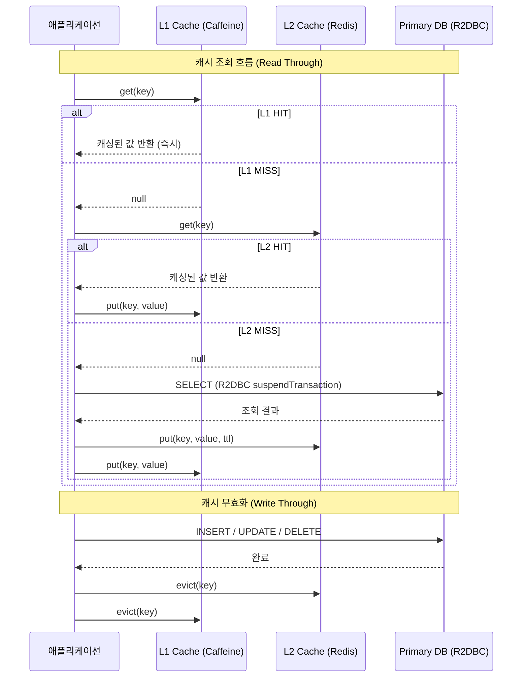

> English version: [README.md](README.md)

# 11. High Performance

Exposed R2DBC 환경에서 성능과 확장성을 높이기 위한 예제를 모아둔 섹션입니다.  
이 디렉터리의 예제는 단순 CRUD보다 캐시, 라우팅, 읽기/쓰기 분리처럼 운영 환경에 가까운 주제를 다룹니다.

## 고성능 전략 개요



## 캐시 계층 구조 (클래스 다이어그램)



## 캐시 히트/미스 처리 흐름



## 학습 목표

- Redis/Redisson 기반 캐시 계층을 Coroutines와 함께 적용한다.
- 요청 컨텍스트를 이용해 tenant + read/write 라우팅을 구현한다.
- Spring WebFlux와 Exposed R2DBC 조합에서 병목이 생기기 쉬운 지점을 파악한다.

## 하위 모듈

| 모듈 | 주제 | 언제 보면 좋은가 |
|---|---|---|
| [02-cache-strategies-r2dbc](./02-cache-strategies-r2dbc/README.md) | Read Through, Write Through, Write Behind, Read-Only 캐시 전략 | DB 부하를 캐시로 완화하는 패턴이 궁금할 때 |
| [03-routing-datasource](./03-routing-datasource/README.md) | tenant + read/write 분리 라우팅, Reactor Context 전파 | 읽기/쓰기 분리, 샤딩, 멀티 테넌트 라우팅의 기초를 보고 싶을 때 |

## 권장 순서

1. `02-cache-strategies-r2dbc`로 캐시 적중/미스 흐름을 먼저 확인합니다.
2. `03-routing-datasource`로 요청 컨텍스트 기반 라우팅을 확인합니다.
3. 필요하면 `09-spring`, `10-multi-tenant` 모듈과 함께 비교해 패턴 차이를 봅니다.

## 실행 팁

```bash
# 캐시 전략 모듈 테스트
./gradlew :02-cache-strategies-r2dbc:test

# 라우팅 데이터소스 모듈 테스트
./gradlew :03-routing-datasource:test
```

루트에서 실행할 때는 실제 Gradle 프로젝트명 기준으로 다음과 같이 사용하는 편이 안전합니다.

```bash
./gradlew :exposed-r2dbc-11-high-performance-02-cache-strategies-r2dbc:test
./gradlew :exposed-r2dbc-11-high-performance-03-routing-datasource:test
```
