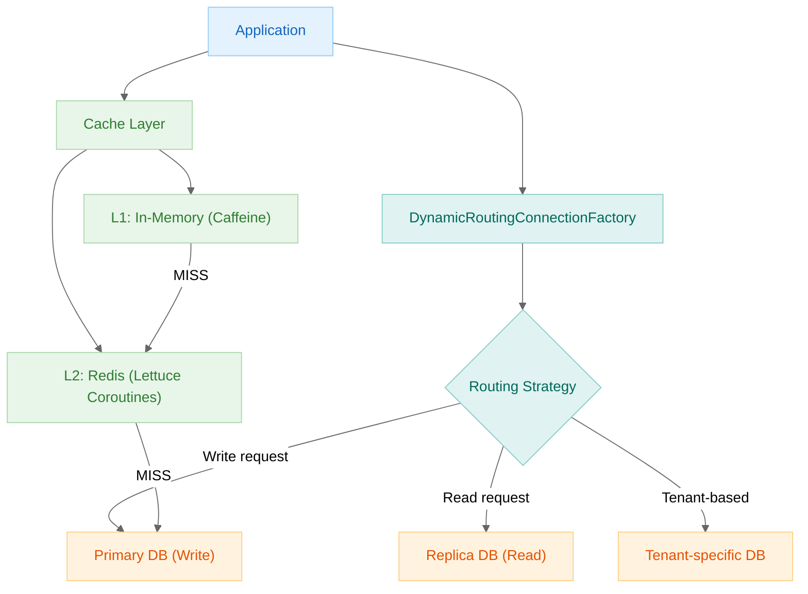
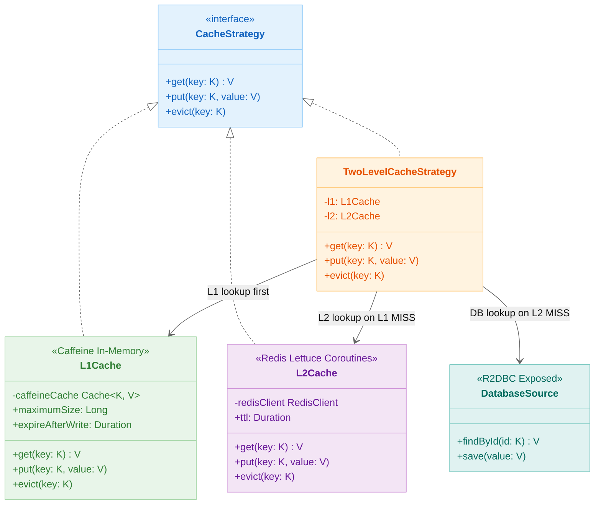
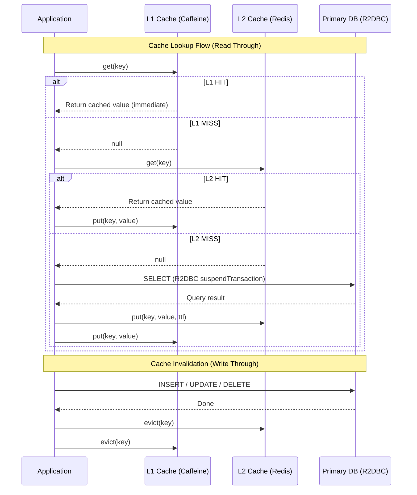

> 한국어 버전: [README.ko.md](README.ko.md)

# 11. High Performance

A collection of examples for improving performance and scalability in Exposed R2DBC environments.
The examples in this directory cover topics closer to production environments — such as caching, routing, and read/write separation — rather than simple CRUD.

## High-Performance Strategy Overview



## Cache Layer Structure (Class Diagram)



## Cache Hit/Miss Processing Flow



## Learning Objectives

- Apply a Redis/Redisson-based cache layer together with Coroutines.
- Implement tenant + read/write routing using request context.
- Identify common bottleneck points when combining Spring WebFlux with Exposed R2DBC.

## Sub-modules

| Module | Topic | When to Read |
|---|---|---|
| [02-cache-strategies-r2dbc](./02-cache-strategies-r2dbc/README.md) | Read Through, Write Through, Write Behind, Read-Only cache strategies | When you want to understand patterns for reducing DB load with caching |
| [03-routing-datasource](./03-routing-datasource/README.md) | Tenant + read/write routing, Reactor Context propagation | When you want to learn the basics of read/write separation, sharding, and multi-tenant routing |

## Recommended Order

1. Start with `02-cache-strategies-r2dbc` to understand cache hit/miss flow.
2. Move to `03-routing-datasource` to understand request-context-based routing.
3. Optionally compare with the `09-spring` and `10-multi-tenant` modules to see the pattern differences.

## Running Tips

```bash
# Test the cache strategy module
./gradlew :02-cache-strategies-r2dbc:test

# Test the routing datasource module
./gradlew :03-routing-datasource:test
```

When running from the root, it is safer to use the actual Gradle project name:

```bash
./gradlew :exposed-r2dbc-11-high-performance-02-cache-strategies-r2dbc:test
./gradlew :exposed-r2dbc-11-high-performance-03-routing-datasource:test
```
