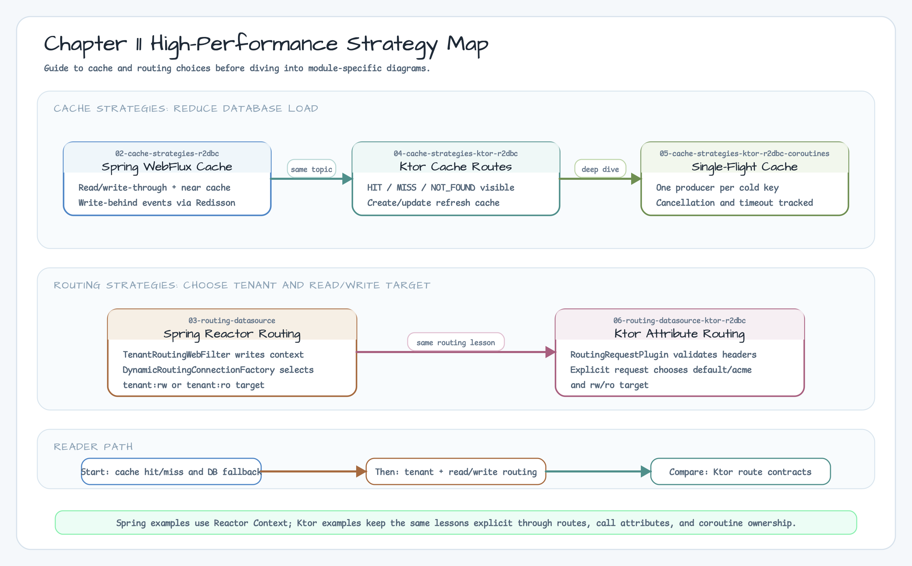
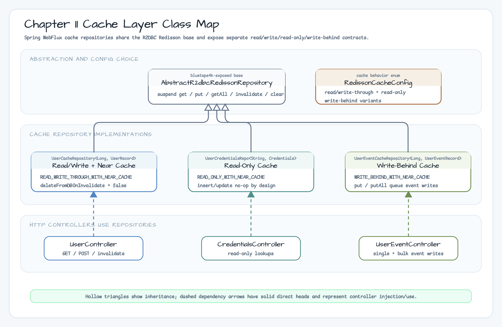
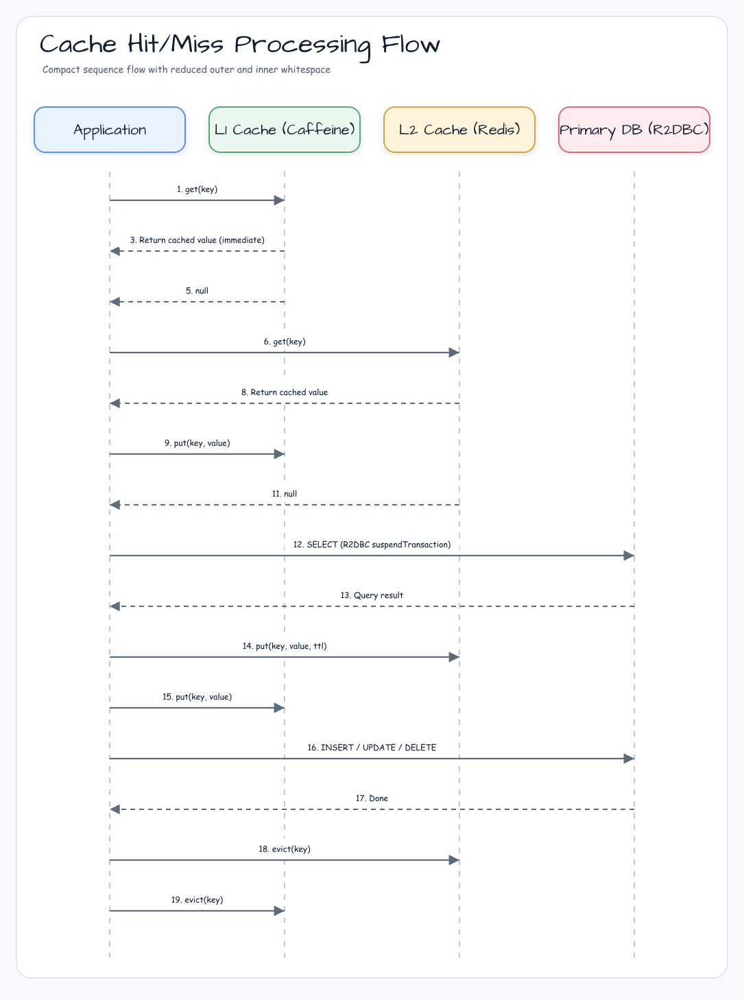

> 한국어 버전: [README.ko.md](README.ko.md)

# 11. High Performance

A collection of examples for improving performance and scalability in Exposed R2DBC environments.
The examples in this directory cover topics closer to production environments — such as caching, routing, and read/write separation — rather than simple CRUD.

## High-Performance Strategy Overview



## Cache Layer Structure (Class Diagram)



## Cache Hit/Miss Processing Flow



## Learning Objectives

- Apply a Redis/Redisson-based cache layer together with Coroutines.
- Implement tenant + read/write routing using request context.
- Identify common bottleneck points when combining Spring WebFlux with Exposed R2DBC.

## Sub-modules

| Module | Topic | When to Read |
|---|---|---|
| [02-cache-strategies-r2dbc](./02-cache-strategies-r2dbc/README.md) | Read Through, Write Through, Write Behind, Read-Only cache strategies | When you want to understand patterns for reducing DB load with caching |
| [03-routing-datasource](./03-routing-datasource/README.md) | Tenant + read/write routing, Reactor Context propagation | When you want to learn the basics of read/write separation, sharding, and multi-tenant routing |
| [04-cache-strategies-ktor-r2dbc](./04-cache-strategies-ktor-r2dbc/README.md) | Ktor route-visible cache hit/miss, invalidation, write refresh, DB fallback | When you want the general cache strategy topic without Spring WebFlux controllers |
| [05-cache-strategies-ktor-r2dbc-coroutines](./05-cache-strategies-ktor-r2dbc-coroutines/README.md) | Ktor coroutine single-flight cache fallback, cancellation, coalesced reads | When you want coroutine-specific cache behavior separate from the general Ktor cache example |

## Recommended Order

1. Start with `02-cache-strategies-r2dbc` to understand cache hit/miss flow.
2. Move to `03-routing-datasource` to understand request-context-based routing.
3. Compare `04-cache-strategies-ktor-r2dbc` when you want to see the same cache strategy surface through Ktor routes.
4. Read `05-cache-strategies-ktor-r2dbc-coroutines` for single-flight fallback and cancellation behavior.
5. Optionally compare with the `09-spring` and `10-multi-tenant` modules to see the pattern differences.

## Running Tips

```bash
# Test the cache strategy module
./gradlew :02-cache-strategies-r2dbc:test

# Test the routing datasource module
./gradlew :03-routing-datasource:test

# Test the Ktor cache strategy module
./gradlew :04-cache-strategies-ktor-r2dbc:test

# Test the Ktor coroutine cache strategy module
./gradlew :05-cache-strategies-ktor-r2dbc-coroutines:test
```

When running from the root, it is safer to use the actual Gradle project name:

```bash
./gradlew :exposed-r2dbc-11-high-performance-02-cache-strategies-r2dbc:test
./gradlew :exposed-r2dbc-11-high-performance-03-routing-datasource:test
./gradlew :exposed-r2dbc-11-high-performance-04-cache-strategies-ktor-r2dbc:test
./gradlew :exposed-r2dbc-11-high-performance-05-cache-strategies-ktor-r2dbc-coroutines:test
```
