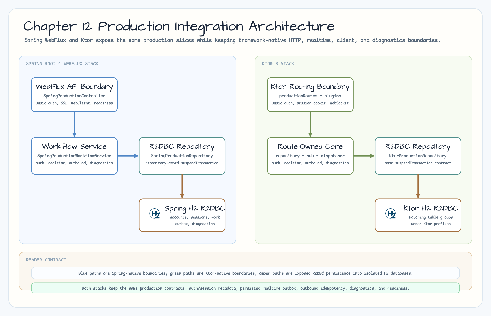
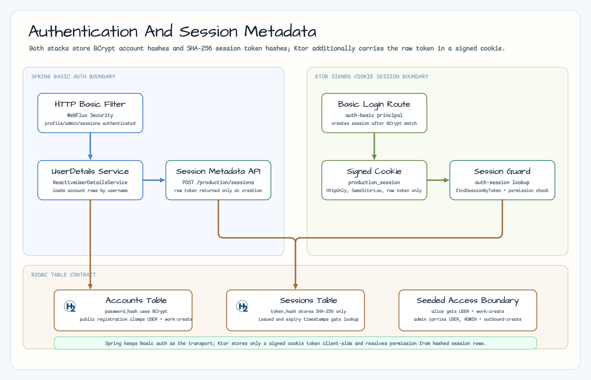
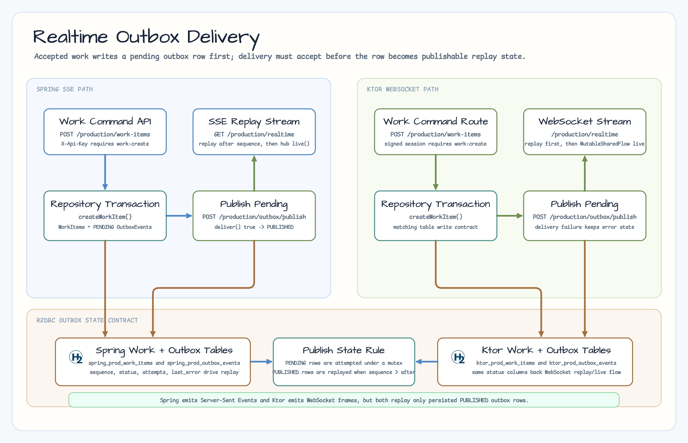
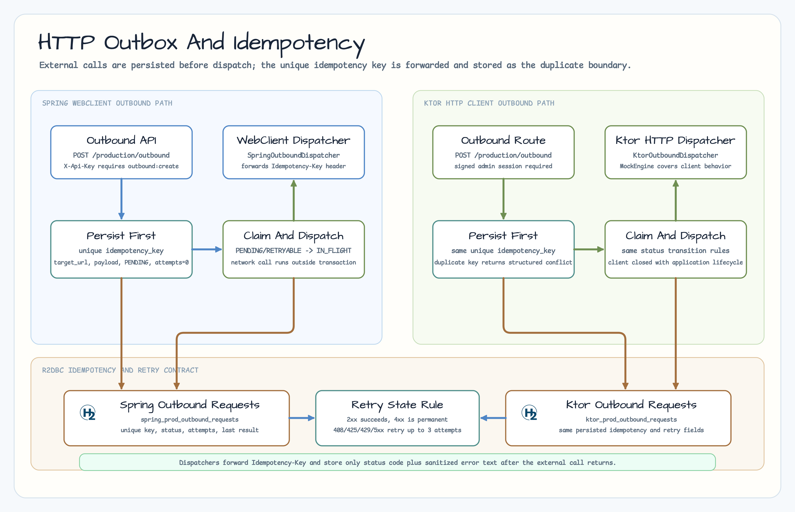
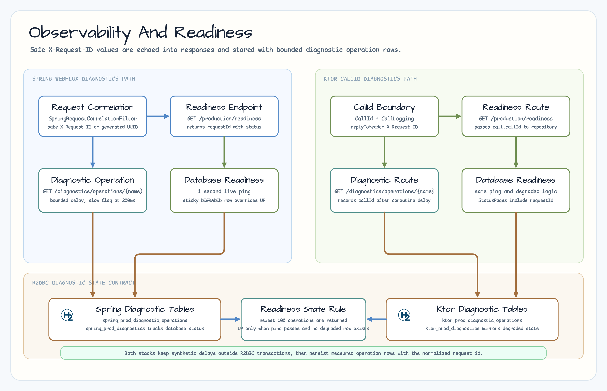
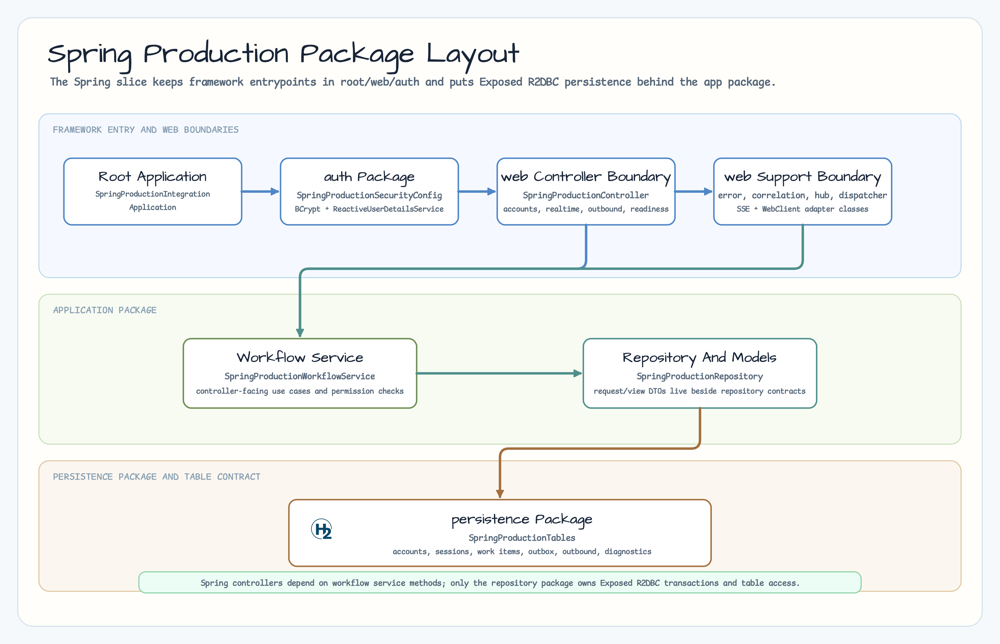

# Spring Production Integration

[English](README.md) | [한국어](README.ko.md)

이 모듈은 12장의 Spring Boot 4 WebFlux 예제입니다. Issue #44의 application
architecture baseline, issue #45의 authentication/session slice, issue #46의
realtime outbox slice, issue #47의 HTTP client outbox/idempotency slice를
포함하고, issue #48의 diagnostics/readiness slice를 추가합니다.

## 아키텍처



## 인증과 세션



Spring slice는 Exposed R2DBC account row로 backed되는 WebFlux Security HTTP
Basic 인증을 사용합니다. Password는 BCrypt hash로 저장하고, session metadata는
SHA-256 token hash만 저장합니다. Raw opaque token은 session 생성 응답에서만
반환합니다. Public account registration은 항상 `work:create` permission과
`USER` role만 부여하며, 이 workshop slice에서 admin/outbound account는 seeded
`admin`뿐입니다.

Spring에서는 Basic authentication이 authoritative transport입니다. Persisted
session row는 Ktor cookie flow와 비교하기 위한 session metadata이며, 별도의
authentication filter 대체물이 아닙니다.

## Realtime Outbox



Spring realtime slice는 기존 API-key permission 경계를 통해 work item을
받고, work item과 `PENDING` outbox row를 하나의 R2DBC transaction에
저장합니다. 이후 pending row를 in-process SSE hub로 publish합니다. Replay는
요청 sequence 이후의 `PUBLISHED` row만 반환하며, delivery 실패는 attempt
count와 error text를 가진 `FAILED` 상태로 보존합니다.

## HTTP Client Outbox



Spring outbound slice는 `outbound:create` 권한이 있는 account에만
`POST /production/outbound`를 허용하고, target URL, payload, unique
idempotency key를 먼저 저장합니다. 이후 `POST /production/outbound/dispatch`가
pending work를 dispatch합니다. `SpringOutboundDispatcher`는 WebFlux
`WebClient`를 사용하고 idempotency key를 `Idempotency-Key` header로 전달합니다.
Repository는 dispatchable row를 `IN_FLIGHT`로 claim한 뒤 HTTP client 호출은
transaction 밖에서 수행하고, retryable failure는 최대 세 번으로 제한하며,
저장되는 error text는 sanitize합니다.

## Observability And Readiness



`SpringRequestCorrelationFilter`는 `X-Request-ID`를 정규화하고, 수용된 값을 모든
응답 header에 echo하며, structured error mapping에서 사용할 수 있게 합니다.
`GET /production/diagnostics/operations/{name}`은 bounded diagnostic operation을
기록하고 optional coroutine delay는 R2DBC transaction 밖에서 수행합니다.
`GET /production/diagnostics/operations`는 최신 100건을 반환합니다.
`GET /production/readiness`는 bounded live database ping을 실행하고,
diagnostics table이 database degraded marker를 가진 동안 sticky `DEGRADED`를
보고합니다.

## 패키지 구성



## Spring Boot 4 vs Ktor

| 관심사 | Spring Boot 4 모듈 | Ktor 쌍 |
|---|---|---|
| HTTP 경계 | Annotation 기반 WebFlux controller | 명시적인 Ktor routing DSL |
| JSON/error mapping | Boot JSON 지원과 `@RestControllerAdvice` | `ContentNegotiation`과 `StatusPages` |
| Session/auth 형태 | WebFlux Security Basic auth와 DB session metadata | Ktor Basic auth가 signed-cookie session metadata 생성 |
| Realtime delivery | Persisted publish 상태가 있는 Server-Sent Events | 같은 outbox 상태를 쓰는 WebSocket replay/live stream |
| Outbound HTTP | Persisted idempotency 상태를 쓰는 WebClient dispatcher | MockEngine test가 있는 Ktor HTTP client dispatcher |
| Diagnostics/readiness | WebFilter request correlation과 annotation 기반 diagnostics endpoint | CallId/CallLogging과 명시적인 route diagnostics |
| R2DBC 경계 | Repository가 `suspendTransaction` 호출을 소유 | Ktor route 아래에서도 같은 repository 형태 |
| Test 방식 | `@SpringBootTest` + `WebTestClient` | `testApplication` + Ktor client plugin |

## 검증

```bash
repo-test-summary -- ./gradlew :01-spring-production-integration:test -PuseDB=H2 --continue --console=plain
```

Test suite는 authorized access, missing credentials, invalid credentials,
non-admin role denial, public registration permission/role clamping, raw token을
숨기는 session listing, event persistence, publish state transition, replay
boundary, delivery failure retention, outbound success/retry/permanent failure,
duplicate idempotency key, permission denial, sanitized dispatch error,
concurrent single-send protection, request-id echo/replacement, structured error
correlation, diagnostic operation timing, readiness degraded/recovery 동작을
검증합니다.
