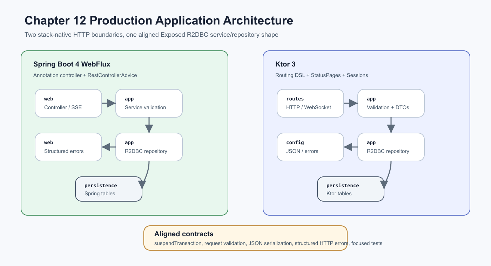

# Ktor Production Integration

[English](README.md) | [한국어](README.ko.md)

This module is the Ktor 3 side of chapter 12. Issue #44 adds the baseline
application architecture: routing, JSON serialization, `StatusPages` error
mapping, session-protected routes, Exposed R2DBC repository, and focused
application tests.

## Architecture



## Package Layout

```text
exposed.r2dbc.examples.production.ktor
├── app         # DTOs, validation, and Exposed R2DBC repository
├── config      # JSON serialization and structured error mapping
├── outbound    # Ktor HTTP client dispatcher boundary
├── persistence # table definitions owned by the repository boundary
└── routes      # HTTP routes and WebSocket replay endpoint
```

## Ktor vs Spring Boot 4

| Concern | Ktor module | Spring Boot 4 pair |
|---|---|---|
| HTTP boundary | Explicit routing DSL | Annotation-driven WebFlux controller |
| JSON/error mapping | `ContentNegotiation` plus `StatusPages` | Boot JSON support plus `@RestControllerAdvice` |
| Session/auth shape | Session plugin guards protected routes | Header-based workshop permission check for this slice |
| R2DBC boundary | Repository-owned `suspendTransaction` calls | Same repository shape behind a Spring service |
| Test style | `testApplication` + Ktor client plugins | `@SpringBootTest` + `WebTestClient` |

## Verification

```bash
repo-test-summary -- ./gradlew :02-ktor-production-integration:test -PuseDB=H2 --continue --console=plain
```
