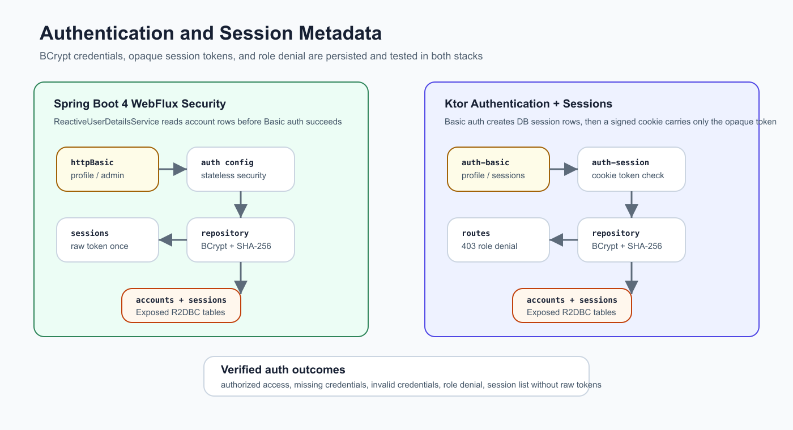
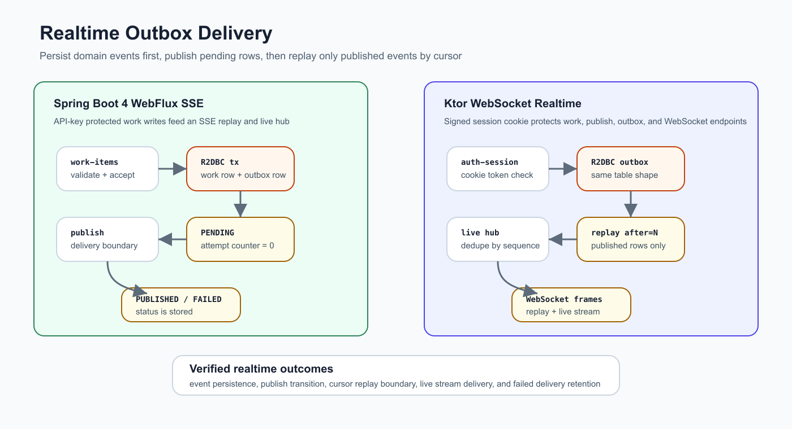
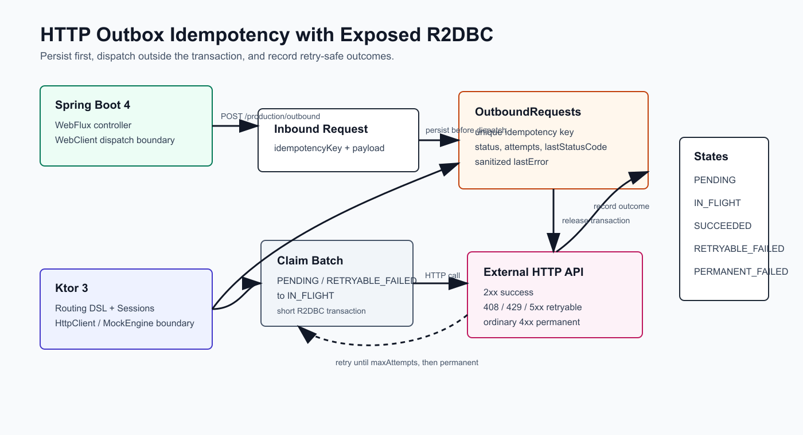

# Ktor Production Integration

[English](README.md) | [한국어](README.ko.md)

This module is the Ktor 3 side of chapter 12. It now includes the application
architecture baseline from issue #44, the authentication / session slice from
issue #45, the realtime outbox slice from issue #46, and the HTTP client
outbox/idempotency slice from issue #47.

## Architecture


## Authentication And Sessions



The Ktor slice uses Basic authentication to create database-backed session
metadata, then stores only the opaque token in a signed `production_session`
cookie. Passwords are BCrypt hashes, and session rows persist only SHA-256 token
hashes. Public account registration always grants the `work:create` permission
and `USER` role; the seeded `admin` account is the only admin/outbound account
in this workshop slice.

The cookie is signed and uses `HttpOnly` plus `SameSite=Lax`. The example runs
over local plain HTTP, so `Secure` cookies and restart-stable signing keys are
left as production-hardening notes rather than enabled defaults.

## Realtime Outbox



The Ktor realtime slice protects work, publish, outbox, and WebSocket endpoints
with the signed session cookie. Work-item creation stores a `PENDING` outbox row
in the same R2DBC transaction, publish attempts deliver through a
`MutableSharedFlow` hub, replay returns only `PUBLISHED` rows after the cursor,
and failed delivery stays visible as `FAILED` state.

## HTTP Client Outbox



The Ktor outbound slice protects `/production/outbound` and
`/production/outbound/dispatch` with the signed admin session. It persists the
target URL, payload, unique idempotency key, retry status, attempt count, and
last dispatch result before any external call. `KtorOutboundDispatcher` uses
Ktor `HttpClient`, forwards the idempotency key as `Idempotency-Key`, and is
tested with `MockEngine`. Dispatch claims rows as `IN_FLIGHT`, calls the HTTP
client outside the transaction, and records retryable or permanent failure
state with sanitized error text.

## Package Layout

```text
exposed.r2dbc.examples.production.ktor
├── app         # DTOs, validation, and Exposed R2DBC repository
├── config      # JSON serialization, structured error mapping, auth failures
├── outbound    # Ktor HTTP client dispatcher boundary
├── persistence # table definitions owned by the repository boundary
└── routes      # HTTP routes and WebSocket replay endpoint
```

## Ktor vs Spring Boot 4

| Concern | Ktor module | Spring Boot 4 pair |
|---|---|---|
| HTTP boundary | Explicit routing DSL | Annotation-driven WebFlux controller |
| JSON/error mapping | `ContentNegotiation` plus `StatusPages` | Boot JSON support plus `@RestControllerAdvice` |
| Session/auth shape | Ktor Basic auth creates signed-cookie session metadata | WebFlux Security Basic auth plus DB session metadata |
| Realtime delivery | WebSocket replay/live stream with persisted publish state | Server-Sent Events with the same outbox state |
| Outbound HTTP | Ktor HTTP client dispatcher with MockEngine tests | WebClient dispatcher with persisted idempotency state |
| R2DBC boundary | Repository-owned `suspendTransaction` calls | Same repository shape behind a Spring service |
| Test style | `testApplication` + Ktor client plugins | `@SpringBootTest` + `WebTestClient` |

## Verification

```bash
repo-test-summary -- ./gradlew :02-ktor-production-integration:test -PuseDB=H2 --continue --console=plain
```

The test suite covers authorized access, missing credentials, invalid
credentials, non-admin role denial, public registration permission/role
clamping, invalid session cookies, session listings that hide raw tokens, event
persistence, publish state transitions, replay/live WebSocket delivery, and
delivery failure retention, outbound success/retry/permanent failure, duplicate
idempotency keys, permission denial, sanitized dispatch errors, Ktor
`MockEngine` dispatch, and concurrent single-send protection.
