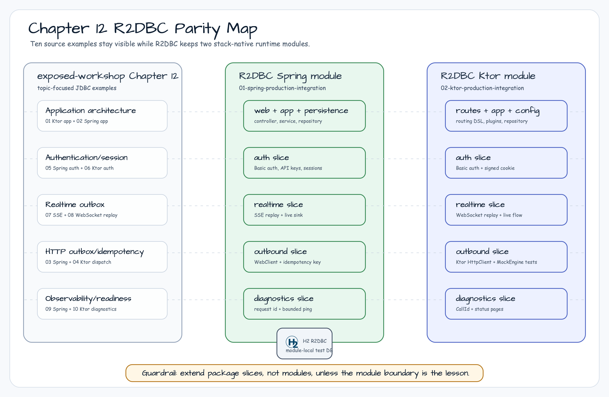
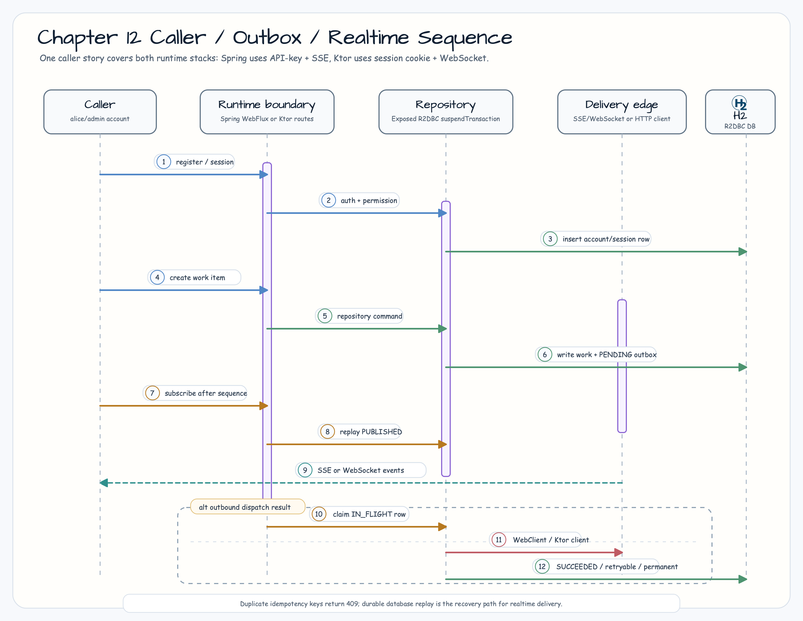

# 12장: Production Integration

[English](README.md) | [한국어](README.ko.md)

12장은 Spring Boot 4와 Ktor에서 production-grade Exposed R2DBC 서비스 경계를
나란히 비교합니다. 두 스택의 도메인 용어는 맞추되, HTTP, realtime, client,
diagnostics 경계는 각 프레임워크의 자연스러운 방식으로 보여줍니다.

## 모듈

| 모듈 | 스택 | 초점 |
|---|---|---|
| [`01-spring-production-integration`](01-spring-production-integration/) | Spring Boot 4 WebFlux | WebFlux Security, controller/service/repository 경계, SSE replay, WebClient outbox dispatch, structured errors, readiness |
| [`02-ktor-production-integration`](02-ktor-production-integration/) | Ktor 3 | Ktor Authentication/Sessions, WebSockets, MockEngine/Ktor HTTP client outbox dispatch, readiness |

## Application Architecture


## Authentication And Sessions


## Realtime Outbox Delivery


Realtime slice는 accepted work item과 outbox event를 같은 Exposed R2DBC
transaction에 저장합니다. Pending row publish는 Spring SSE 또는 Ktor
WebSocket delivery 경계가 event를 받아들인 뒤에만 `PUBLISHED`로 전환합니다.
Delivery 실패는 attempt count와 error note를 포함한 `FAILED` 상태로 저장하므로
reconnect/replay는 in-memory event에만 의존하지 않습니다.

## HTTP Client Outbox And Idempotency


Outbound slice는 외부 HTTP 호출을 dispatch하기 전에 row로 먼저 저장하고,
database-unique idempotency key를 duplicate boundary로 사용합니다. Dispatch는
짧은 R2DBC transaction에서 eligible row를 `IN_FLIGHT`로 claim한 뒤,
Spring WebClient 또는 Ktor HTTP client 호출은 transaction 밖에서 수행합니다.
이후 attempt count, status code, sanitized error text와 함께 `SUCCEEDED`,
`RETRYABLE_FAILED`, `PERMANENT_FAILED` 상태를 저장합니다. Test는 replaceable
dispatcher와 Ktor `MockEngine`을 사용하므로 실제 외부 서비스 없이 success,
retry, duplicate, permanent failure, concurrent single-send 동작을 검증합니다.

## Observability And Readiness


Observability slice는 Spring WebFlux와 Ktor에서 `X-Request-ID`를 같은
계약으로 정규화합니다. 안전한 caller-provided ID는 응답에 그대로 echo하고,
invalid ID는 generated UUID로 교체하며, structured error에는 request id를
포함합니다. Diagnostic operation endpoint는 synthetic delay를 R2DBC
transaction 밖에서 끝낸 뒤 duration과 slow flag를 row로 저장하고 최신 100건을
조회합니다. Readiness는 bounded live database ping을 수행하고, diagnostics가
database degraded marker를 기록하면 sticky `DEGRADED`를 반환하며, marker를
clear하면 다시 `UP`으로 회복합니다.

## 이슈별 주제 맵

| Issue | 주제 | Spring slice | Ktor slice |
|---|---|---|---|
| #44 | Application architecture | `app` | `app` |
| #45 | Authentication/session | `auth` | `auth` |
| #46 | Realtime outbox | SSE replay 기반 `realtime` | WebSocket 기반 `realtime` |
| #47 | HTTP client outbox/idempotency | `outbound` | `outbound` |
| #48 | Observability/readiness | `diagnostics` | `diagnostics` |
| #49 | Documentation and verification | README + Gradle/test evidence | README + Gradle/test evidence |

## Source Example Parity

`exposed-workshop`는 12장을 10개의 topic-focused module로 유지합니다. 이
R2DBC workshop은 runtime stack별 두 module을 의도적으로 유지하고, source
example을 module 내부 package slice에 매핑합니다.



| `exposed-workshop` 예제 | R2DBC 대응 | Coverage 결정 |
|---|---|---|
| `01-ktor-application-architecture` | `02-ktor-production-integration`의 `app`, `config`, `routes`, `persistence` package | 독립 module 대신 Ktor module 안에서 cover |
| `02-spring-application-architecture` | `01-spring-production-integration`의 `app`, `persistence`, `web` package | 독립 module 대신 Spring module 안에서 cover |
| `03-spring-http-outbox-idempotency` | Spring `outbound` slice, `SpringOutboundDispatcher`, outbound test | Spring package slice로 cover |
| `04-ktor-http-outbox-idempotency` | Ktor `outbound` slice, `KtorOutboundDispatcher`, MockEngine test | Ktor package slice로 cover |
| `05-spring-auth-session` | Spring `auth` slice와 session metadata test | Spring package slice로 cover |
| `06-ktor-auth-session` | Ktor authentication/session cookie flow와 session metadata test | Ktor package slice로 cover |
| `07-spring-outbox-realtime` | Spring `realtime` SSE replay와 persisted outbox test | Spring package slice로 cover |
| `08-ktor-outbox-realtime` | Ktor WebSocket replay/live stream과 persisted outbox test | Ktor package slice로 cover |
| `09-spring-observability-readiness` | Spring diagnostics/readiness 및 request-correlation test | Spring package slice로 cover |
| `10-ktor-observability-readiness` | Ktor diagnostics/readiness 및 request-correlation test | Ktor package slice로 cover |

향후 Chapter 12 R2DBC 작업은 새 이슈가 module boundary 자체를 학습 목표로
증명하지 않는 한 기존 package slice를 확장합니다.

## 호출자 흐름



| 단계 | Spring WebFlux | Ktor |
|---|---|---|
| 시작점 | `:01-spring-production-integration` | `:02-ktor-production-integration` |
| 사용자 등록 | `apiKey`, `username`, 선택적 `password`로 `POST /production/accounts` | 같은 payload로 `POST /production/accounts` |
| 인증 | `/production/profile`, `/production/admin`, `/production/sessions`는 HTTP Basic 사용 | HTTP Basic으로 `POST /production/sessions` 호출 후 `production_session` cookie 사용 |
| Work 생성 | `X-Api-Key: alice-api-key`로 `POST /production/work-items` | Signed session cookie로 `POST /production/work-items` |
| Realtime 구독/replay | `GET /production/realtime?after=<sequence>`가 SSE event 반환 | `ws://.../production/realtime?after=<sequence>`가 replay 후 WebSocket event stream |
| Outbound HTTP dispatch | `X-Api-Key: admin-api-key`로 `POST /production/outbound`, `/production/outbound/dispatch` | Admin session cookie로 같은 path 호출 |
| Diagnostics 확인 | `GET /production/diagnostics/operations`, `GET /production/diagnostics/operations/{name}`, `GET /production/readiness` | 같은 path |

Seeded workshop account는 work-item용 `alice` / `password` /
`alice-api-key`, outbound/admin 예제용 `admin` / `password` /
`admin-api-key`입니다. 이 credential은 local workshop fixture이며 production
default가 아닙니다.

## Delivery, Retry, Readiness 의미

| 영역 | 호출자에게 보이는 계약 |
|---|---|
| Idempotency | Idempotency key는 module database 안에서 unique합니다. 같은 payload라도 중복 key는 항상 HTTP 409를 반환하며, 이전 success response를 replay하지 않습니다. |
| Outbound retry | Dispatch는 eligible row를 `IN_FLIGHT`로 claim하고 HTTP client 호출은 transaction 밖에서 수행한 뒤 `SUCCEEDED`, `RETRYABLE_FAILED`, `PERMANENT_FAILED`를 기록합니다. Retryable failure는 세 번의 attempt cap 전까지 다시 dispatch할 수 있습니다. |
| Realtime replay | Published outbox row는 module database 안에서 증가하는 sequence를 가집니다. `after=<last-seen-sequence>`로 reconnect하면 이후 `PUBLISHED` row만 replay합니다. Client는 reconnect 경계에서 duplicate delivery를 허용해야 합니다. |
| Live delivery | Spring은 SSE, Ktor는 WebSocket을 사용합니다. 두 stack 모두 durable outbox persistence 이후 live delivery는 best-effort이며, database replay path가 recovery contract입니다. |
| Readiness | Readiness는 bounded live database ping 성공 시에만 `UP`입니다. Persisted degraded marker 또는 unreachable database는 `DEGRADED`이며, marker clear 후 다음 ping 성공 시 `UP`으로 돌아옵니다. |

## Operator Notes

- Outbound row를 수동 변경하기 전 dispatcher를 비활성화하거나 중지합니다.
- `IN_FLIGHT`에 멈춰 있거나 반복적으로 `RETRYABLE_FAILED`인 row는
  `PENDING`으로 reset하기 전에 원인을 확인합니다. Idempotency key는 계속
  duplicate boundary입니다.
- Degraded marker는 해당 diagnostic row가 나타내는 database 문제가 해소된 뒤
  clear합니다.
- Retry/replay 작업은 idempotency-aware하게 수행합니다. 호출자가 새 outbound
  request를 의도한 경우가 아니라면 retry를 강제로 만들기 위해 idempotency key를
  변경하지 않습니다.

## Production 계약

- Database access는 Exposed R2DBC `suspendTransaction` 안에서 실행합니다.
- Password는 BCrypt hash로 저장하고, session table은 SHA-256 token hash만
  저장합니다. Raw session token은 session 생성 시점에만 반환합니다.
- Public registration은 `work:create` permission과 `USER` role만 부여합니다.
  Admin/outbound access는 seeded admin account에서만 오므로 auth slice에서
  privileged user를 self-register할 수 없습니다.
- App-boundary test는 Spring/Ktor bootstrap을 예측 가능하게 유지하기 위해 H2
  R2DBC를 사용합니다.
- 중복 idempotency key는 두 스택 모두 HTTP 409와 structured conflict error를
  반환합니다.
- Realtime 예제는 delivery 전에 event를 outbox에 저장하고, pending row만
  publish하며, 실패 상태를 기록하고, cursor 이후 `PUBLISHED` row만 replay합니다.
- HTTP client outbox 예제는 delivery 전에 outbound row를 저장하고, retryable
  row를 dispatch 전에 claim하며, 최대 세 번까지 retry하고, 저장되는 dispatch
  error에서 credential처럼 보이는 값을 redact합니다.
- Request correlation은 안전한 `X-Request-ID`만 수용하고 header가 없거나
  invalid하면 UUID를 생성합니다.
- Diagnostic operation endpoint는 최신 100건만 조회하고, 250 ms를 넘는
  operation을 slow로 표시하며, delay 중에는 database transaction을 열지
  않습니다.
- Readiness는 bounded live database ping 성공 시에만 `UP`을 반환하고,
  database unreachable 또는 explicit degraded marker 상태는 `DEGRADED`로
  보고합니다.

## 검증

```bash
./gradlew projects
repo-test-summary -- ./gradlew :01-spring-production-integration:test :02-ktor-production-integration:test
```

검증 범위는 의도적으로 나누어 둡니다.

- `settings.gradle.kts`는 `includeModules("12-production-integration", false, false)`를 통해
  12장 leaf module 두 개를 자동으로 발견합니다.
- `.github/workflows/Examples.yml`은 12장 파일, root README 파일, README diagram
  asset이 바뀔 때 두 12장 module의 H2 focused test를 실행합니다.
- Main CI workflow는 repository의 다른 non-doc code 변경에 대해
  repository-wide build, detekt, DB matrix test를 실행합니다. Nightly는 full
  repository H2 test와 DB shard coverage를 유지하므로 12장도 일반 `test` task
  경로로 계속 검증됩니다.
