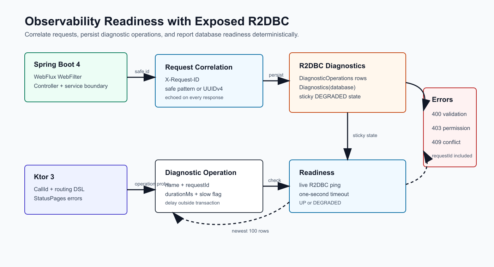

# Chapter 12: Production Integration

[English](README.md) | [한국어](README.ko.md)

Chapter 12 compares production-oriented Exposed R2DBC service boundaries in
Spring Boot 4 and Ktor. The chapter keeps the domain vocabulary aligned across
both stacks while showing the native HTTP, realtime, client, and diagnostics
surfaces each framework expects.

## Modules

| Module | Stack | Focus |
|---|---|---|
| [`01-spring-production-integration`](01-spring-production-integration/) | Spring Boot 4 WebFlux | WebFlux Security, controller/service/repository boundaries, SSE replay, WebClient outbox dispatch, structured errors, readiness |
| [`02-ktor-production-integration`](02-ktor-production-integration/) | Ktor 3 | Ktor Authentication/Sessions, WebSockets, MockEngine/Ktor HTTP client outbox dispatch, readiness |

## Application Architecture


## Authentication And Sessions


## Realtime Outbox Delivery


The realtime slice persists each accepted work item and outbox event in the
same Exposed R2DBC transaction. Publishing pending rows moves events to
`PUBLISHED` only after the Spring SSE or Ktor WebSocket delivery boundary
accepts them. Failed delivery is stored as `FAILED` with an attempt count and
error note, so reconnect/replay never depends on an in-memory event alone.

## HTTP Client Outbox And Idempotency


The outbound slice persists each external HTTP request before dispatch and
uses a database-unique idempotency key as the duplicate boundary. Dispatch
claims eligible rows as `IN_FLIGHT` in a short R2DBC transaction, performs the
Spring WebClient or Ktor HTTP client call outside the transaction, then records
`SUCCEEDED`, `RETRYABLE_FAILED`, or `PERMANENT_FAILED` with attempt count,
status code, and sanitized error text. Tests use replaceable dispatchers and
Ktor `MockEngine`, so success, retry, duplicate, permanent failure, and
concurrent single-send behavior are covered without a real external service.

## Observability And Readiness



The observability slice normalizes `X-Request-ID` across Spring WebFlux and
Ktor. Safe caller-provided IDs are echoed in responses, invalid IDs are replaced
with a generated UUID, and structured errors include the request id. Diagnostic
operation endpoints record the newest operation rows with duration and slow
flags after any synthetic delay finishes outside an R2DBC transaction.
Readiness performs a bounded live database ping, reports sticky `DEGRADED`
state when diagnostics record a database problem, and returns to `UP` after the
degraded marker is cleared.

## Topic Map

| Issue | Topic | Spring slice | Ktor slice |
|---|---|---|---|
| #44 | Application architecture | `app` | `app` |
| #45 | Authentication/session | `auth` | `auth` |
| #46 | Realtime outbox | `realtime` with SSE replay | `realtime` with WebSockets |
| #47 | HTTP client outbox/idempotency | `outbound` | `outbound` |
| #48 | Observability/readiness | `diagnostics` | `diagnostics` |
| #49 | Documentation and verification | README + Gradle/test evidence | README + Gradle/test evidence |

## Source Example Parity

`exposed-workshop` keeps Chapter 12 as ten focused modules. This R2DBC workshop
intentionally keeps two modules, one per runtime stack, and maps each source
example to package-level slices inside those modules.

| `exposed-workshop` example | R2DBC counterpart | Coverage decision |
|---|---|---|
| `01-ktor-application-architecture` | `02-ktor-production-integration` packages `app`, `config`, `routes`, `persistence` | Covered in the Ktor module instead of a standalone module |
| `02-spring-application-architecture` | `01-spring-production-integration` packages `app`, `persistence`, `web` | Covered in the Spring module instead of a standalone module |
| `03-spring-http-outbox-idempotency` | Spring `outbound` slice, `SpringOutboundDispatcher`, outbound tests | Covered by the Spring package slice |
| `04-ktor-http-outbox-idempotency` | Ktor `outbound` slice, `KtorOutboundDispatcher`, MockEngine tests | Covered by the Ktor package slice |
| `05-spring-auth-session` | Spring `auth` slice and session metadata tests | Covered by the Spring package slice |
| `06-ktor-auth-session` | Ktor authentication/session cookie flow and session metadata tests | Covered by the Ktor package slice |
| `07-spring-outbox-realtime` | Spring `realtime` SSE replay and persisted outbox tests | Covered by the Spring package slice |
| `08-ktor-outbox-realtime` | Ktor WebSocket replay/live stream and persisted outbox tests | Covered by the Ktor package slice |
| `09-spring-observability-readiness` | Spring diagnostics/readiness and request-correlation tests | Covered by the Spring package slice |
| `10-ktor-observability-readiness` | Ktor diagnostics/readiness and request-correlation tests | Covered by the Ktor package slice |

Future Chapter 12 R2DBC work should extend these package slices unless a new
issue proves that the module boundary itself is the teaching target.

## Caller Flow

| Step | Spring WebFlux | Ktor |
|---|---|---|
| Start point | `:01-spring-production-integration` | `:02-ktor-production-integration` |
| Register a user | `POST /production/accounts` with `apiKey`, `username`, and optional `password` | `POST /production/accounts` with the same payload |
| Authenticate | HTTP Basic for `/production/profile`, `/production/admin`, and `/production/sessions` | HTTP Basic creates a `production_session` cookie through `POST /production/sessions` |
| Create work | `POST /production/work-items` with `X-Api-Key: alice-api-key` | `POST /production/work-items` with the signed session cookie |
| Subscribe/replay realtime | `GET /production/realtime?after=<sequence>` returns SSE events | `ws://.../production/realtime?after=<sequence>` replays then streams WebSocket events |
| Dispatch outbound HTTP | `POST /production/outbound` and `/production/outbound/dispatch` with `X-Api-Key: admin-api-key` | Same paths with the admin session cookie |
| Inspect diagnostics | `GET /production/diagnostics/operations`, `GET /production/diagnostics/operations/{name}`, `GET /production/readiness` | Same paths |

Seeded workshop accounts are `alice` / `password` with `alice-api-key` for
work-item access and `admin` / `password` with `admin-api-key` for outbound and
admin examples. These credentials are local workshop fixtures, not production
defaults.

## Delivery, Retry, And Readiness Semantics

| Area | Caller-visible contract |
|---|---|
| Idempotency | The idempotency key is unique per module database. A duplicate key always returns HTTP 409, even if the payload matches an earlier request. The example does not replay the prior success response. |
| Outbound retry | Dispatch claims eligible rows as `IN_FLIGHT`, calls the HTTP client outside the transaction, and records `SUCCEEDED`, `RETRYABLE_FAILED`, or `PERMANENT_FAILED`. Retryable failures can be dispatched again until the three-attempt cap turns them permanent. |
| Realtime replay | Published outbox rows have monotonically increasing sequence values inside the module database. Reconnect with `after=<last-seen-sequence>` to replay only later `PUBLISHED` rows; clients should tolerate duplicate delivery around reconnects. |
| Live delivery | Spring uses SSE and Ktor uses WebSockets. In both stacks, live delivery is best-effort after durable outbox persistence; the database replay path is the recovery contract. |
| Readiness | Readiness returns `UP` only after a bounded live database ping. A persisted degraded marker or unreachable database reports `DEGRADED`; clearing the marker returns the example to `UP` after the next successful ping. |

## Operator Notes

- Disable or stop the dispatcher before manually changing outbound rows.
- Inspect rows stuck in `IN_FLIGHT` or repeated `RETRYABLE_FAILED` state before
  resetting them to `PENDING`; the idempotency key remains the duplicate
  boundary.
- Clear the degraded marker only after the database problem represented by the
  diagnostic row is resolved.
- Keep retry and replay operations idempotency-aware: do not change
  idempotency keys to force a retry unless the caller intentionally wants a new
  outbound request.

## Production Contracts

- Database access runs through Exposed R2DBC `suspendTransaction`.
- Passwords are stored as BCrypt hashes, and session tables store only SHA-256
  token hashes. Raw session tokens are returned only when a session is created.
- Public registration permission/role clamping grants only `work:create` and
  `USER`; admin/outbound access comes from the seeded admin account so the auth
  slice cannot self-register privileged users.
- App-boundary tests use H2 R2DBC for predictable Spring/Ktor startup.
- Duplicate idempotency keys return HTTP 409 with a structured conflict error.
- Realtime examples persist events before delivery, publish only pending rows,
  record failed delivery state, and replay only `PUBLISHED` rows after a cursor.
- HTTP client outbox examples persist outbound rows before delivery, claim
  retryable rows before dispatch, cap retries at three attempts, and redact
  credential-like text from stored dispatch errors.
- Request correlation accepts only safe `X-Request-ID` values and generates a
  UUID when the incoming header is missing or invalid.
- Diagnostic operation endpoints keep the newest 100 rows and mark operations
  over 250 ms as slow without holding a database transaction during delay.
- Readiness reports `UP` only after a bounded live database ping and reports
  `DEGRADED` for unreachable database state or an explicit degraded marker.

## Verification

```bash
./gradlew projects
repo-test-summary -- ./gradlew :01-spring-production-integration:test :02-ktor-production-integration:test
```

Verification coverage is split deliberately:

- `settings.gradle.kts` discovers both chapter 12 leaf modules through
  `includeModules("12-production-integration", false, false)`.
- `.github/workflows/Examples.yml` runs focused H2 tests for both chapter 12
  modules whenever chapter 12 files, root README files, or README diagram
  assets change.
- The main CI workflow still runs repository-wide build, detekt, and DB matrix
  tests for non-doc code changes elsewhere in the repository. Nightly keeps the
  full repository H2 test and DB shard coverage, so chapter 12 remains covered
  by the normal `test` task path.
