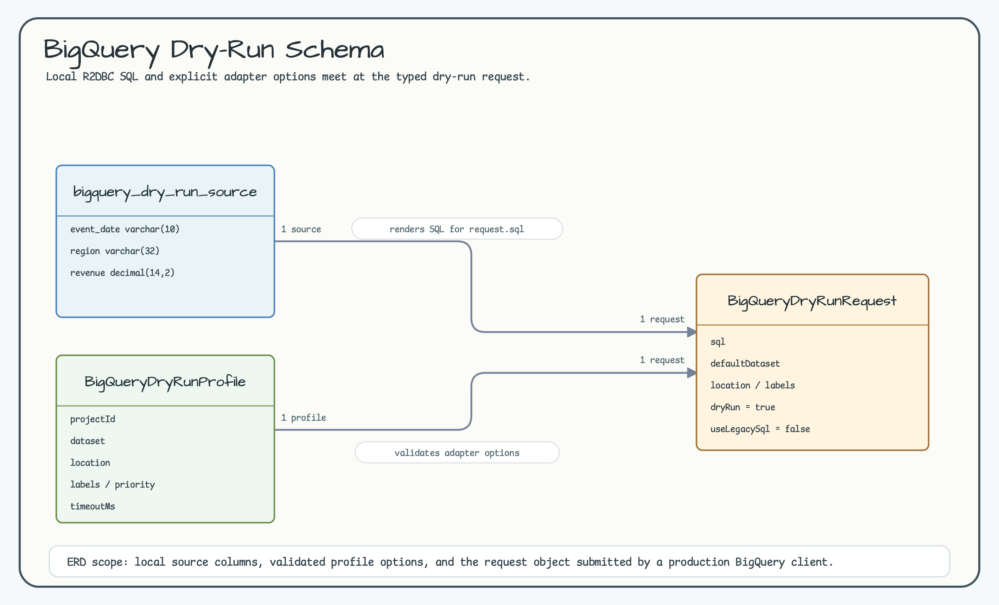
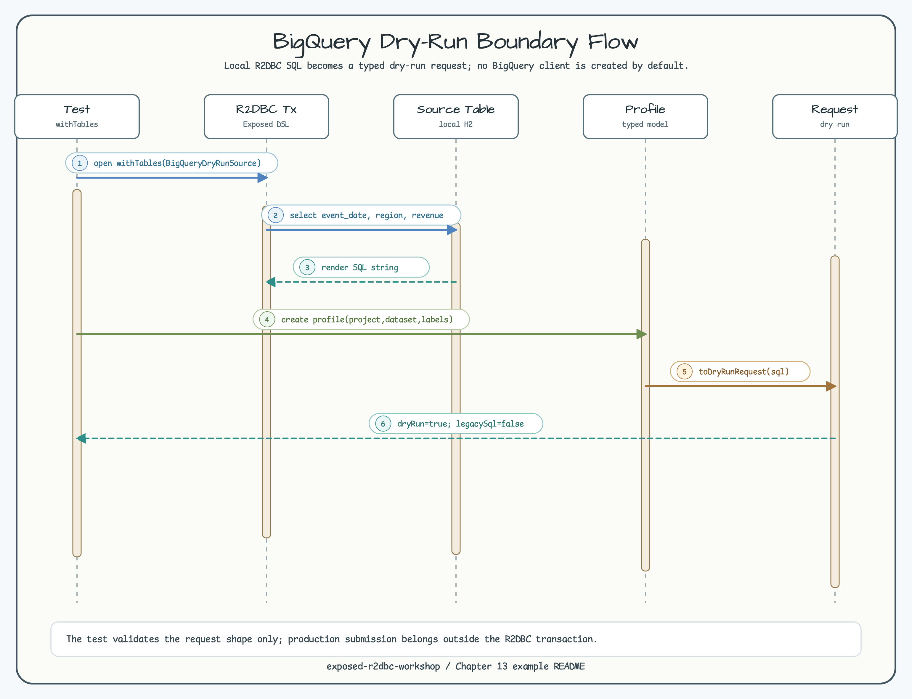

# BigQuery Dry-Run Boundary

[English](README.md) | [한국어](README.ko.md)

This module renders a local Exposed R2DBC query and wraps it in a typed
BigQuery dry-run request. The default test never creates a BigQuery client and
does not require credentials.

## Scenario

- Render SQL from `BigQueryDryRunSource` inside an R2DBC transaction.
- Build `BigQueryDryRunRequest` with `dryRun = true` and `useLegacySql = false`.
- Keep default dataset, location, labels, priority, and timeout explicit.

## Diagrams

The ERD shows the local source table, adapter profile, and typed request
boundary. The sequence diagram shows the default credential-free test flow.





## Verification

```bash
./gradlew :01-bigquery-dry-run:test -PuseDB=H2 --console=plain
```
