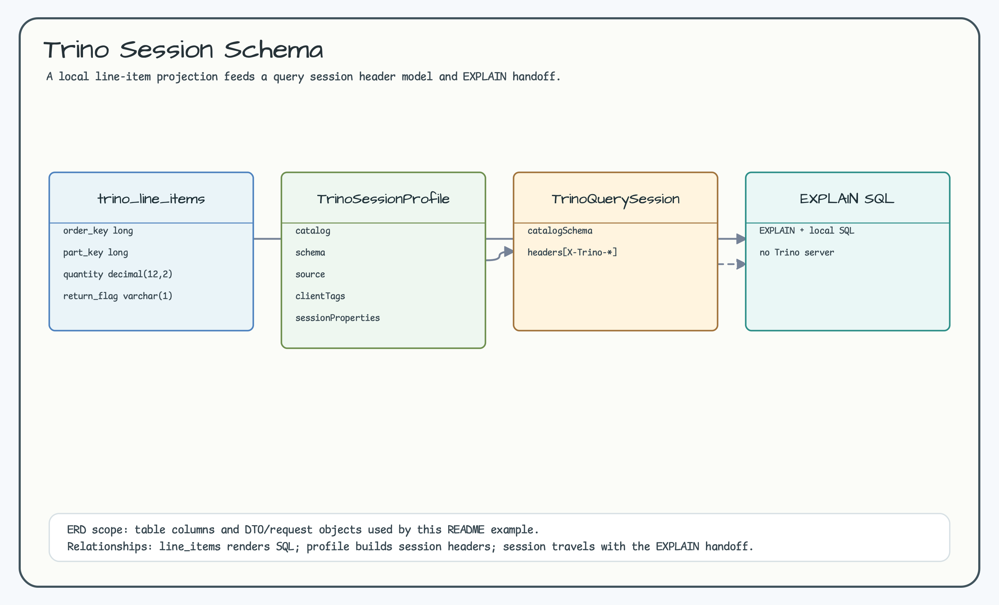
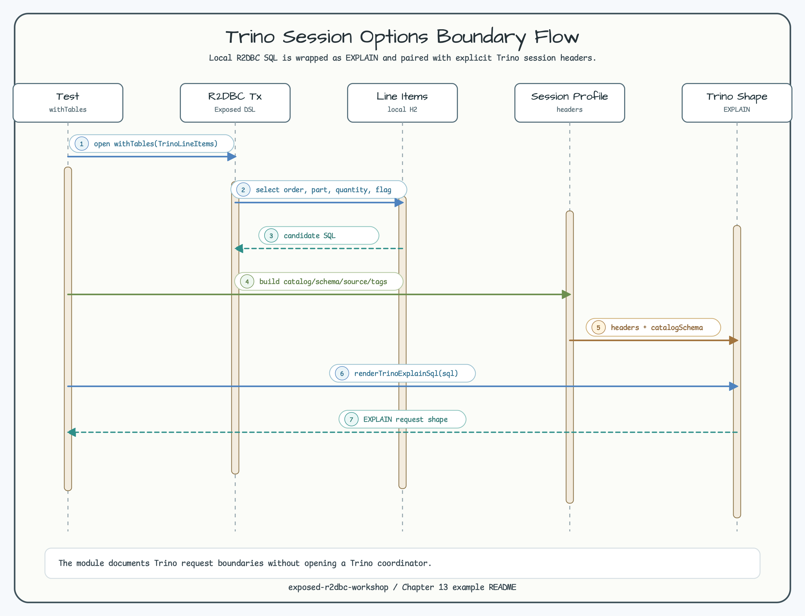

# Trino Session Options Boundary

[English](README.md) | [한국어](README.ko.md)

이 모듈은 Trino server를 시작하지 않고도 session option 경계를 명시합니다.
Local Exposed R2DBC SQL을 렌더링하고 Trino EXPLAIN request shape과 header를
구성합니다.

## 시나리오

- R2DBC transaction 안에서 `TrinoLineItems` SQL을 렌더링합니다.
- Catalog, schema, source, client tag, session property를 담은
  `TrinoQuerySession` header를 만듭니다.
- Local SQL을 `EXPLAIN`으로 감싸 handoff boundary를 문서화합니다.

## 다이어그램

ERD는 local line-item table, session option model, EXPLAIN handoff shape을
보여줍니다. Sequence Diagram은 Trino coordinator를 시작하지 않고 SQL 렌더링과
Trino header를 명시하는 흐름을 보여줍니다.





## 검증

```bash
./gradlew :02-trino-session-options:test -PuseDB=H2 --console=plain
```
