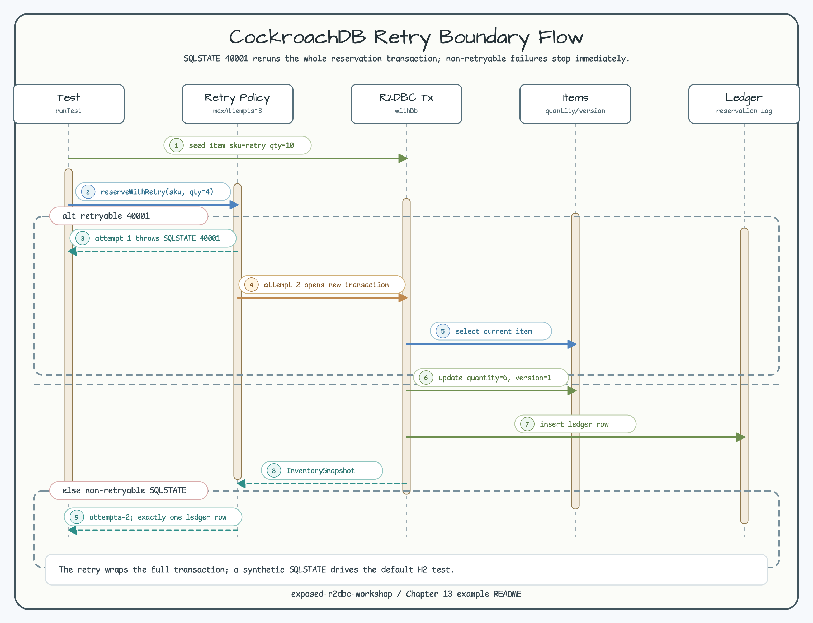

# CockroachDB Retry Boundary

[English](README.md) | [한국어](README.ko.md)

이 모듈은 기본 경로에서 CockroachDB container를 시작하지 않고 CockroachDB retry
계약을 모델링합니다. SQLSTATE `40001`만 retryable로 보고 reservation
transaction을 Exposed R2DBC로 재실행합니다.

## 시나리오

- H2 R2DBC로 inventory row를 준비합니다.
- 첫 번째 attempt에서 synthetic `RetryableSqlStateFailure("40001")`를 던집니다.
- Reservation을 재실행하고 ledger row는 정확히 하나만 저장합니다.
- Non-retryable SQLSTATE는 즉시 실패합니다.

## 다이어그램

ERD는 inventory state, 성공한 reservation ledger row, snapshot projection,
retry policy를 보여줍니다. Sequence Diagram은 retryable SQLSTATE branch와
non-retryable failure branch를 함께 보여줍니다.




## 검증

```bash
./gradlew :03-cockroachdb-retry:test -PuseDB=H2 --console=plain
```
