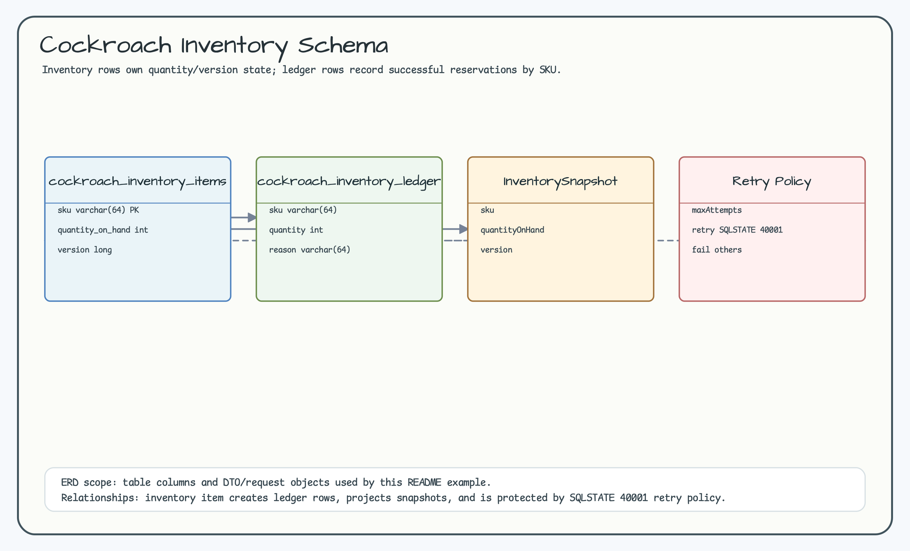
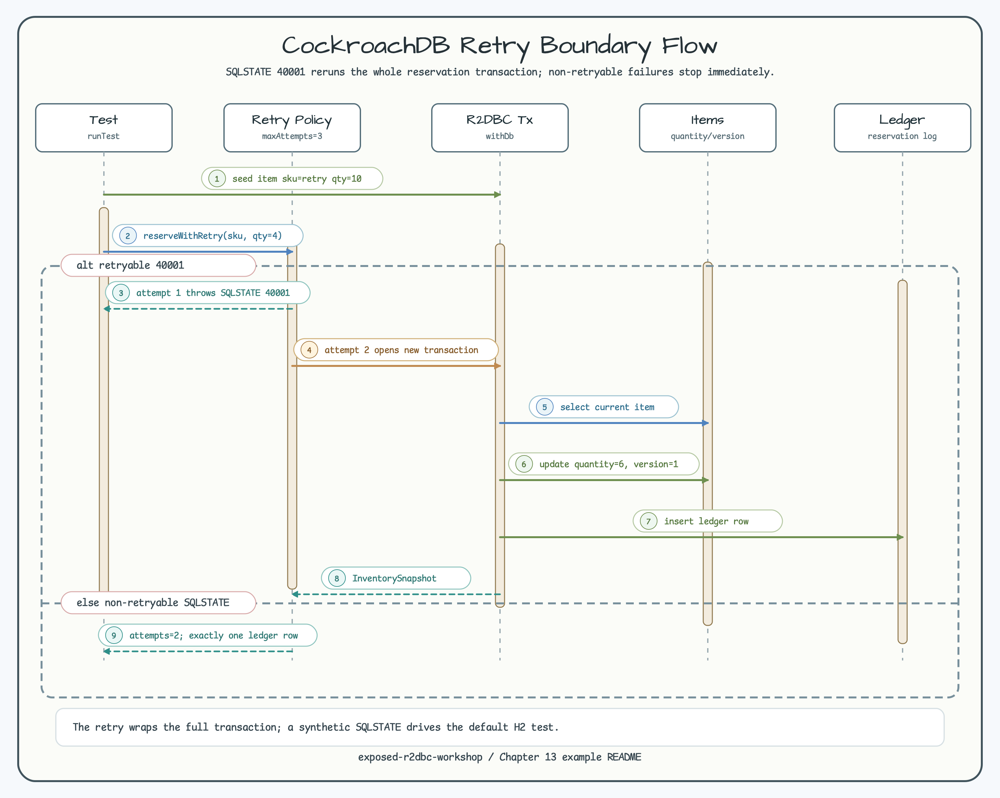

# CockroachDB Retry Boundary

[English](README.md) | [Korean](README.ko.md)

This module models the CockroachDB retry contract without starting a
CockroachDB container by default. SQLSTATE `40001` is treated as retryable and
the reservation transaction is rerun through Exposed R2DBC.

## Scenario

- Seed inventory rows with H2 R2DBC.
- Throw a synthetic `RetryableSqlStateFailure("40001")` on the first attempt.
- Rerun the reservation and persist exactly one ledger row.
- Fail immediately for non-retryable SQLSTATE values.

## Diagrams

The ERD shows inventory state, successful reservation ledger rows, snapshot
projection, and retry policy. The sequence diagram shows the retryable
SQLSTATE branch and the non-retryable failure branch.





## Verification

```bash
./gradlew :03-cockroachdb-retry:test -PuseDB=H2 --console=plain
```
