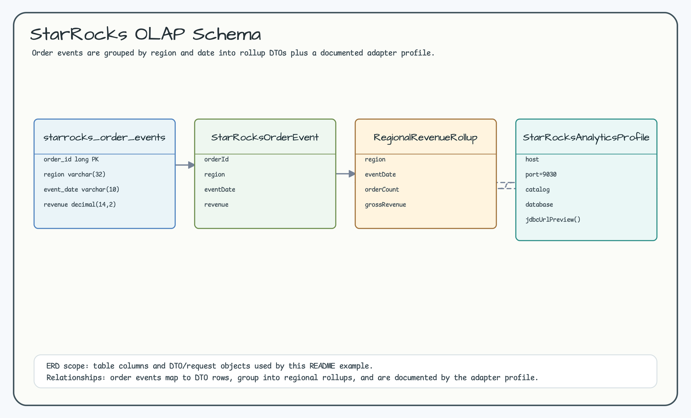
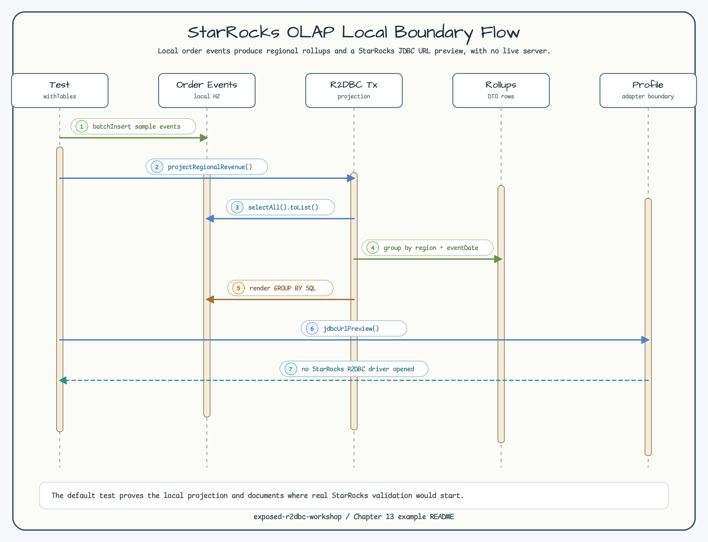

# StarRocks OLAP Local Boundary

[English](README.md) | [한국어](README.ko.md)

이 모듈은 local H2 R2DBC projection으로 StarRocks-style OLAP rollup row를
준비합니다. 실제 검증 경로를 위한 JDBC URL preview는 제공하지만 기본 테스트에서
StarRocks connection을 열지 않습니다.

## 시나리오

- `StarRocksOrderEvents`에 order event를 저장합니다.
- Exposed R2DBC로 daily regional revenue rollup을 projection합니다.
- Grouped rollup SQL statement를 렌더링합니다.
- StarRocks R2DBC applicability boundary를 명시합니다.

## 다이어그램

ERD는 local order event, DTO row, regional rollup, documented adapter profile을
보여줍니다. Sequence Diagram은 local projection과 documentation-only
StarRocks handoff를 보여줍니다.





## 검증

```bash
./gradlew :04-starrocks-olap-local:test -PuseDB=H2 --console=plain
```
