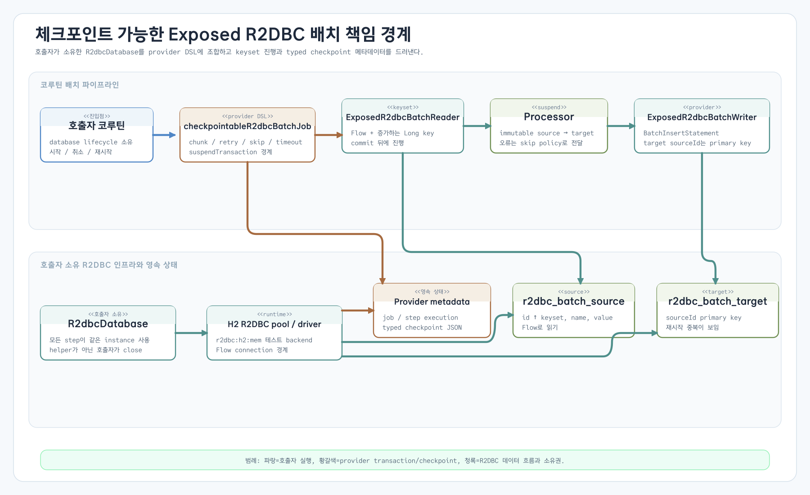
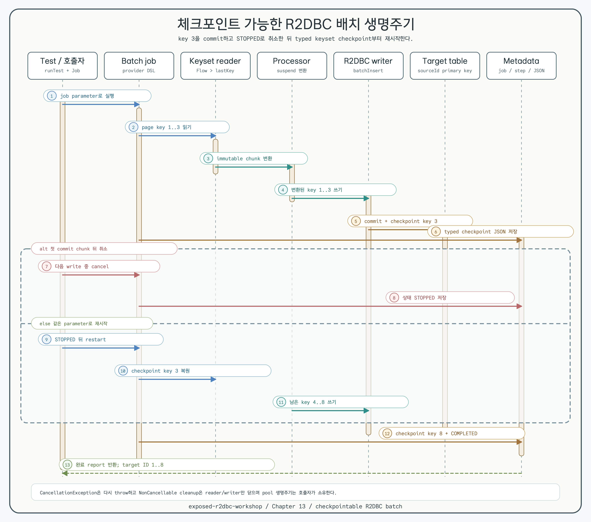

# Checkpointable Exposed R2DBC Batch

[English](README.md)

이 모듈은
[`exposed-workshop/13-ecosystem-integrations/11-checkpointable-batch`](https://github.com/bluetape4k/exposed-workshop/tree/develop/13-ecosystem-integrations/11-checkpointable-batch)의
JDBC checkpointable batch workshop에 대응하는 R2DBC sibling입니다. published
bluetape4k batch provider를 직접 조합하여 reader, chunk writer, metadata
repository, checkpoint, restart 경계를 coroutine-first 예제로 보여 줍니다.

## 범위와 provider 계약

job은 caller-owned `R2dbcDatabase`와 함께 `ExposedR2dbcBatchJobRepository`,
`ExposedR2dbcBatchReader`, `ExposedR2dbcBatchWriter`를 사용합니다. Database
접근은 provider 내부의 `suspendTransaction`으로 수행합니다. 이 모듈은 JDBC
호출을 감싸거나 `runBlocking`을 추가하거나 별도의 batch runner를 구현하지
않습니다.

이 workshop이 해석하는 provider artifact는
`io.github.bluetape4k.exposed:bluetape4k-exposed-batch:2.0.0`입니다. 안정
`bluetape4k-dependencies:2.0.0` catalog와 Maven Central을 통해 해석합니다.
이 release에서 R2DBC repository의 metadata table import는
`io.bluetape4k.batch.r2dbc.tables`, codec은 `io.bluetape4k.batch.CheckpointJson`입니다.
Package 이름은 artifact 호환성 경계이며 JDBC transaction을 사용한다는 뜻이
아닙니다. Workshop도 provider의 R2DBC table package를 직접 사용합니다.

upstream PR #747은 2.0.0 release에 포함되어 `FAILED` report의 checkpoint를
보존합니다. 첫 commit chunk 뒤 writer 오류가 발생하면 checkpoint `3`을
저장하고, 같은 parameter로 다시 실행할 때 source key `4`부터 `8`까지
완료하는 실패·재시작 테스트로 검증합니다. 이제 안정 catalog에서 provider를
사용하므로 source workaround는 필요하지 않습니다.

## Schema와 API

`R2dbcBatchSourceTable`은 증가하는 `id`, `name`, `value`를 저장합니다.
`R2dbcBatchTargetTable`은 변환된 row를 저장하고 `sourceId`를 primary key로
사용합니다. 이 primary key는 restart 중 우연한 중복을 조용히 숨기지 않고
관찰 가능하게 만듭니다.

Workshop의 public surface는 다음과 같습니다.

- `R2dbcSourceRecord`, `R2dbcTargetRecord` — 변경할 수 없는 source/target 값입니다.
- `R2dbcBatchOptions` — job parameter, chunk/page size, skip/retry policy,
  commit timeout입니다. 빈 job name과 0 이하 chunk/page size는 즉시
  `IllegalArgumentException`으로 실패합니다.
- `createR2dbcBatchSchema(database)` — 전달받은 database에 provider metadata와
  source/target table을 생성합니다.
- `checkpointableR2dbcBatchJob(database, options, processor, writer)` — provider
  DSL job을 만듭니다.
- `runCheckpointableR2dbcBatch(database, options)` — 기본 변환(이름 대문자화,
  값 두 배)을 실행합니다.

핵심 조합은 다음과 같습니다.

```kotlin
val reader = ExposedR2dbcBatchReader(
    database = database,
    table = R2dbcBatchSourceTable,
    keyColumn = R2dbcBatchSourceTable.id,
    pageSize = options.pageSize,
    rowMapper = { row ->
        R2dbcSourceRecord(
            id = row[R2dbcBatchSourceTable.id],
            name = row[R2dbcBatchSourceTable.name],
            value = row[R2dbcBatchSourceTable.value],
        )
    },
    keyExtractor = R2dbcSourceRecord::id,
    keyClass = Long::class,
)

val job = batchJob(options.jobName) {
    repository(ExposedR2dbcBatchJobRepository(database, CheckpointJson.jackson3()))
    params(options.parameters)
    step<R2dbcSourceRecord, R2dbcTargetRecord>("transform-and-write") {
        reader(reader)
        processor(defaultR2dbcProcessor)
        writer(r2dbcTargetWriter(database))
        chunkSize(options.chunkSize)
        skipPolicy(options.skipPolicy)
        retryPolicy(options.retryPolicy)
        commitTimeout(options.commitTimeout)
    }
}
```

`ExposedR2dbcBatchReader`는 증가하는 keyset으로 page를 읽고
`onChunkCommitted` 이후에만 checkpoint를 전진시킵니다. Helper는
`R2dbcDatabase`나 내부 `ConnectionPool`을 닫지 않으며 lifecycle은 caller가
소유합니다.

## 실행과 restart 흐름



각 chunk는 다음 순서로 실행됩니다.

1. Source page를 읽고 item을 처리합니다.
2. Provider R2DBC writer로 변환한 목록을 씁니다.
3. Chunk를 commit하고 reader key를 전진시킨 뒤 provider metadata table에
   typed checkpoint JSON을 저장합니다.
4. `STOPPED` 또는 `FAILED` 뒤 같은 job parameter로 다시 실행하면 마지막
   checkpoint key 이후부터 재개합니다. key `3` 뒤 writer가 실패하면
   checkpoint `3`을 보존하므로 key `4`부터 시작해 `8`까지 완료합니다.



Lifecycle diagram은 cancellation branch를 중심으로 보여 줍니다. `FAILED`
checkpoint/restart branch는 위 failure matrix와 회귀 테스트로 검증하므로,
공통 lifecycle topology에 집중하는 현재 visual asset을 유지합니다.

Cancellation test는 두 번째 write를 의도적으로 막습니다. 첫 chunk checkpoint가
저장된 뒤 coroutine을 취소하면 job과 step metadata는 `STOPPED`가 되고
`CancellationException`은 caller로 재전파됩니다. 이후 실행은 source key
`4..8`을 처리하며, target primary key와 최종 ID 집합으로 첫 chunk가 다시
기록되지 않았음을 증명합니다.

이 예제는 database checkpoint/restart 예제이지 일반적인 exactly-once side
effect 보장이 아닙니다. provider writer와 checkpoint update도 별도 transaction
이므로 target primary key는 일반 insert를 멱등으로 만들지 않고 replay를
duplicate 오류로 드러냅니다. Writer가 외부 side effect를 commit한 뒤
checkpoint 저장 전에 실패하면 외부 작업은 at-least-once 문제로 남습니다.
Message broker, scheduler, production outbox coordination은 이 모듈의 범위
밖입니다.

## 테스트로 고정한 실패 계약

| 시나리오 | 관찰 가능한 계약 |
|---|---|
| 정상 실행 | 변환된 8개 row, `COMPLETED`, checkpoint `8L` |
| `SkipPolicy.ALL` processor 오류 | 홀수 ID만 기록되고 step은 `COMPLETED_WITH_SKIPS` |
| 일시적인 writer 오류 | `RetryPolicy(maxAttempts = 2, delay = 1.milliseconds)`로 재시도 후 성공 |
| Commit timeout | timeout chunk에 partial target row 없이 skip |
| 재시도하지 않는 writer 오류 | report와 metadata는 `FAILED`, 이전 commit chunk는 보이며 checkpoint `3`을 같은 parameter 재시작에 사용 |
| Coroutine cancellation | `CancellationException` 재전파, job과 step은 `STOPPED` |
| STOPPED restart | 저장된 keyset checkpoint 이후부터 재개하고 target ID 중복 없음 |
| FAILED restart | 저장된 checkpoint `3` 이후 source key `4`부터 `8`까지 완료하고 target ID 중복 없음 |
| 잘못된 option/schema | 양수 경계 적용, 모든 metadata/source/target table 생성 |

## JDBC sibling과 비교

| 관심사 | JDBC sibling | 이 R2DBC 모듈 |
|---|---|---|
| Database API | `Database`와 blocking `transaction` | `R2dbcDatabase`와 `suspendTransaction` |
| Reader/writer | `ExposedJdbcBatchReader`/`ExposedJdbcBatchWriter` | `ExposedR2dbcBatchReader`/`ExposedR2dbcBatchWriter` |
| Flow 경계 | JDBC collection | R2DBC `Flow`를 test/helper에서 의도적으로 collect |
| Cancellation | Thread/blocking lifecycle | Structured coroutine cancellation과 `STOPPED` restart test |
| Target key | `sourceId` primary key | `sourceId` primary key, 같은 중복 관찰성 |

두 모듈은 drop-in migration layer가 아니라 별도의 학습 sibling입니다. Blocking
Exposed transaction이 integration 경계이면 JDBC 예제를, native R2DBC suspension,
Flow consumption, coroutine cancellation이 경계이면 이 모듈을 선택합니다.

## 실행과 검증

```bash
./gradlew :09-checkpointable-r2dbc-batch:test -PuseDB=H2
./gradlew :09-checkpointable-r2dbc-batch:build -PuseDB=H2
```

기본 backend는 local H2 R2DBC이며 shared workshop fixture는 UTC로 테스트합니다.
다른 DB matrix, Testcontainers, production scheduler, Actuator/metrics, reactive
transaction manager는 이 예제에서 제공하지 않습니다.
