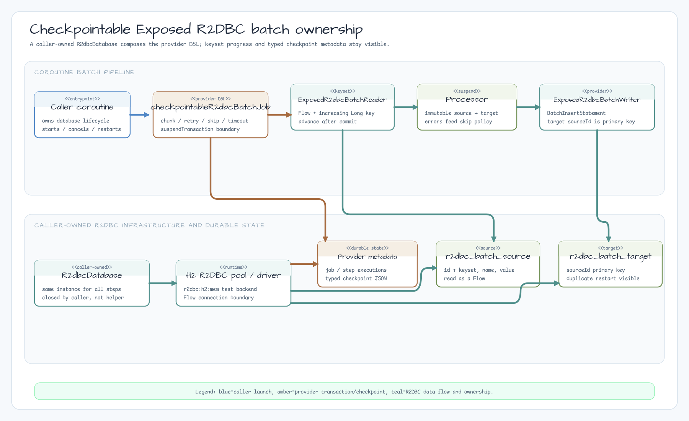
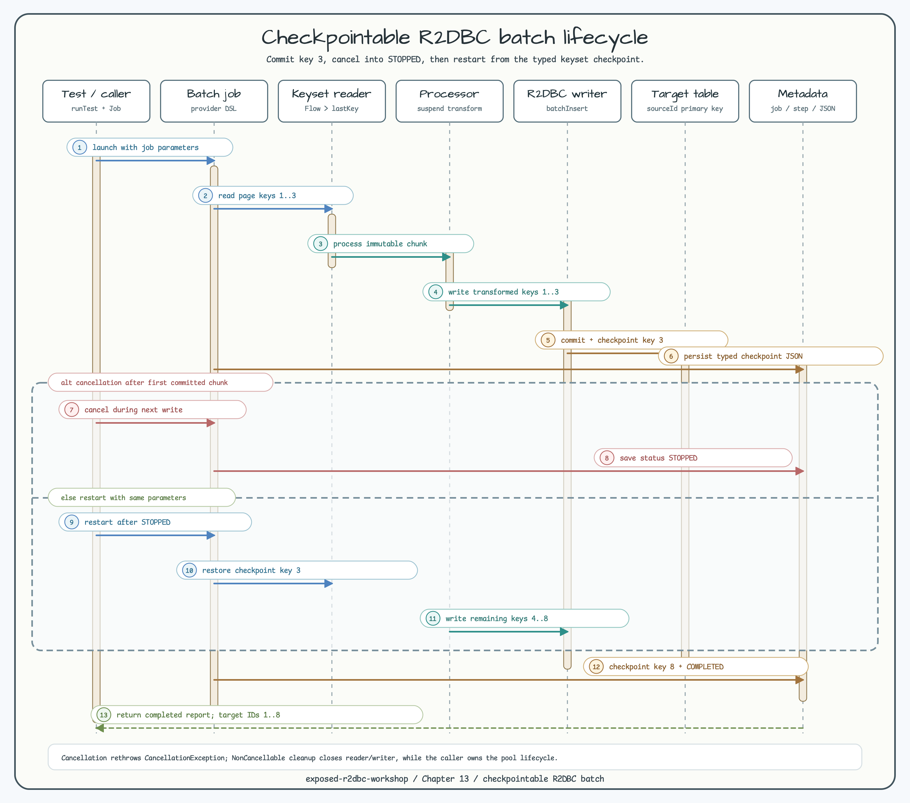

# Checkpointable Exposed R2DBC Batch

[한국어](README.ko.md)

This module is the R2DBC sibling of the JDBC checkpointable batch workshop in
[`exposed-workshop/13-ecosystem-integrations/11-checkpointable-batch`](https://github.com/bluetape4k/exposed-workshop/tree/develop/13-ecosystem-integrations/11-checkpointable-batch).
It composes the published bluetape4k batch provider directly so the reader,
chunk writer, metadata repository, checkpoint, and restart boundaries remain
visible in a coroutine-first example.

## Scope and provider contract

The job uses `ExposedR2dbcBatchJobRepository`, `ExposedR2dbcBatchReader`, and
`ExposedR2dbcBatchWriter` with a caller-owned `R2dbcDatabase`. Database access
is performed by the provider through `suspendTransaction`; this module does
not wrap JDBC calls, add `runBlocking`, or implement a second batch runner.

The provider artifact resolved by this workshop is
`io.github.bluetape4k.exposed:bluetape4k-exposed-batch:1.12.1`. In that published
artifact, the R2DBC repository imports its metadata tables from
`io.bluetape4k.batch.jdbc.tables.*` and its codec from
`io.bluetape4k.batch.internal.CheckpointJson`. The package name is an artifact
compatibility boundary, not a JDBC transaction requirement. The workshop does
not import the newer, unreleased `io.bluetape4k.batch.r2dbc.tables` package and
does not add a workaround for provider Issue #745.

There is an important version boundary: upstream PR #747 fixes preservation of a
checkpoint in a `FAILED` report, but it was merged after the `1.12.1` release and
has not been published to Maven Central yet. This workshop therefore proves
`STOPPED` restart with `1.12.1`; it does not claim `FAILED`-run restart until a
provider release containing that fix is resolved.

## Schema and API

`R2dbcBatchSourceTable` stores an increasing `id`, `name`, and `value`.
`R2dbcBatchTargetTable` stores the transformed row and uses `sourceId` as its
primary key. The primary key makes an accidental duplicate visible during a
restart instead of silently hiding it.

The public workshop surface is:

- `R2dbcSourceRecord` and `R2dbcTargetRecord` — immutable source/target values.
- `R2dbcBatchOptions` — job parameters, chunk/page size, skip/retry policies,
  and commit timeout. Blank job names and non-positive chunk/page sizes fail
  immediately with `IllegalArgumentException`.
- `createR2dbcBatchSchema(database)` — creates provider metadata plus source and
  target tables in the supplied database.
- `checkpointableR2dbcBatchJob(database, options, processor, writer)` — builds
  the provider DSL job.
- `runCheckpointableR2dbcBatch(database, options)` — runs the default transform
  (`uppercase` name and doubled value).

The essential composition is:

```kotlin
val reader = ExposedR2dbcBatchReader(
    database = database,
    table = R2dbcBatchSourceTable,
    keyColumn = R2dbcBatchSourceTable.id,
    pageSize = options.pageSize,
    rowMapper = { row ->
        R2dbcSourceRecord(
            id = row[R2dbcBatchSourceTable.id],
            name = row[R2dbcBatchSourceTable.name],
            value = row[R2dbcBatchSourceTable.value],
        )
    },
    keyExtractor = R2dbcSourceRecord::id,
    keyClass = Long::class,
)

val job = batchJob(options.jobName) {
    repository(ExposedR2dbcBatchJobRepository(database, CheckpointJson.jackson3()))
    params(options.parameters)
    step<R2dbcSourceRecord, R2dbcTargetRecord>("transform-and-write") {
        reader(reader)
        processor(defaultR2dbcProcessor)
        writer(r2dbcTargetWriter(database))
        chunkSize(options.chunkSize)
        skipPolicy(options.skipPolicy)
        retryPolicy(options.retryPolicy)
        commitTimeout(options.commitTimeout)
    }
}
```

`ExposedR2dbcBatchReader` reads pages with an increasing keyset and advances its
checkpoint only after `onChunkCommitted`. The helper owns neither the
`R2dbcDatabase` nor an underlying `ConnectionPool`; the caller owns their
lifecycle.

## Execution and restart flow



Each chunk follows this order:

1. Read a source page and process the items.
2. Write the transformed list with the provider R2DBC writer.
3. Commit the chunk, advance the reader key, and persist typed checkpoint JSON
   in the provider metadata tables.
4. On a later run after `STOPPED` with the same job parameters, resume after the
   last committed key. `FAILED`-run restart awaits the provider fix described
   above.



The cancellation test deliberately blocks the second write. After the first
chunk checkpoint is persisted, cancelling the coroutine leaves job and step
metadata in `STOPPED`, rethrows `CancellationException`, and allows a later run
to finish source keys `4..8`. The target primary key and final ID set prove that
the committed first chunk is not written twice.

This is a database checkpoint/restart example, not a general exactly-once
side-effect guarantee. If a writer commits an external side effect and fails
before its checkpoint is saved, the external operation remains an at-least-once
concern. The provider writer and checkpoint update also use separate transactions;
the target primary key exposes a replay as a duplicate error rather than making a
plain insert idempotent. Message brokers, schedulers, and production outbox
coordination are outside this module.

## Failure contract covered by tests

| Scenario | Observable contract |
|---|---|
| Normal run | Eight transformed rows, `COMPLETED`, checkpoint `8L` |
| Processor error with `SkipPolicy.ALL` | Odd IDs are written and step is `COMPLETED_WITH_SKIPS` |
| Transient writer error | `RetryPolicy(maxAttempts = 2, delay = 1.milliseconds)` retries and succeeds |
| Commit timeout | Timed-out chunk is skipped without partial target rows |
| Non-retryable writer error | Report and metadata remain `FAILED`; committed earlier chunks remain visible; failed-run restart is provider-version dependent |
| Coroutine cancellation | `CancellationException` is rethrown; job and step become `STOPPED` |
| STOPPED restart | Saved keyset checkpoint resumes after the committed chunk with no duplicate target IDs |
| Invalid options/schema | Positive boundaries are enforced and all metadata/source/target tables are created |

## JDBC sibling comparison

| Concern | JDBC sibling | This R2DBC module |
|---|---|---|
| Database API | `Database` and blocking `transaction` | `R2dbcDatabase` and `suspendTransaction` |
| Reader/writer | `ExposedJdbcBatchReader`/`ExposedJdbcBatchWriter` | `ExposedR2dbcBatchReader`/`ExposedR2dbcBatchWriter` |
| Flow boundary | JDBC collection | R2DBC `Flow` is intentionally collected in tests/helpers |
| Cancellation | Thread/blocking lifecycle | Structured coroutine cancellation and `STOPPED` restart test |
| Target key | `sourceId` primary key | `sourceId` primary key, with the same duplicate observability |

The modules are separate teaching siblings rather than a drop-in migration
layer. Choose the JDBC example when a blocking Exposed transaction is the
integration boundary; choose this module when native R2DBC suspension, Flow
consumption, and coroutine cancellation are the boundary.

## Run and verify

```bash
./gradlew :09-checkpointable-r2dbc-batch:test -PuseDB=H2
./gradlew :09-checkpointable-r2dbc-batch:build -PuseDB=H2
```

The default backend is local H2 R2DBC. The shared workshop fixture keeps tests
in UTC. Other database matrices, Testcontainers, a production scheduler,
Actuator/metrics, and a reactive transaction manager are intentionally not
provided by this example.
