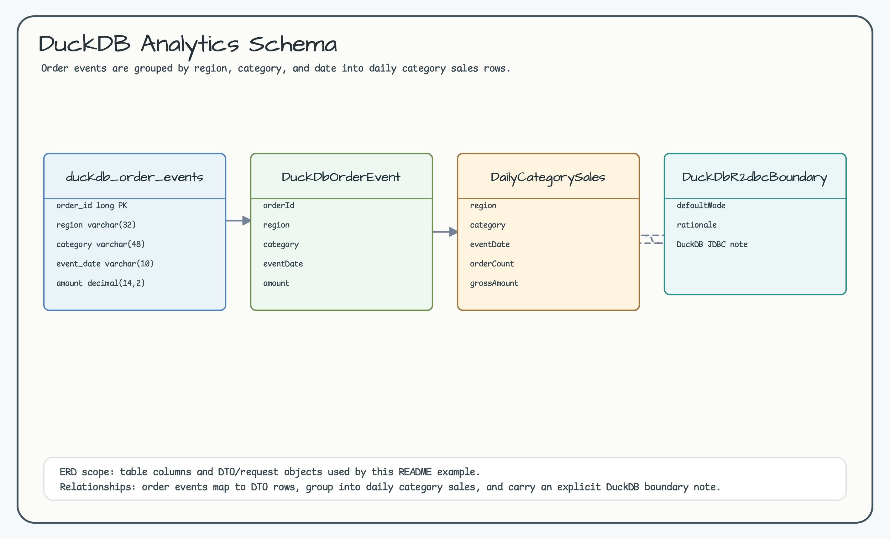
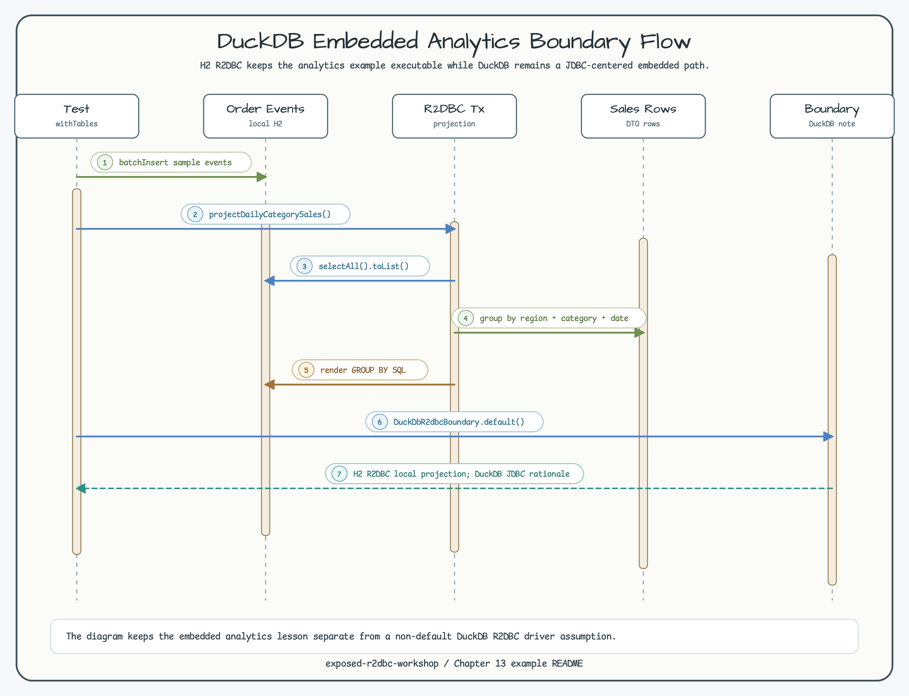

# DuckDB Embedded Analytics Boundary

[English](README.md) | [한국어](README.ko.md)

This module keeps the embedded analytics lesson from the source workshop while
making the R2DBC boundary explicit. Default tests use H2 R2DBC local projection
instead of opening a DuckDB JDBC session.

## Scenario

- Insert order events into `DuckDbOrderEvents`.
- Project daily category sales through Exposed R2DBC.
- Render grouped analytics SQL.
- Document why DuckDB remains a JDBC-centered embedded engine in this workshop.

## Diagrams

The ERD shows local order events, DTO rows, daily category sales, and the
DuckDB boundary note. The sequence diagram shows the H2 R2DBC projection while
keeping the DuckDB path explicit and non-default.





## Verification

```bash
./gradlew :09-duckdb-embedded-analytics:test -PuseDB=H2 --console=plain
```
