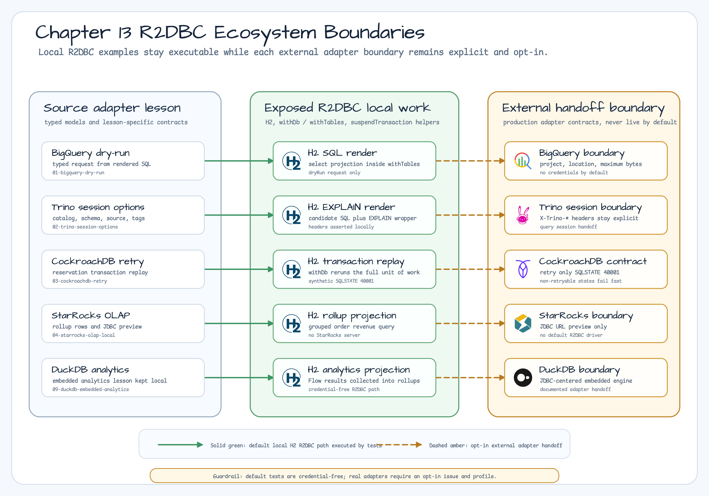

# 13장: Ecosystem Integrations

[English](README.md) | [한국어](README.ko.md)

13장은 R2DBC에서 안전하게 다룰 수 있는 ecosystem integration 예제를
소개합니다. 원본 `exposed-workshop` 13장은 cloud warehouse, distributed SQL
engine, embedded analytics store를 포함합니다. 이 R2DBC workshop은 같은 학습
목표를 유지하되, 기본 실행 경로는 local, deterministic, credential-free로
제한합니다.

## 모듈

| 모듈 | 시나리오 | 기본 실행 |
|---|---|---|
| [`01-bigquery-dry-run`](01-bigquery-dry-run/) | 로컬에서 렌더링한 Exposed R2DBC SQL로 typed BigQuery dry-run request를 구성 | H2 R2DBC SQL 렌더링, BigQuery credential 없음 |
| [`02-trino-session-options`](02-trino-session-options/) | Trino catalog/schema/source/tag/session property를 query boundary에서 명시 | H2 R2DBC SQL 렌더링과 EXPLAIN request shape |
| [`03-cockroachdb-retry`](03-cockroachdb-retry/) | CockroachDB retryable SQLSTATE `40001`에서 inventory reservation transaction을 재실행 | H2 R2DBC transaction replay와 synthetic SQLSTATE failure |
| [`04-starrocks-olap-local`](04-starrocks-olap-local/) | OLAP rollup row를 준비하고 StarRocks adapter boundary를 문서화 | H2 R2DBC local projection, StarRocks server 없음 |
| [`09-duckdb-embedded-analytics`](09-duckdb-embedded-analytics/) | Embedded analytics lesson을 유지하면서 DuckDB JDBC boundary를 문서화 | H2 R2DBC local projection, DuckDB driver 없음 |

각 예제 README는 별도의 ERD와 Sequence Diagram을 포함합니다. Source를 먼저 열지
않아도 local schema/request model과 기본 실행 흐름을 확인할 수 있습니다.

## 아키텍처

13장은 세 가지 경계를 분리합니다.



초록 실선 화살표는 테스트가 실행하는 기본 local H2 R2DBC 경로입니다. 황색
점선 화살표는 opt-in external adapter handoff boundary이며, request와 driver
contract를 문서화하지만 기본값으로 live vendor system을 호출하지 않습니다.

| 경계 | 책임 | 기본 테스트 전략 |
|---|---|---|
| Typed adapter model | Production code가 외부 시스템에 넘겨야 하는 option을 명시적으로 표현 | Data class validation과 header/request assertion |
| Exposed R2DBC local work | `suspendTransaction` helper 안에서 SQL 렌더링, Flow 수집, transaction retry 수행 | `withDb` / `withTables` 기반 H2 R2DBC |
| External system handoff | 실제 BigQuery, Trino, CockroachDB, StarRocks, DuckDB adapter가 위치할 경계 설명 | Documentation-only 또는 synthetic failure, 기본 live 호출 없음 |

기본 테스트는 실제 credential, 외부 network, vendor container를 요구하지
않습니다. 실제 adapter가 필요해지면 별도의 opt-in issue와 test profile 뒤에
추가합니다.

## Source Example Parity

| `exposed-workshop` 예제 | R2DBC 대응 | Coverage 결정 |
|---|---|---|
| `01-bigquery-dry-run` | `01-bigquery-dry-run` | Typed dry-run request와 local R2DBC SQL 렌더링으로 cover |
| `02-trino-session-options` | `02-trino-session-options` | Typed session header와 local R2DBC EXPLAIN SQL로 cover |
| `03-cockroachdb-retry` | `03-cockroachdb-retry` | SQLSTATE retry policy와 H2 R2DBC transaction replay로 cover |
| `04-starrocks-olap-local` | `04-starrocks-olap-local` | Local OLAP projection과 명시적 StarRocks R2DBC boundary로 cover |
| `09-duckdb-embedded-analytics` | `09-duckdb-embedded-analytics` | Local analytics projection과 명시적 DuckDB JDBC boundary로 cover |
| `05-ktor-exposed-integration` | 향후 issue #116 | Framework integration scope |
| `06-spring-modulith-publications` | 향후 issue #116 | Framework integration scope |
| `07-ddd-aggregate-repository` | 향후 issue #117 | Domain modeling scope |
| `08-ddd-modulith-boundaries` | 향후 issue #117 | Domain modeling scope |

## Adapter Boundary Notes

- BigQuery dry-run test는 request shape만 검증합니다. Production client 호출은
  database transaction 밖에서 수행해야 합니다.
- Trino session test는 catalog, schema, source, client tag, session property를
  header로 명시합니다.
- CockroachDB retry 예제는 SQLSTATE `40001`만 retry하며, non-retryable
  SQLSTATE는 즉시 실패합니다.
- StarRocks 예제는 local rollup row와 JDBC URL preview를 만들지만 기본
  StarRocks R2DBC driver가 있다고 가정하지 않습니다.
- DuckDB 예제는 embedded analytics 개념을 local로 유지합니다. 이 workshop은
  DuckDB를 JDBC 중심 embedded engine으로 보고 H2 R2DBC projection을 사용합니다.

## 검증

```bash
./gradlew projects --console=plain
repo-test-summary -- ./gradlew :01-bigquery-dry-run:test :02-trino-session-options:test :03-cockroachdb-retry:test :04-starrocks-olap-local:test :09-duckdb-embedded-analytics:test -PuseDB=H2 --continue --console=plain
```

`.github/workflows/Examples.yml`는 Chapter 13 파일, root README, shared
infrastructure, Gradle 파일, workflow 자체가 바뀔 때 같은 Chapter 13 H2 smoke
coverage를 실행합니다.
