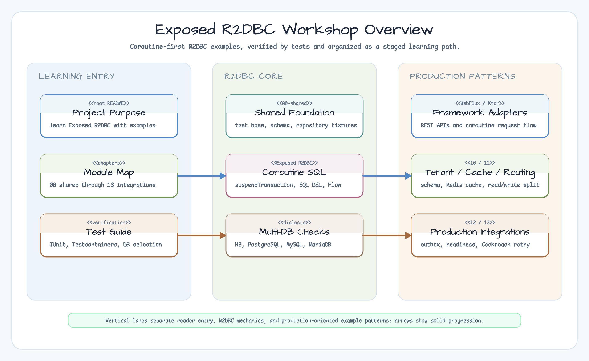
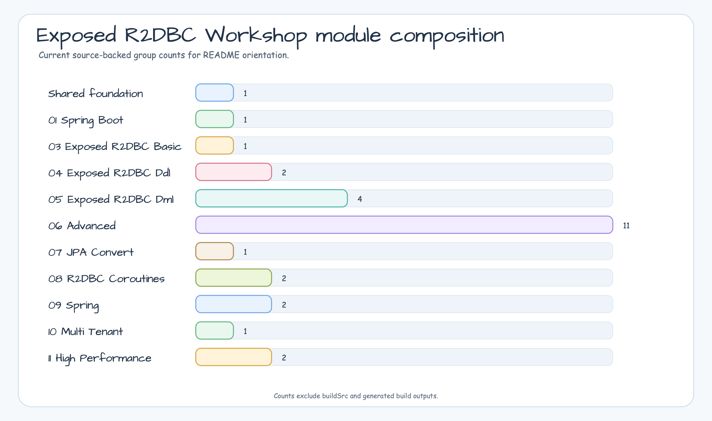
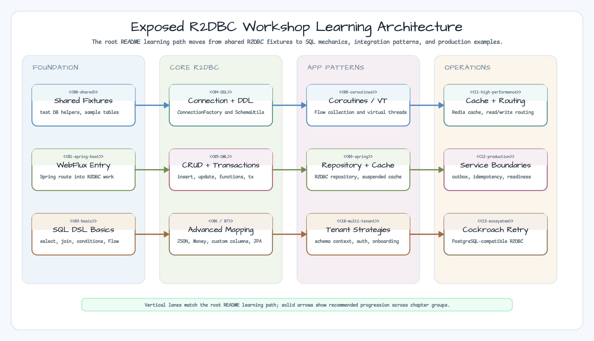
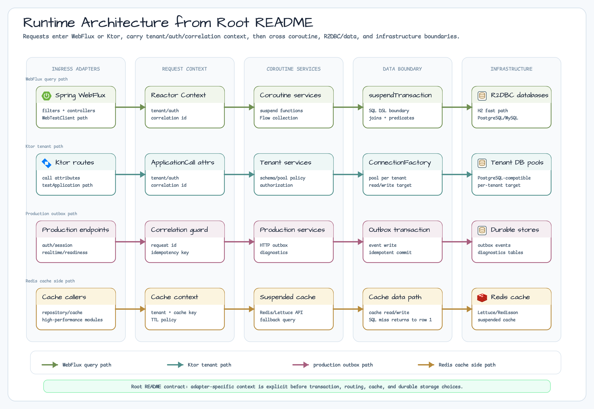
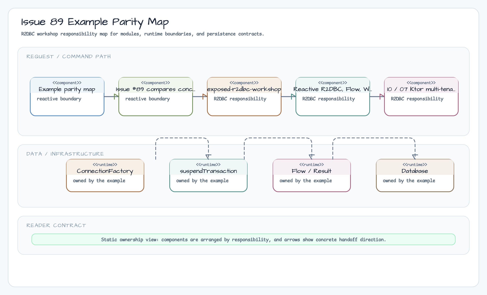
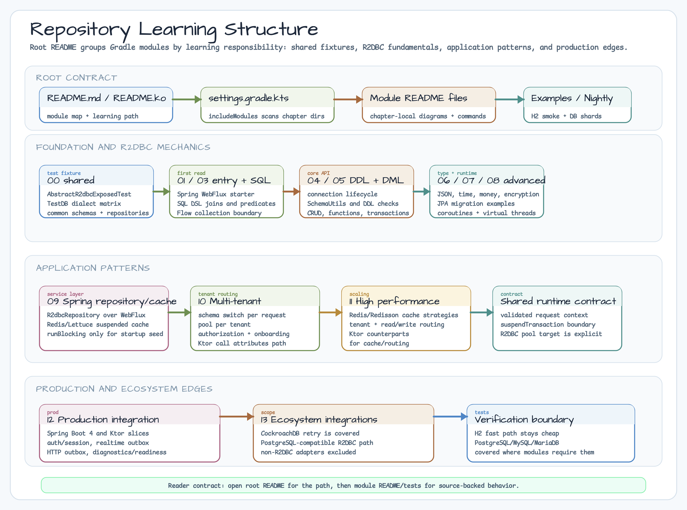

# Exposed R2DBC Workshop

> Korean version: [README.ko.md](README.ko.md)

[](https://github.com/bluetape4k/exposed-r2dbc-workshop/actions/workflows/ci.yml)
[](https://kotlinlang.org)
[](https://openjdk.org)
[](LICENSE)


This multi-module workshop organizes Kotlin Exposed R2DBC examples step by step.
It teaches practical patterns such as Reactive SQL DSL, Coroutines, Spring WebFlux,
multi-tenancy, caching, and routing through examples and tests.

## Project Purpose

`exposed-r2dbc-workshop` teaches Kotlin Exposed R2DBC with coroutine-first,
test-backed examples for reactive database access, WebFlux integration,
schema lifecycle, DDL/DML, multi-tenancy, cache, and routing patterns.

## What It Provides

- **Reactive SQL learning path** from shared test infrastructure to high-performance routing.
- **Coroutine/R2DBC examples** with `suspendTransaction`, Flow collection, WebFlux, and Ktor request handling.
- **JDK 25 Virtual Threads example** using the `bluetape4k-virtualthread-jdk25:2.1.0-SNAPSHOT` provider selected by the `bluetape4k-dependencies:2.1.0-SNAPSHOT` BOM.
- **Multi-database verification** for H2, PostgreSQL, MySQL, and MariaDB.
- **Production patterns** for repository, cache, multi-tenant schema, routing datasource,
  realtime outbox, HTTP client outbox/idempotency, observability/readiness, and
  checkpointable batch restart examples.

For a detailed explanation, see the [Kotlin Exposed Book](https://debop.notion.site/Kotlin-Exposed-Book-1ad2744526b080428173e9c907abdae2).

<!-- README_VISUAL_OVERVIEW:START -->
## Overview Diagram



## Module Composition Chart


<!-- README_VISUAL_OVERVIEW:END -->

## Key Points

- Kotlin `2.3.20`, JDK `25+`, Exposed `1.1.1`, Spring Boot `3.5.11`, Bluetape4k `2.1.0-SNAPSHOT`
- Most examples are test-driven, so following the tests is a practical way to learn alongside the code.
- Scenarios are verified with H2, PostgreSQL, and MySQL.
- Spring/WebFlux and Ktor modules include REST API, cache, multi-tenancy, and routing examples.

## Requirements

- JDK 25 or later
- Docker, Colima, or another environment capable of running Testcontainers
- Gradle Wrapper is recommended

## Quick Start

```bash
# Run all tests
./gradlew test

# Fast tests using H2 only
./gradlew test -PuseFastDB=true

# Select specific databases
./gradlew test -PuseDB=H2,POSTGRESQL

# Test specific modules
./gradlew :05-exposed-r2dbc-repository-coroutines:test
./gradlew :07-multitenant-ktor:test
./gradlew :06-routing-datasource-ktor-r2dbc:test

# Run a Spring example
./gradlew :07-spring-suspended-cache:bootRun
```

## Testing Guide

- The default regression command is `./gradlew test`.
- If Docker resources are limited or you want to reduce database startup time, start with `-PuseFastDB=true`.
- To check only selected dialects, use a value such as `-PuseDB=H2,POSTGRESQL`.
- Database/Testcontainers modules consume significant resources, so module-level validation is more efficient during development.

## Recommended Learning Path



1. Spring entry point: [01-spring-boot/spring-webflux-exposed](01-spring-boot/spring-webflux-exposed/README.md)
2. SQL DSL fundamentals: [03-exposed-r2dbc-basic/exposed-r2dbc-sql-example](03-exposed-r2dbc-basic/exposed-r2dbc-sql-example/README.md)
3. DDL/DML patterns: [04-exposed-r2dbc-ddl](04-exposed-r2dbc-ddl/01-connection/README.md), [05-exposed-r2dbc-dml](05-exposed-r2dbc-dml/01-dml/README.md)
4. Advanced features: [06-advanced](06-advanced/README.md)
5. JPA migration: [07-jpa-convert/01-convert-jpa-basic](07-jpa-convert/01-convert-jpa-basic/README.md)
6. Coroutines / Virtual Threads: [08-r2dbc-coroutines](08-r2dbc-coroutines/01-exposed-r2dbc-coroutines-basic/README.md), [Virtual Threads (JDK25)](08-r2dbc-coroutines/02-exposed-r2dbc-virtualthreads-basic/README.md)
7. Spring repository variants: [09-spring/05-exposed-r2dbc-repository-coroutines](09-spring/05-exposed-r2dbc-repository-coroutines/README.md) (manual), [09-spring/06-exposed-spring-boot-r2dbc-repository](09-spring/06-exposed-spring-boot-r2dbc-repository/README.md) (provider adapter)
8. Multi-tenancy / performance: [10-multi-tenant](10-multi-tenant/README.md), [11-high-performance](11-high-performance/README.md)
9. Production integration: [12-production-integration](12-production-integration/README.md)
10. Ecosystem integrations: [13-ecosystem-integrations](13-ecosystem-integrations/README.md), including the [checkpointable R2DBC batch](13-ecosystem-integrations/09-checkpointable-r2dbc-batch/README.md) sibling

## Module Map

| Group                    | Description                                     | Representative document                                                       |
|--------------------------|-----------------------------------------------|-------------------------------------------------------------------------------|
| `00-shared`              | Shared test infrastructure, schemas, and sample repositories                    | [Shared](00-shared/exposed-r2dbc-shared/README.md)                            |
| `01-spring-boot`         | Spring WebFlux + Exposed R2DBC integration                                      | [Spring WebFlux](01-spring-boot/spring-webflux-exposed/README.md)             |
| `02-alternatives-to-jpa` | JPA alternative patterns (JDBC Template, JOOQ, and others)                       | Not present in this checkout                                                  |
| `03-exposed-r2dbc-basic` | SQL DSL fundamentals, joins, and predicates                                      | [SQL Example](03-exposed-r2dbc-basic/exposed-r2dbc-sql-example/README.md)     |
| `04-exposed-r2dbc-ddl`   | Connection management, DDL, and schema control                                   | [Connection](04-exposed-r2dbc-ddl/01-connection/README.md)                    |
| `05-exposed-r2dbc-dml`   | CRUD, functions, types, and transactions                                        | [DML](05-exposed-r2dbc-dml/01-dml/README.md)                                  |
| `06-advanced`            | Encryption, JSON, Money, custom columns, Jackson, and Tink                      | [Advanced](06-advanced/README.md)                                             |
| `07-jpa-convert`         | Converting JPA patterns to Exposed R2DBC                                         | [JPA Convert](07-jpa-convert/01-convert-jpa-basic/README.md)                  |
| `08-r2dbc-coroutines`    | Coroutines, Flow, Virtual Threads (JDK25 provider) | [Coroutines](08-r2dbc-coroutines/01-exposed-r2dbc-coroutines-basic/README.md), [Virtual Threads](08-r2dbc-coroutines/02-exposed-r2dbc-virtualthreads-basic/README.md) |
| `09-spring`              | Manual/provider repository patterns, Redis-backed suspended cache | [Manual Repository](09-spring/05-exposed-r2dbc-repository-coroutines/README.md), [Provider Adapter](09-spring/06-exposed-spring-boot-r2dbc-repository/README.md) |
| `10-multi-tenant`        | Schema, connection-factory, authorization, and onboarding multi-tenancy with WebFlux/Ktor | [Multi-Tenant Strategies](10-multi-tenant/README.md) |
| `11-high-performance`    | Cache strategies, routing datasource, read/write separation, and Ktor comparison | [High Performance](11-high-performance/README.md)                             |
| `12-production-integration` | Spring Boot 4/Ktor production service patterns, realtime replay, HTTP client outbox/idempotency, request correlation/readiness diagnostics | [Production Integration](12-production-integration/README.md)                 |
| `13-ecosystem-integrations` | CockroachDB retry, Ktor, custom Spring Modulith publication, DDD aggregate/boundary, and checkpointable batch examples through R2DBC | [Ecosystem Integrations](13-ecosystem-integrations/README.md)                 |

## Notable Examples

- [09-spring/05-exposed-r2dbc-repository-coroutines](09-spring/05-exposed-r2dbc-repository-coroutines/README.md)
  Spring WebFlux + Coroutines + Exposed repository patterns
- [09-spring/06-exposed-spring-boot-r2dbc-repository](09-spring/06-exposed-spring-boot-r2dbc-repository/README.md)
  Spring Boot repository scanning, provider mapping, and single-call/outer transaction boundaries
- [09-spring/07-spring-suspended-cache](09-spring/07-spring-suspended-cache/README.md)
  A combination of the Lettuce coroutine cache and Exposed repositories
- [10-multi-tenant](10-multi-tenant/README.md)
  A comparison of schema, connection-factory, authorization, and onboarding strategies
- [10-multi-tenant/03-multitenant-spring-webflux](10-multi-tenant/03-multitenant-spring-webflux/README.md)
  Reactor Context + Coroutine Context tenant propagation
- [10-multi-tenant/06-tenant-onboarding-spring-webflux](10-multi-tenant/06-tenant-onboarding-spring-webflux/README.md)
  Runtime tenant metadata reservation, R2DBC pool provisioning, and failure cleanup
- [10-multi-tenant/07-multitenant-ktor](10-multi-tenant/07-multitenant-ktor/README.md)
  Ktor call-attribute based schema-per-tenant request flow
- [10-multi-tenant/08-resilient-tenant-onboarding-spring-webflux](10-multi-tenant/08-resilient-tenant-onboarding-spring-webflux/README.md)
  Token/TTL-based tenant onboarding lifecycle and restart recovery
- [11-high-performance/03-routing-datasource](11-high-performance/03-routing-datasource/README.md)
  Reactor Context based tenant/read-write routing datasource
- [11-high-performance/04-cache-strategies-ktor-r2dbc](11-high-performance/04-cache-strategies-ktor-r2dbc/README.md),
  [11-high-performance/05-cache-strategies-ktor-r2dbc-coroutines](11-high-performance/05-cache-strategies-ktor-r2dbc-coroutines/README.md),
  [11-high-performance/06-routing-datasource-ktor-r2dbc](11-high-performance/06-routing-datasource-ktor-r2dbc/README.md),
  [11-high-performance/07-cache-strategies-r2dbc-caffeine](11-high-performance/07-cache-strategies-r2dbc-caffeine/README.md)
  A comparison of Ktor R2DBC cache, coroutine single-flight cache, routing datasource, and provider-backed Caffeine adapter
- [12-production-integration](12-production-integration/README.md)
  Spring Boot 4/Ktor production service boundary comparison
- [12-production-integration/01-spring-production-integration](12-production-integration/01-spring-production-integration/README.md),
  [12-production-integration/02-ktor-production-integration](12-production-integration/02-ktor-production-integration/README.md)
  HTTP client outbox/idempotency plus request-correlation and readiness diagnostics
- [13-ecosystem-integrations](13-ecosystem-integrations/README.md)
  CockroachDB retry, Ktor, custom Spring Modulith publication, DDD aggregate/boundary, and checkpointable batch R2DBC examples; BigQuery, Trino, StarRocks, and DuckDB are documented as out of R2DBC scope
- [13-ecosystem-integrations/09-checkpointable-r2dbc-batch](13-ecosystem-integrations/09-checkpointable-r2dbc-batch/README.md)
  Provider-native keyset reader/writer, typed checkpoint metadata, cancellation `STOPPED`, and duplicate-visible `STOPPED` restart proof

## Architecture diagram



The workshop README set should explain examples with rendered PNG diagrams first.
The root architecture shows the shared mental model:

- Spring WebFlux and Ktor adapters collect request context such as tenant, auth, and correlation IDs.
- Coroutine services use repository, cache, multi-tenant, and production integration patterns.
- All database work enters Exposed through `suspendTransaction`, SQL DSL/Flow collection, and R2DBC `ConnectionFactory` routing.
- Infrastructure examples cover primary/replica databases, Redis-backed suspended cache, and outbox/idempotency storage.

## Example parity with exposed-workshop



Issue [#89](https://github.com/bluetape4k/exposed-r2dbc-workshop/issues/89) tracks concept-level parity with
[`exposed-workshop`](https://github.com/bluetape4k/exposed-workshop), not exact module-name parity. R2DBC-only and
JDBC-only architecture choices remain distinct when the API model is different.

| Topic in `exposed-workshop` | R2DBC counterpart | Decision |
|-----------------------------|-------------------|----------|
| Ktor examples epic `#45` and multi-tenant `#46` | Closed R2DBC issues `#32`, `#33`; module `10-multi-tenant/07-multitenant-ktor` | Covered by counterpart |
| Ktor cache/routing issues `#47`, `#48`, `#49`, `#50` | Closed R2DBC issues `#34`, `#35`, `#36`, `#69`; modules `11-high-performance/04-06-*` | Covered by counterpart |
| Spring Boot tenant strategy issues `#51`, `#55`, `#56` | Closed R2DBC issues `#37`-`#42`; modules `10-multi-tenant/03-06-*` | Covered by counterpart |
| Chapter 12 production integration epic `#57` | Closed R2DBC issues `#43`-`#49`; modules `12-production-integration/01-*`, `02-*` | Covered by counterpart |
| Chapter 13 ecosystem integrations | R2DBC issues `#113`, `#115`, `#116`, `#117`, `#205`; modules `13-ecosystem-integrations/03`, `05`-`09` | CockroachDB retry, Ktor, custom Spring Modulith publication, DDD aggregate/boundary, and checkpointable batch paths are covered; BigQuery/Trino/StarRocks/DuckDB remain excluded as JDBC/HTTP/native-client centered |
| R2DBC connection-factory-per-tenant | Closed R2DBC issue `#39`; no exact JDBC equivalent | Platform-specific, no duplicate issue |
| JDBC DAO/entities, transaction template, benchmark | Blocking/JDBC-only modules in `exposed-workshop` | Platform-specific, no duplicate issue |

## Key Exposed v1 Changes

The package moved from `org.jetbrains.exposed` to `org.jetbrains.exposed.v1`.

| Before | After |
|---------|---------|
| `org.jetbrains.exposed.sql` | `org.jetbrains.exposed.v1.core` |
| `org.jetbrains.exposed.dao` | `org.jetbrains.exposed.v1.dao` |
| `Transaction.exec(...)` | `suspendTransaction { ... }` (R2DBC) |
| Immediate `selectAll()` result | `selectAll()` returns a Flow |
| Immediate `insert { }` execution | Suspending `insert { }` execution |

**Important:** In R2DBC, all database access must run inside a `suspendTransaction` block.
The `withDb(testDB) { }` / `withTables(testDB, *tables) { }` helpers keep test code concise.

## Adding a New Example

This section explains how to add a new example to the workshop.

### 1. Define the Table

```kotlin
// src/main/kotlin/.../MySchema.kt
object MyTable : IntIdTable("my_table") {
    val name = varchar("name", 100)
    val createdAt = datetime("created_at").defaultExpression(CurrentDateTime)
}
```

### 2. Write the Example Test

```kotlin
// src/test/kotlin/.../Ex01_MyExample.kt
class Ex01_MyExample : AbstractR2dbcExposedTest() {
    companion object : KLoggingChannel()

    @ParameterizedTest
    @MethodSource(ENABLE_DIALECTS_METHOD)
    fun `feature description`(testDB: TestDB) = runTest {
        withTables(testDB, MyTable) {
            MyTable.insert { it[name] = "test" }
            val result = MyTable.selectAll().toList()
            result shouldHaveSize 1
        }
    }
}
```

### 3. Checklist

- [ ] Extend `AbstractR2dbcExposedTest`
- [ ] Add `companion object : KLoggingChannel()`
- [ ] Use `@ParameterizedTest @MethodSource(ENABLE_DIALECTS_METHOD)`
- [ ] Guarantee isolation with `withTables(testDB, ...) { }`
- [ ] Write Korean KDoc for public APIs
- [ ] Update the example section in `README.md`

## Repository Structure



## Development Tips

- Write Korean KDoc for public APIs when adding a new example.
- Keep table creation and cleanup scope narrow to avoid shared state in database tests.
- When a regression fails, reproduce the module's `:module:test` before running the full build.
- Enable H2-only mode with `-PuseFastDB=true` for fast development without Docker.

## Claude Code Support

This project includes a dedicated skill for [Claude Code](https://claude.ai/code) + [oh-my-claudecode](https://github.com/Yeachan-Heo/oh-my-claudecode) users.

### Project-Specific Skill

It is located at `.omc/skills/exposed-r2dbc/` and is applied automatically when you clone this repository.

- Usage patterns for `withDb` / `withTables` / `suspendTransaction`
- `Table` definitions and column type references
- `TestDB` enum and multi-database parameterized test structure
- DML (INSERT / SELECT+Flow / UPDATE / DELETE) patterns
- MUST DO / MUST NOT DO anti-patterns

### Quick Start

```bash
# Install oh-my-claudecode
claude /oh-my-claudecode:omc-setup

# Check the available skills
claude /oh-my-claudecode:skill list
```
