# README UML 다이어그램 추가 구현 계획

> **작업자 참고:** 이 계획은 task 단위로 구현하며, 권장 실행 표면은 superpowers:subagent-driven-development이고 대안은 superpowers:executing-plans다. 진행 상태는 checkbox(`- [ ]`)로 추적한다.

**목표:** 25개 서브모듈 README에 모듈 성격에 맞는 Mermaid UML 다이어그램(erDiagram/classDiagram/sequenceDiagram/flowchart)을 추가한다.

**아키텍처:** 모듈 그룹별 순차 처리. 각 모듈의 Kotlin 소스 파일을 읽어 실제 구조를 파악한 뒤 다이어그램을 생성한다. 기존 README 내용은 삭제하지 않으며, "기술 스택" 표 직후 또는 "핵심 개념" 섹션 앞에 삽입한다.

**기술 스택:** Mermaid (GitHub Markdown 렌더링), Kotlin/Exposed R2DBC, Testcontainers

**명세:** `docs/superpowers/specs/2026-03-23-readme-uml-diagrams-design.md`

---

## 다이어그램 삽입 규칙 (모든 작업 공통)

1. **소스 코드 먼저 읽기** — 실제 클래스/테이블/API를 파악한 뒤 다이어그램 작성 (추측 금지)
2. **삽입 위치** — 기술 스택 표 바로 다음, 또는 "핵심 개념" / "예제 카테고리" 섹션 바로 앞
3. **섹션 제목** — `## 구조 다이어그램` (erDiagram·classDiagram) 또는 `## 실행 흐름` (sequenceDiagram·flowchart)
4. **한국어 레이블**, 클래스/메서드 이름은 영어 유지
5. **Mermaid 코드 블록**: ` ```mermaid ... ``` `
6. **기존 내용 삭제 금지**

---

## 작업 1: 05-dml — `01-dml` (erDiagram)

**파일:**

- 수정: `05-exposed-r2dbc-dml/01-dml/README.md`
- 읽기: `00-shared/exposed-r2dbc-shared/src/main/kotlin/exposed/r2dbc/shared/dml/DMLTestData.kt`

- [ ] **단계 1: 소스 읽기** — `DMLTestData.kt`에서 Cities, Users, UserData, Sales, SomeAmounts 테이블 정의와 FK 관계 파악
- [ ] **단계 2: erDiagram 작성 후 README 삽입**

삽입 위치: "기술 스택" 표 바로 다음

```markdown
## 구조 다이어그램

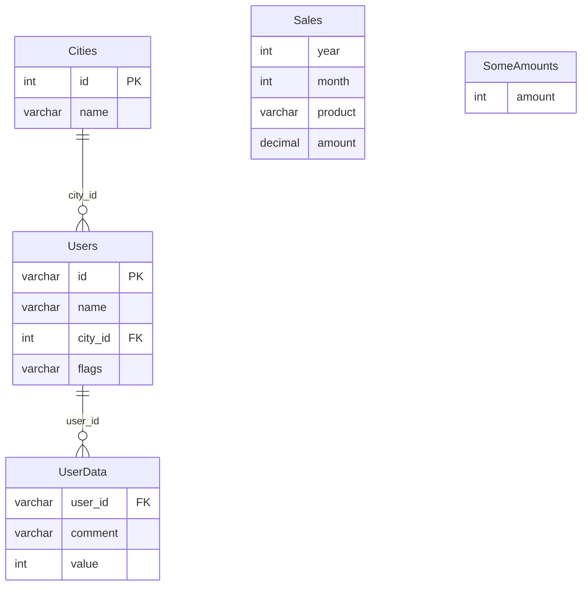
```mermaid
erDiagram
    Cities {
        int id PK
        varchar name
    }
    Users {
        varchar id PK
        varchar name
        int city_id FK
        varchar flags
    }
    UserData {
        varchar user_id FK
        varchar comment
        int value
    }
    Sales {
        int year
        int month
        varchar product
        decimal amount
    }
    SomeAmounts {
        int amount
    }

    Cities ||--o{ Users : "city_id"
    Users ||--o{ UserData : "user_id"
```

```

- [ ] **단계 3: 커밋**

```bash
git add 05-exposed-r2dbc-dml/01-dml/README.md
git commit -m "docs: 01-dml README에 erDiagram 추가"
```

---

## 작업 2: 05-dml — `02-types` (classDiagram)

**파일:**

- 수정: `05-exposed-r2dbc-dml/02-types/README.md`
- 읽기: `05-exposed-r2dbc-dml/02-types/src/test/kotlin/exposed/r2dbc/examples/types/` (파일 목록 확인)

- [ ] **단계 1: 소스 읽기** — 테스트 파일 목록으로 다루는 컬럼 타입 범주 파악
- [ ] **단계 2: classDiagram 작성 후 README 삽입**

삽입 위치: "기술 스택" 표 바로 다음

```markdown
## 구조 다이어그램

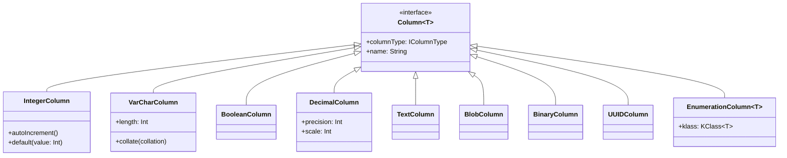
```mermaid
classDiagram
    class Column~T~ {
        <<interface>>
        +columnType: IColumnType
        +name: String
    }
    class IntegerColumn {
        +autoIncrement()
        +default(value: Int)
    }
    class VarCharColumn {
        +length: Int
        +collate(collation)
    }
    class BooleanColumn
    class DecimalColumn {
        +precision: Int
        +scale: Int
    }
    class TextColumn
    class BlobColumn
    class BinaryColumn
    class UUIDColumn
    class EnumerationColumn~T~ {
        +klass: KClass~T~
    }

    Column <|-- IntegerColumn
    Column <|-- VarCharColumn
    Column <|-- BooleanColumn
    Column <|-- DecimalColumn
    Column <|-- TextColumn
    Column <|-- BlobColumn
    Column <|-- BinaryColumn
    Column <|-- UUIDColumn
    Column <|-- EnumerationColumn
```

```

> **참고**: 실제 테스트 파일을 읽어 다루는 타입 범주를 정확히 반영할 것

- [ ] **단계 3: 커밋**

```bash
git add 05-exposed-r2dbc-dml/02-types/README.md
git commit -m "docs: 02-types README에 classDiagram 추가"
```

---

## 작업 3: 05-dml — `03-functions` (flowchart)

**파일:**

- 수정: `05-exposed-r2dbc-dml/03-functions/README.md`
- 읽기: `05-exposed-r2dbc-dml/03-functions/src/test/kotlin/exposed/r2dbc/examples/functions/` (파일 목록)

- [ ] **단계 1: 소스 읽기** — 파일 목록으로 함수 카테고리 파악 (문자열/수학/날짜/집계 등)
- [ ] **단계 2: flowchart 작성 후 README 삽입**

삽입 위치: "기술 스택" 표 바로 다음

```markdown
## 함수 카테고리

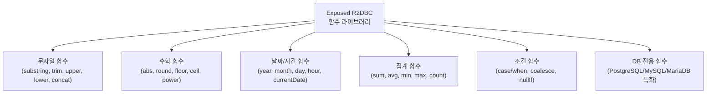
```mermaid
flowchart TD
    F["Exposed R2DBC\n함수 라이브러리"]
    F --> S["문자열 함수\n(substring, trim, upper, lower, concat)"]
    F --> M["수학 함수\n(abs, round, floor, ceil, power)"]
    F --> D["날짜/시간 함수\n(year, month, day, hour, currentDate)"]
    F --> A["집계 함수\n(sum, avg, min, max, count)"]
    F --> C["조건 함수\n(case/when, coalesce, nullIf)"]
    F --> DB["DB 전용 함수\n(PostgreSQL/MySQL/MariaDB 특화)"]
```

```

> **참고**: 실제 테스트 파일 목록을 읽어 카테고리를 정확히 반영할 것

- [ ] **단계 3: 커밋**

```bash
git add 05-exposed-r2dbc-dml/03-functions/README.md
git commit -m "docs: 03-functions README에 flowchart 추가"
```

---

## 작업 4: 05-dml — `04-transactions` (sequenceDiagram + flowchart)

**파일:**

- 수정: `05-exposed-r2dbc-dml/04-transactions/README.md`
- 읽기: `05-exposed-r2dbc-dml/04-transactions/src/test/kotlin/exposed/r2dbc/examples/transactions/` (파일 목록 + 주요 테스트)

- [ ] **단계 1: 소스 읽기** — 트랜잭션 테스트 파일 목록 확인, suspendTransaction/중첩 트랜잭션 패턴 파악
- [ ] **단계 2: sequenceDiagram 작성 후 README 삽입**

```markdown
## 실행 흐름

### R2DBC suspendTransaction 흐름

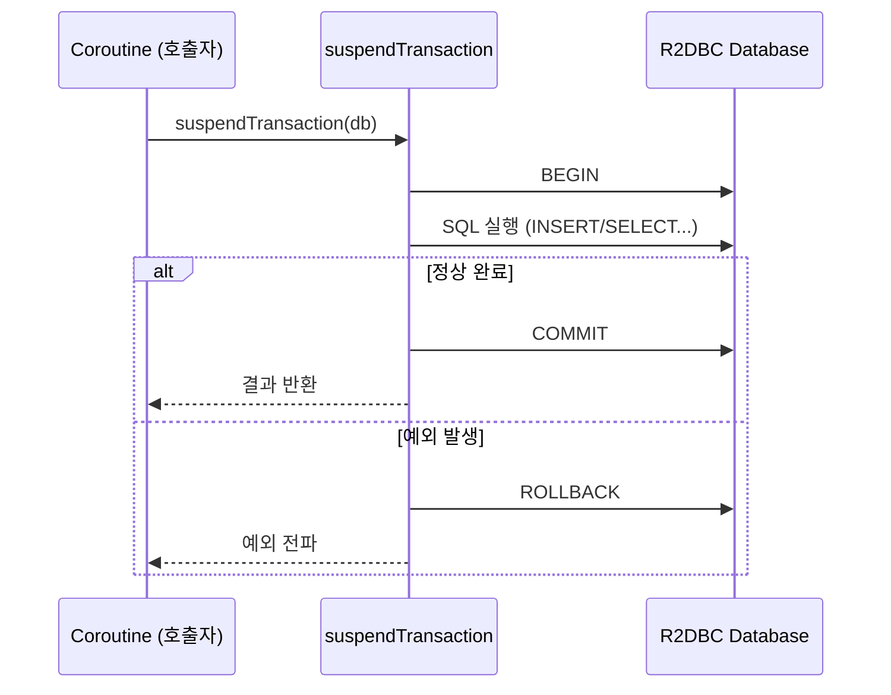
```mermaid
sequenceDiagram
    participant C as Coroutine (호출자)
    participant T as suspendTransaction
    participant DB as R2DBC Database

    C ->> T: suspendTransaction(db)
    T ->> DB: BEGIN
    T ->> DB: SQL 실행 (INSERT/SELECT...)
    alt 정상 완료
        T ->> DB: COMMIT
        T -->> C: 결과 반환
    else 예외 발생
        T ->> DB: ROLLBACK
        T -->> C: 예외 전파
    end
```

### 중첩 트랜잭션 / Savepoint 흐름

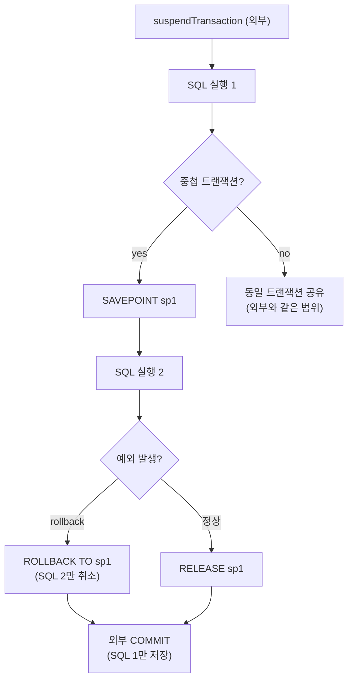
```mermaid
flowchart TD
    A["suspendTransaction (외부)"] --> B["SQL 실행 1"]
    B --> C{"중첩 트랜잭션?"}
    C -->|yes| D["SAVEPOINT sp1"]
    D --> E["SQL 실행 2"]
    E --> G{예외 발생?}
    G -->|rollback| H["ROLLBACK TO sp1\n(SQL 2만 취소)"]
    G -->|정상| I["RELEASE sp1"]
    H --> J["외부 COMMIT\n(SQL 1만 저장)"]
    I --> J
    C -->|no| K["동일 트랜잭션 공유\n(외부와 같은 범위)"]
```

```

- [ ] **단계 3: 커밋**

```bash
git add 05-exposed-r2dbc-dml/04-transactions/README.md
git commit -m "docs: 04-transactions README에 sequenceDiagram + flowchart 추가"
```

---

## 작업 5: 04-ddl — `01-connection` (sequenceDiagram)

**파일:**

- 수정: `04-exposed-r2dbc-ddl/01-connection/README.md`
- 읽기: `04-exposed-r2dbc-ddl/01-connection/src/test/kotlin/` (주요 테스트)

- [ ] **단계 1: 소스 읽기** — R2DBC 연결 설정 및 생명주기 관련 코드 파악
- [ ] **단계 2: sequenceDiagram 작성 후 README 삽입**

```markdown
## 실행 흐름

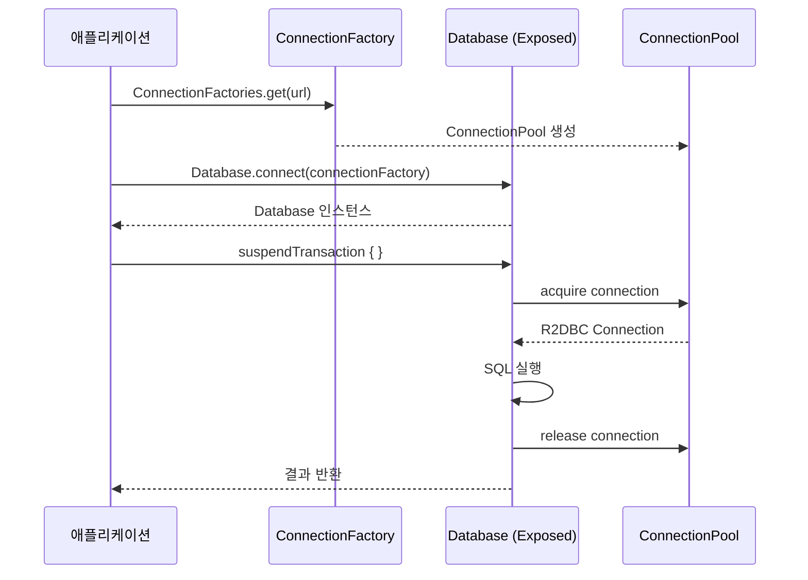
```mermaid
sequenceDiagram
    participant App as 애플리케이션
    participant CF as ConnectionFactory
    participant DB as Database (Exposed)
    participant Pool as ConnectionPool

    App ->> CF: ConnectionFactories.get(url)
    CF -->> Pool: ConnectionPool 생성
    App ->> DB: Database.connect(connectionFactory)
    DB -->> App: Database 인스턴스

    App ->> DB: suspendTransaction { }
    DB ->> Pool: acquire connection
    Pool -->> DB: R2DBC Connection
    DB ->> DB: SQL 실행
    DB ->> Pool: release connection
    DB -->> App: 결과 반환
```

```

- [ ] **단계 3: 커밋**

```bash
git add 04-exposed-r2dbc-ddl/01-connection/README.md
git commit -m "docs: 01-connection README에 sequenceDiagram 추가"
```

---

## 작업 6: 04-ddl — `02-ddl` (classDiagram + flowchart)

**파일:**

- 수정: `04-exposed-r2dbc-ddl/02-ddl/README.md`
- 읽기: `04-exposed-r2dbc-ddl/02-ddl/src/test/kotlin/` (주요 테스트)

- [ ] **단계 1: 소스 읽기** — Table 정의 패턴, SchemaUtils 사용, DDL 연산 파악
- [ ] **단계 2: classDiagram + flowchart 작성 후 README 삽입**

```markdown
## 구조 다이어그램

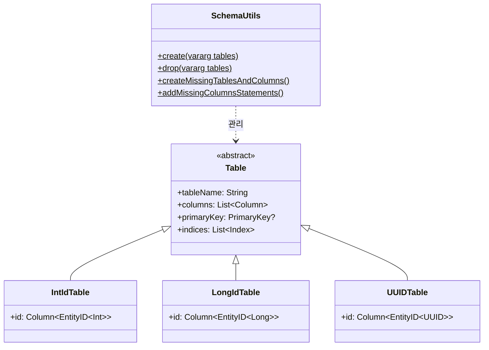
```mermaid
classDiagram
    class Table {
        <<abstract>>
        +tableName: String
        +columns: List~Column~
        +primaryKey: PrimaryKey?
        +indices: List~Index~
    }
    class IntIdTable {
        +id: Column~EntityID~Int~~
    }
    class LongIdTable {
        +id: Column~EntityID~Long~~
    }
    class UUIDTable {
        +id: Column~EntityID~UUID~~
    }
    class SchemaUtils {
        +create(vararg tables)$
        +drop(vararg tables)$
        +createMissingTablesAndColumns()$
        +addMissingColumnsStatements()$
    }

    Table <|-- IntIdTable
    Table <|-- LongIdTable
    Table <|-- UUIDTable
    SchemaUtils ..> Table : 관리
```

## DDL 실행 흐름

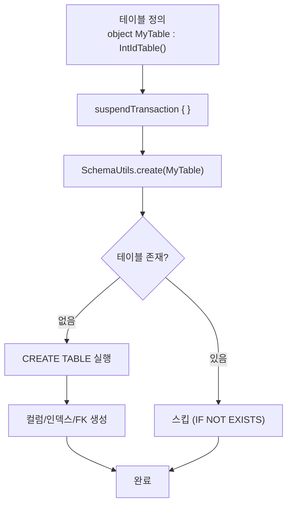
```mermaid
flowchart TD
    A["테이블 정의\nobject MyTable : IntIdTable()"] --> B["suspendTransaction { }"]
    B --> C["SchemaUtils.create(MyTable)"]
    C --> D{테이블 존재?}
    D -->|없음| E["CREATE TABLE 실행"]
    D -->|있음| F["스킵 (IF NOT EXISTS)"]
    E --> G["컬럼/인덱스/FK 생성"]
    G --> H["완료"]
    F --> H
```

```

- [ ] **단계 3: 커밋**

```bash
git add 04-exposed-r2dbc-ddl/02-ddl/README.md
git commit -m "docs: 02-ddl README에 classDiagram + flowchart 추가"
```

---

## 작업 7: 03-basic — `exposed-r2dbc-sql-example` (erDiagram + classDiagram)

**파일:**

- 수정: `03-exposed-r2dbc-basic/exposed-r2dbc-sql-example/README.md`
- 읽기: `03-exposed-r2dbc-basic/exposed-r2dbc-sql-example/src/test/kotlin/` (테이블 정의 + 예제)

- [ ] **단계 1: 소스 읽기** — 예제 테이블 정의, SQL DSL Query 구조 파악
- [ ] **단계 2: erDiagram + classDiagram 작성 후 README 삽입**

```markdown
## 구조 다이어그램

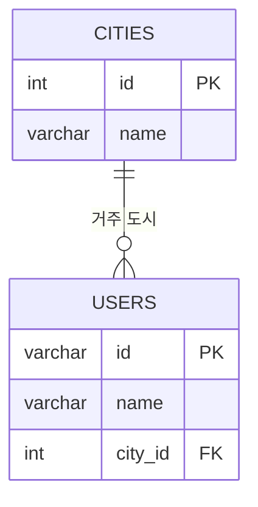
```mermaid
erDiagram
    CITIES {
        int id PK
        varchar name
    }
    USERS {
        varchar id PK
        varchar name
        int city_id FK
    }
    CITIES ||--o{ USERS : "거주 도시"
```

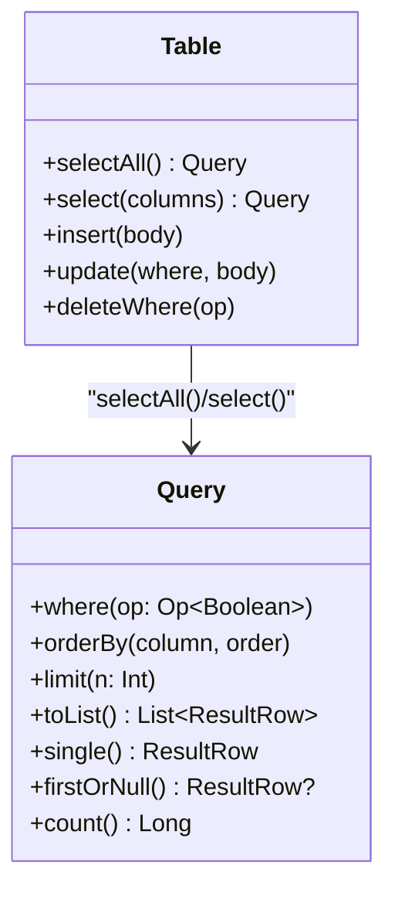
```mermaid
classDiagram
    class Query {
        +where(op: Op~Boolean~)
        +orderBy(column, order)
        +limit(n: Int)
        +toList() List~ResultRow~
        +single() ResultRow
        +firstOrNull() ResultRow?
        +count() Long
    }
    class Table {
        +selectAll() Query
        +select(columns) Query
        +insert(body)
        +update(where, body)
        +deleteWhere(op)
    }
    Table --> Query : "selectAll()/select()"
```

```

- [ ] **단계 3: 커밋**

```bash
git add 03-exposed-r2dbc-basic/exposed-r2dbc-sql-example/README.md
git commit -m "docs: exposed-r2dbc-sql-example README에 erDiagram + classDiagram 추가"
```

---

## 작업 8: 06-advanced — `01-crypt` (sequenceDiagram)

**파일:**

- 수정: `06-advanced/01-exposed-r2dbc-crypt/README.md`
- 읽기: `06-advanced/01-exposed-r2dbc-crypt/src/test/kotlin/`

- [ ] **단계 1: 소스 읽기** — Vault/암호화 컬럼 정의, 저장/조회 패턴 파악
- [ ] **단계 2: sequenceDiagram 작성 후 README 삽입**

```markdown
## 실행 흐름

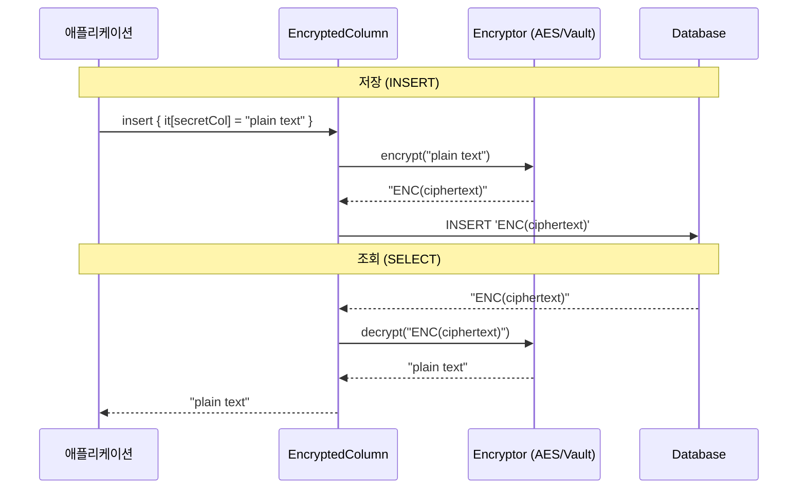
```mermaid
sequenceDiagram
    participant App as 애플리케이션
    participant Col as EncryptedColumn
    participant Enc as Encryptor (AES/Vault)
    participant DB as Database

    Note over App,DB: 저장 (INSERT)
    App ->> Col: insert { it[secretCol] = "plain text" }
    Col ->> Enc: encrypt("plain text")
    Enc -->> Col: "ENC(ciphertext)"
    Col ->> DB: INSERT 'ENC(ciphertext)'

    Note over App,DB: 조회 (SELECT)
    DB -->> Col: "ENC(ciphertext)"
    Col ->> Enc: decrypt("ENC(ciphertext)")
    Enc -->> Col: "plain text"
    Col -->> App: "plain text"
```

```

- [ ] **단계 3: 커밋**

```bash
git add 06-advanced/01-exposed-r2dbc-crypt/README.md
git commit -m "docs: 01-crypt README에 sequenceDiagram 추가"
```

---

## 작업 9: 06-advanced — `02-javatime` + `03-kotlin-datetime` (classDiagram)

**파일:**

- 수정: `06-advanced/02-exposed-r2dbc-javatime/README.md`
- 수정: `06-advanced/03-exposed-r2dbc-kotlin-datetime/README.md`
- 읽기: 각 모듈 테스트 파일 (사용하는 타입 확인)

- [ ] **단계 1: 두 모듈 소스 동시 읽기** — Java Time / kotlinx-datetime 컬럼 타입 매핑 파악
- [ ] **단계 2: `02-javatime` classDiagram 삽입**

```markdown
## 구조 다이어그램

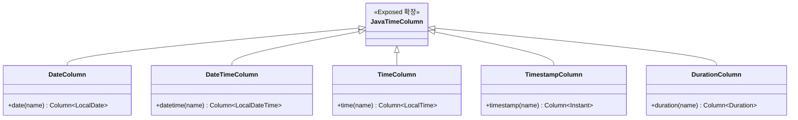
```mermaid
classDiagram
    class JavaTimeColumn {
        <<Exposed 확장>>
    }
    class DateColumn {
        +date(name) Column~LocalDate~
    }
    class DateTimeColumn {
        +datetime(name) Column~LocalDateTime~
    }
    class TimeColumn {
        +time(name) Column~LocalTime~
    }
    class TimestampColumn {
        +timestamp(name) Column~Instant~
    }
    class DurationColumn {
        +duration(name) Column~Duration~
    }

    JavaTimeColumn <|-- DateColumn
    JavaTimeColumn <|-- DateTimeColumn
    JavaTimeColumn <|-- TimeColumn
    JavaTimeColumn <|-- TimestampColumn
    JavaTimeColumn <|-- DurationColumn
```

```

- [ ] **단계 3: `03-kotlin-datetime` classDiagram 삽입** (kotlinx.datetime 타입으로 동일 패턴 작성)
- [ ] **단계 4: 커밋**

```bash
git add 06-advanced/02-exposed-r2dbc-javatime/README.md 06-advanced/03-exposed-r2dbc-kotlin-datetime/README.md
git commit -m "docs: javatime/kotlin-datetime README에 classDiagram 추가"
```

---

## 작업 10: 06-advanced — JSON 계열 4개 모듈 (classDiagram)

**파일:**

- 수정: `06-advanced/04-exposed-r2dbc-json/README.md`
- 수정: `06-advanced/08-exposed-r2dbc-jackson/README.md`
- 수정: `06-advanced/09-exposed-r2dbc-fastjson2/README.md`
- 수정: `06-advanced/11-exposed-r2dbc-jackson3/README.md`
- 읽기: 각 모듈 소스 (사용하는 JSON 직렬화 방식 파악)

각 모듈별 차별화 포인트:

- `04-json`: `json` vs `jsonb` — DB별 지원 차이 (PostgreSQL jsonb, MySQL json)
- `08-jackson`: ObjectMapper 통합 방식 (커스텀 ObjectMapper 주입)
- `09-fastjson2`: JSONReader/JSONWriter 기반 고성능 직렬화
- `11-jackson3`: Jackson3 API 변경점 (패키지 변경, 설정 방식 차이)

- [ ] **단계 1: 4개 모듈 소스 동시 읽기**
- [ ] **단계 2: `04-json` classDiagram 삽입** (json vs jsonb 강조)
- [ ] **단계 3: `08-jackson` classDiagram 삽입** (ObjectMapper 통합 강조)
- [ ] **단계 4: `09-fastjson2` classDiagram 삽입** (JSONReader/Writer 강조)
- [ ] **단계 5: `11-jackson3` classDiagram 삽입** (Jackson3 API 변경점 강조)
- [ ] **단계 6: 커밋**

```bash
git add 06-advanced/04-exposed-r2dbc-json/README.md \
        06-advanced/08-exposed-r2dbc-jackson/README.md \
        06-advanced/09-exposed-r2dbc-fastjson2/README.md \
        06-advanced/11-exposed-r2dbc-jackson3/README.md
git commit -m "docs: JSON 계열 4개 모듈 README에 classDiagram 추가"
```

---

## 작업 11: 06-advanced — `05-money` + `06-custom-columns` (classDiagram)

**파일:**

- 수정: `06-advanced/05-exposed-r2dbc-money/README.md`
- 수정: `06-advanced/06-exposed-r2dbc-custom-columns/README.md`
- 읽기: 각 모듈 소스

- [ ] **단계 1: 두 모듈 소스 동시 읽기**
- [ ] **단계 2: `05-money` classDiagram 삽입** (MonetaryAmount/Money 컬럼 계층)
- [ ] **단계 3: `06-custom-columns` classDiagram 삽입** (Column → CustomColumn 확장 패턴)
- [ ] **단계 4: 커밋**

```bash
git add 06-advanced/05-exposed-r2dbc-money/README.md 06-advanced/06-exposed-r2dbc-custom-columns/README.md
git commit -m "docs: money/custom-columns README에 classDiagram 추가"
```

---

## 작업 12: 06-advanced — `07-custom-entities` (classDiagram + erDiagram)

**파일:**

- 수정: `06-advanced/07-exposed-r2dbc-custom-entities/README.md`
- 읽기: `06-advanced/07-exposed-r2dbc-custom-entities/src/test/kotlin/`

- [ ] **단계 1: 소스 읽기** — Entity DAO 클래스 계층 + 테이블 관계 파악
- [ ] **단계 2: classDiagram + erDiagram 작성 후 삽입**

> **참고**: 실제 소스를 읽어 엔티티 클래스명과 테이블 관계를 정확히 반영할 것

```markdown
## 구조 다이어그램

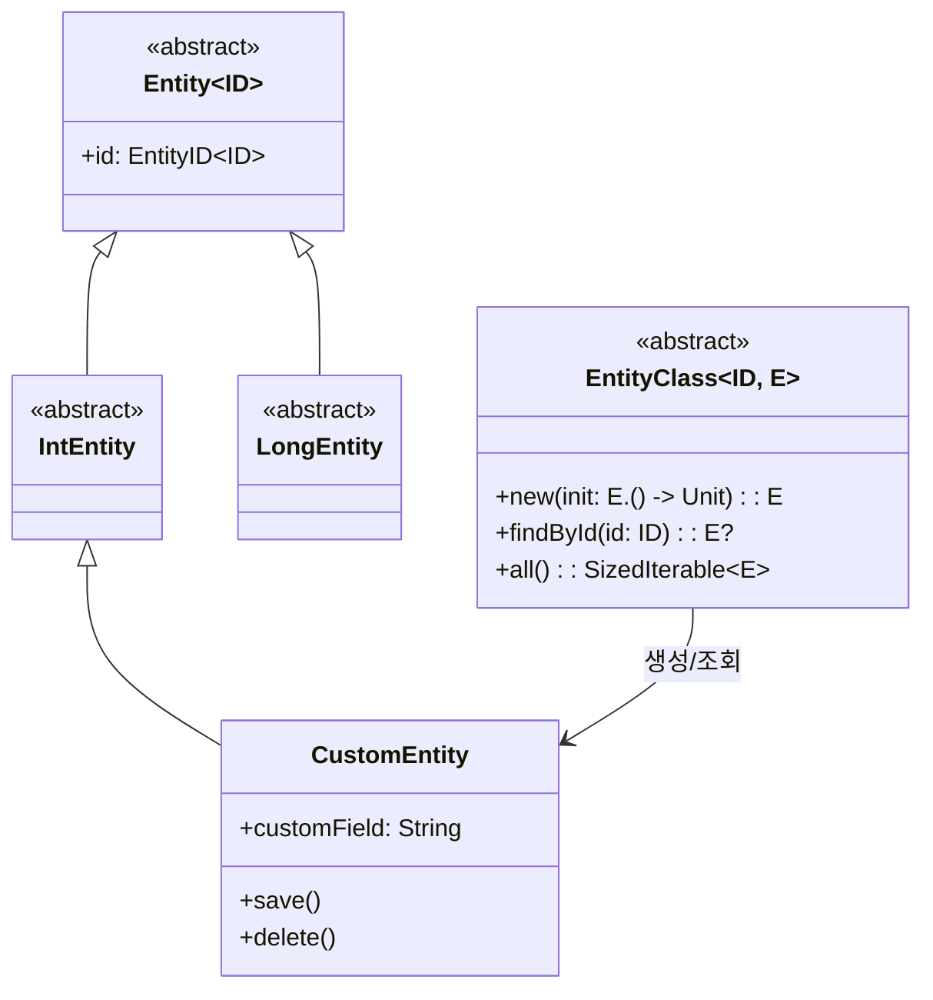
```mermaid
classDiagram
    class Entity~ID~ {
        <<abstract>>
        +id: EntityID~ID~
    }
    class IntEntity {
        <<abstract>>
    }
    class LongEntity {
        <<abstract>>
    }
    class CustomEntity {
        +customField: String
        +save()
        +delete()
    }
    class EntityClass~ID, E~ {
        <<abstract>>
        +new(init: E.() -> Unit): E
        +findById(id: ID): E?
        +all(): SizedIterable~E~
    }

    Entity <|-- IntEntity
    Entity <|-- LongEntity
    IntEntity <|-- CustomEntity
    EntityClass --> CustomEntity : 생성/조회
```

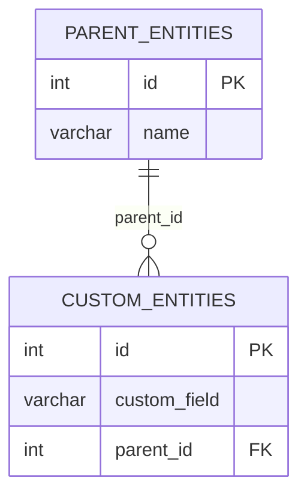
```mermaid
erDiagram
    CUSTOM_ENTITIES {
        int id PK
        varchar custom_field
        int parent_id FK
    }
    PARENT_ENTITIES {
        int id PK
        varchar name
    }
    PARENT_ENTITIES ||--o{ CUSTOM_ENTITIES : "parent_id"
```

```

- [ ] **단계 3: 커밋**

```bash
git add 06-advanced/07-exposed-r2dbc-custom-entities/README.md
git commit -m "docs: custom-entities README에 classDiagram + erDiagram 추가"
```

---

## 작업 13: 06-advanced — 암호화 2개 (`10-jasypt`, `12-tink`) (sequenceDiagram)

**파일:**

- 수정: `06-advanced/10-exposed-r2dbc-jasypt/README.md`
- 수정: `06-advanced/12-exposed-r2dbc-tink/README.md`
- 읽기: 각 모듈 소스

- [ ] **단계 1: 두 모듈 소스 동시 읽기** — Jasypt/Tink 암호화 컬럼 패턴 파악
- [ ] **단계 2: `10-jasypt` sequenceDiagram 삽입** (BasicTextEncryptor 기반 흐름)
- [ ] **단계 3: `12-tink` sequenceDiagram 삽입** (Tink KeysetHandle/Aead 기반 흐름)
- [ ] **단계 4: 커밋**

```bash
git add 06-advanced/10-exposed-r2dbc-jasypt/README.md 06-advanced/12-exposed-r2dbc-tink/README.md
git commit -m "docs: jasypt/tink README에 sequenceDiagram 추가"
```

---

## 작업 14: 07-jpa-convert — `01-convert-jpa-basic` (flowchart)

**파일:**

- 수정: `07-jpa-convert/01-convert-jpa-basic/README.md`
- 읽기: `07-jpa-convert/01-convert-jpa-basic/src/test/kotlin/`

- [ ] **단계 1: 소스 읽기** — JPA Entity/Repository → Exposed Table/DSL 변환 패턴 파악
- [ ] **단계 2: flowchart 작성 후 삽입**

```markdown
## JPA → Exposed R2DBC 마이그레이션 경로

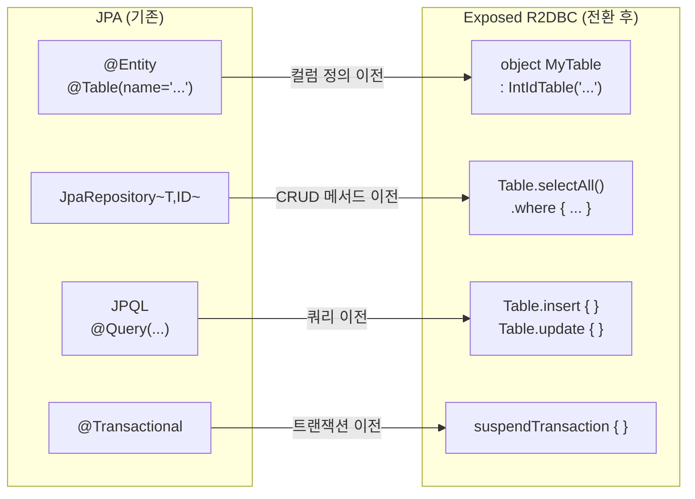
```mermaid
flowchart LR
    subgraph JPA ["JPA (기존)"]
        JE["@Entity\n@Table(name='...')"]
        JR["JpaRepository~T,ID~"]
        JQ["JPQL\n@Query(...)"]
        JT["@Transactional"]
    end
    subgraph Exposed ["Exposed R2DBC (전환 후)"]
        ET["object MyTable\n: IntIdTable('...')"]
        EQ["Table.selectAll()\n.where { ... }"]
        EC["Table.insert { }\nTable.update { }"]
        EST["suspendTransaction { }"]
    end

    JE -->|"컬럼 정의 이전"| ET
    JR -->|"CRUD 메서드 이전"| EQ
    JQ -->|"쿼리 이전"| EC
    JT -->|"트랜잭션 이전"| EST
```

```

- [ ] **단계 3: 커밋**

```bash
git add 07-jpa-convert/01-convert-jpa-basic/README.md
git commit -m "docs: 01-convert-jpa-basic README에 flowchart 추가"
```

---

## 작업 15: 08-coroutines — `01-coroutines-basic` (sequenceDiagram + flowchart)

**파일:**

- 수정: `08-r2dbc-coroutines/01-exposed-r2dbc-coroutines-basic/README.md`
- 읽기: `08-r2dbc-coroutines/01-exposed-r2dbc-coroutines-basic/src/test/kotlin/`

- [ ] **단계 1: 소스 읽기** — coroutine scope, suspendTransaction, Flow 수집 패턴 파악
- [ ] **단계 2: sequenceDiagram + flowchart 작성 후 삽입**

```markdown
## 실행 흐름

### Coroutine + R2DBC 트랜잭션

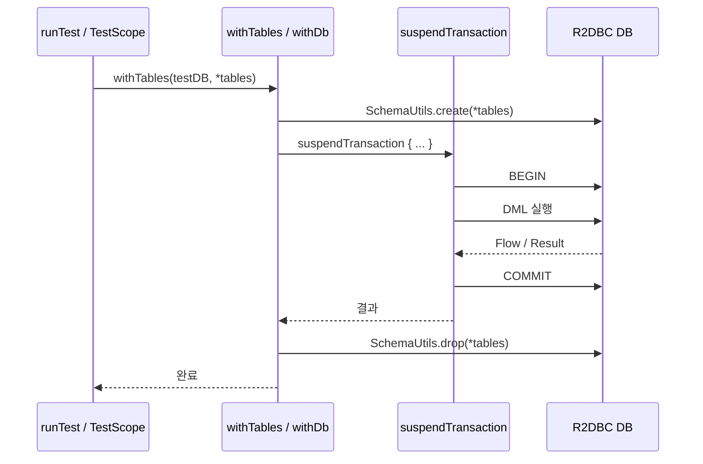
```mermaid
sequenceDiagram
    participant T as runTest / TestScope
    participant W as withTables / withDb
    participant ST as suspendTransaction
    participant DB as R2DBC DB

    T ->> W: withTables(testDB, *tables)
    W ->> DB: SchemaUtils.create(*tables)
    W ->> ST: suspendTransaction { ... }
    ST ->> DB: BEGIN
    ST ->> DB: DML 실행
    DB -->> ST: Flow / Result
    ST ->> DB: COMMIT
    ST -->> W: 결과
    W ->> DB: SchemaUtils.drop(*tables)
    W -->> T: 완료
```

### Flow 수집 패턴

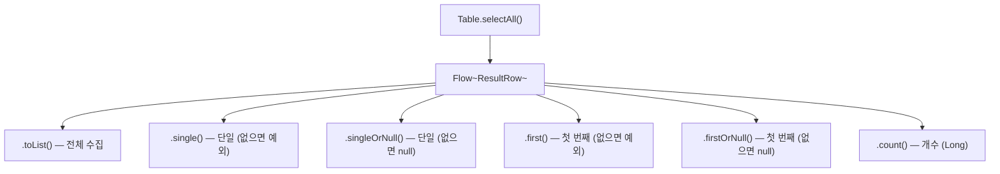
```mermaid
flowchart TD
    Q["Table.selectAll()"] --> F["Flow~ResultRow~"]
    F --> L[".toList() — 전체 수집"]
    F --> S[".single() — 단일 (없으면 예외)"]
    F --> SN[".singleOrNull() — 단일 (없으면 null)"]
    F --> FI[".first() — 첫 번째 (없으면 예외)"]
    F --> FN[".firstOrNull() — 첫 번째 (없으면 null)"]
    F --> C[".count() — 개수 (Long)"]
```

```

- [ ] **단계 3: 커밋**

```bash
git add 08-r2dbc-coroutines/01-exposed-r2dbc-coroutines-basic/README.md
git commit -m "docs: 01-coroutines-basic README에 sequenceDiagram + flowchart 추가"
```

---

## 작업 16: 08-coroutines — `02-virtualthreads-basic` (sequenceDiagram)

**파일:**

- 수정: `08-r2dbc-coroutines/02-exposed-r2dbc-virtualthreads-basic/README.md`
- 읽기: `08-r2dbc-coroutines/02-exposed-r2dbc-virtualthreads-basic/src/test/kotlin/`

- [ ] **단계 1: 소스 읽기** — `runSuspendVT`, `virtualThreadTransaction`, API 사용 패턴 파악
- [ ] **단계 2: sequenceDiagram 작성 후 삽입**

```markdown
## 실행 흐름

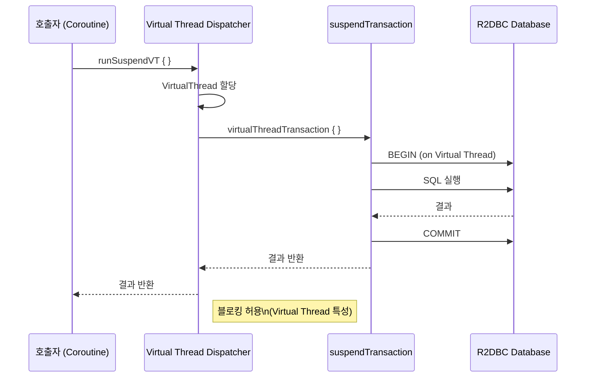
```mermaid
sequenceDiagram
    participant C as 호출자 (Coroutine)
    participant VT as Virtual Thread Dispatcher
    participant ST as suspendTransaction
    participant DB as R2DBC Database

    C ->> VT: runSuspendVT { }
    VT ->> VT: VirtualThread 할당
    VT ->> ST: virtualThreadTransaction { }
    ST ->> DB: BEGIN (on Virtual Thread)
    ST ->> DB: SQL 실행
    DB -->> ST: 결과
    ST ->> DB: COMMIT
    ST -->> VT: 결과 반환
    VT -->> C: 결과 반환
    Note right of VT: 블로킹 허용\n(Virtual Thread 특성)
```

```

- [ ] **단계 3: 커밋**

```bash
git add 08-r2dbc-coroutines/02-exposed-r2dbc-virtualthreads-basic/README.md
git commit -m "docs: 02-virtualthreads-basic README에 sequenceDiagram 추가"
```

---

## 작업 17: 09-spring — `07-spring-suspended-cache` (sequenceDiagram)

**파일:**

- 수정: `09-spring/07-spring-suspended-cache/README.md`
- 읽기: `09-spring/07-spring-suspended-cache/src/main/kotlin/` + `src/test/kotlin/`

- [ ] **단계 1: 소스 읽기** — Redis 캐시 조회 흐름, cache hit/miss 패턴 파악
- [ ] **단계 2: sequenceDiagram 작성 후 삽입**

```markdown
## 실행 흐름

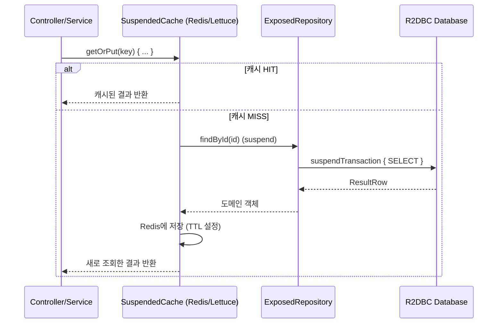
```mermaid
sequenceDiagram
    participant C as Controller/Service
    participant Cache as SuspendedCache (Redis/Lettuce)
    participant Repo as ExposedRepository
    participant DB as R2DBC Database

    C ->> Cache: getOrPut(key) { ... }
    alt 캐시 HIT
        Cache -->> C: 캐시된 결과 반환
    else 캐시 MISS
        Cache ->> Repo: findById(id) (suspend)
        Repo ->> DB: suspendTransaction { SELECT }
        DB -->> Repo: ResultRow
        Repo -->> Cache: 도메인 객체
        Cache ->> Cache: Redis에 저장 (TTL 설정)
        Cache -->> C: 새로 조회한 결과 반환
    end
```

```

- [ ] **단계 3: 커밋**

```bash
git add 09-spring/07-spring-suspended-cache/README.md
git commit -m "docs: spring-suspended-cache README에 sequenceDiagram 추가"
```

---

## 작업 18: 11-high-performance — `README` (flowchart)

**파일:**

- 수정: `11-high-performance/README.md`
- 읽기: `11-high-performance/README.md` (현재 내용 파악)

- [ ] **단계 1: README 읽기** — 현재 내용과 다루는 모듈 파악
- [ ] **단계 2: flowchart 작성 후 삽입** (전략 개요)

```markdown
## 고성능 전략 개요

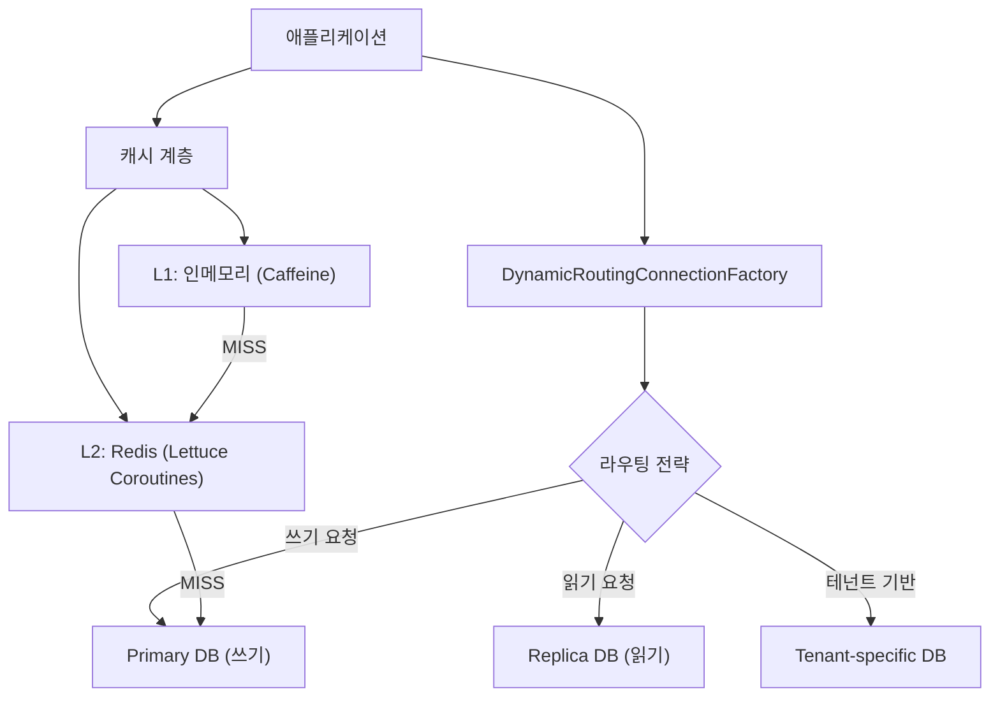
```mermaid
flowchart TD
    App["애플리케이션"] --> CF["DynamicRoutingConnectionFactory"]
    CF --> Strat{"라우팅 전략"}
    Strat -->|쓰기 요청| PDB["Primary DB (쓰기)"]
    Strat -->|읽기 요청| RDB["Replica DB (읽기)"]
    Strat -->|테넌트 기반| TDB["Tenant-specific DB"]

    App --> Cache["캐시 계층"]
    Cache --> L1["L1: 인메모리 (Caffeine)"]
    Cache --> L2["L2: Redis (Lettuce Coroutines)"]
    L1 -->|MISS| L2
    L2 -->|MISS| PDB
```

```

- [ ] **단계 3: 커밋**

```bash
git add 11-high-performance/README.md
git commit -m "docs: 11-high-performance README에 flowchart 추가"
```

---

## 작업 19: 11-high-performance — `02-cache-strategies-r2dbc` (classDiagram + flowchart)

**파일:**

- 수정: `11-high-performance/02-cache-strategies-r2dbc/README.md`
- 읽기: `11-high-performance/02-cache-strategies-r2dbc/src/` (캐시 전략 클래스)

- [ ] **단계 1: 소스 읽기** — 캐시 전략 클래스 구조, 계층 흐름 파악
- [ ] **단계 2: classDiagram + flowchart 작성 후 삽입**

> **참고**: 실제 소스를 읽어 캐시 전략 클래스명과 계층 흐름을 정확히 반영할 것

```markdown
## 구조 다이어그램

```mermaid
classDiagram
    class CacheStrategy~K,V~ {
        <<interface>>
        +get(key: K): V?
        +put(key: K, value: V)
        +evict(key: K)
        +clear()
    }
    class CaffeineCache~K,V~ {
        -cache: Cache~K,V~
        +get(key): V?
        +put(key, value)
    }
    class RedisCache~K,V~ {
        -redisCommands: RedisCoroutinesCommands
        +get(key): V?
        +put(key, value)
    }
    class TwoLevelCache~K,V~ {
        -l1: CaffeineCache
        -l2: RedisCache
        +get(key): V?
        +put(key, value)
    }

    CacheStrategy <|.. CaffeineCache
    CacheStrategy <|.. RedisCache
    CacheStrategy <|.. TwoLevelCache
    TwoLevelCache --> CaffeineCache : L1
    TwoLevelCache --> RedisCache : L2
```

## 캐시 조회 흐름

```mermaid
flowchart TD
    REQ["캐시 조회 요청\nget(key)"] --> L1{L1 캐시\n(Caffeine) HIT?}
    L1 -->|HIT| R1["L1에서 반환"]
    L1 -->|MISS| L2{L2 캐시\n(Redis) HIT?}
    L2 -->|HIT| FILL1["L1에 저장 후 반환"]
    L2 -->|MISS| DB["DB 조회\nsuspendTransaction"]
    DB --> FILL2["L2(Redis)에 저장"]
    FILL2 --> FILL1
```

```

- [ ] **단계 3: 커밋**

```bash
git add 11-high-performance/02-cache-strategies-r2dbc/README.md
git commit -m "docs: 02-cache-strategies-r2dbc README에 classDiagram + flowchart 추가"
```

---

## 최종 검증

- [ ] **전체 파일 확인**: 25개 README 모두 Mermaid 블록 포함 여부 확인

```bash
grep -r "mermaid" --include="*.md" -l | sort
```

- [ ] **기존 내용 보존 확인**: 삭제된 섹션 없는지 git diff로 확인

```bash
git diff HEAD~19 --stat
```

- [ ] **최종 커밋**

```bash
git commit --allow-empty -m "docs: 모든 서브모듈 README UML 다이어그램 추가 완료"
```
