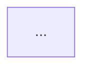
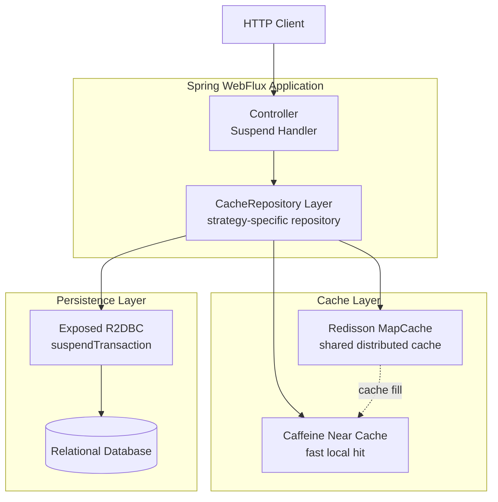
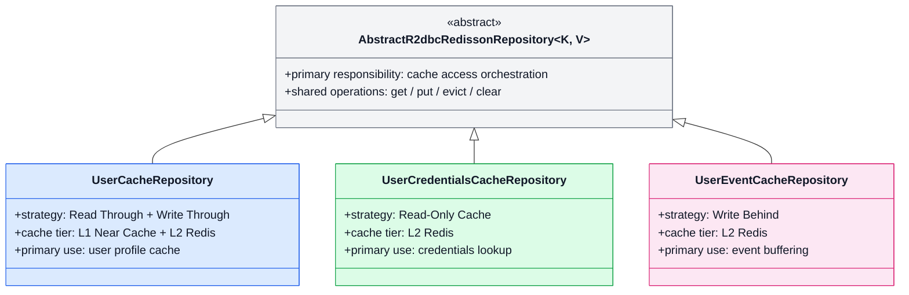

# 02-cache-strategies-r2dbc README Diagram Refresh 구현 계획

> **작업자 참고:** 이 계획은 task 단위로 구현하며, 권장 실행 표면은 superpowers:subagent-driven-development이고 대안은 superpowers:executing-plans다. 진행 상태는 checkbox(`- [ ]`)로 추적한다.

**목표:** `11-high-performance/02-cache-strategies-r2dbc/README.md`의 Mermaid 다이어그램을 개선해 캐시 조회 흐름과 CacheRepository 구조를 더 읽기 쉽게 만들고, 보조 architecture diagram을 추가한다.

**아키텍처:** README는 GitHub 렌더링 호환성을 위해 Mermaid만 사용한다. 다이어그램은 `architecture → classDiagram → cache flow` 순으로 재배치하고, classDiagram은 전략/책임 중심으로 축약하며, flowchart는 L1/L2/DB 경로와 HIT/MISS/FILL을 색상과 subgraph로 명확히 구분한다.

**기술 스택:** Markdown, Mermaid (`flowchart`, `classDiagram`), GitHub README rendering

---

## 파일 지도

- 수정: `11-high-performance/02-cache-strategies-r2dbc/README.md`
- 참조: `docs/superpowers/specs/2026-04-13-02-cache-strategies-r2dbc-readme-diagrams-design.md`
- 선택 검증 메모: `docs/testlogs/2026-04.md` (문서 전용 변경이면 기록 생략 가능)

## 작업 1: README 다이어그램 배치 재구성

**파일:**
- 수정: `11-high-performance/02-cache-strategies-r2dbc/README.md`
- 참조: `docs/superpowers/specs/2026-04-13-02-cache-strategies-r2dbc-readme-diagrams-design.md`

- [ ] **단계 1: 현재 README의 대상 구간을 확인한다**

확인할 구간:

```md
## 구조 다이어그램

```mermaid
classDiagram
...
```

## 캐시 조회 흐름


```

기대 결과:
- 기존 `classDiagram`과 `flowchart` 블록의 시작/끝 위치를 파악한다.
- 새 `architecture diagram`을 `기술 스택` 다음에 넣을 위치를 정한다.

- [ ] **단계 2: architecture diagram 섹션 제목과 설명 문장을 추가한다**

삽입할 텍스트:

```md
## 아키텍처 개요

이 모듈은 WebFlux + Coroutines 환경에서 `CacheRepository`를 중심으로 Caffeine Near Cache, Redisson, Exposed R2DBC, 관계형 데이터베이스를 연결합니다. 읽기 요청은 L1/L2 캐시를 우선 사용하고, 쓰기 요청은 전략별로 DB 반영 방식이 달라집니다.
```

- [ ] **단계 3: architecture diagram Mermaid 블록을 추가한다**

삽입할 다이어그램:



- [ ] **단계 4: README에서 architecture → class → flow 순서가 되도록 섹션 위치를 정리한다**

목표 순서:

```md
## 기술 스택
...

## 아키텍처 개요
...

## CacheRepository 구조
...

## 캐시 조회 흐름
...
```

- [ ] **단계 5: 변경된 Markdown 블록 문법을 눈으로 검토한다**

검토 기준:
- Mermaid fenced block이 정확히 닫혔는지
- 제목 수준(`##`)이 일관적인지
- 설명 문장이 다이어그램 바로 위/아래에 배치됐는지

## 작업 2: CacheRepository classDiagram 개선

**파일:**
- 수정: `11-high-performance/02-cache-strategies-r2dbc/README.md`

- [ ] **단계 1: 기존 classDiagram 제목을 더 직접적인 이름으로 바꾼다**

교체 내용:

```md
## 구조 다이어그램
```

→

```md
## CacheRepository 구조
```

- [ ] **단계 2: 기존 classDiagram 블록을 전략/책임 중심 버전으로 교체한다**

교체할 다이어그램:



- [ ] **단계 3: classDiagram 아래 짧은 설명 문장을 추가한다**

추가 문장:

```md
세 Repository는 공통 캐시 접근 기반 클래스를 공유하지만, 각기 다른 캐시 전략을 적용합니다. `UserCacheRepository`는 읽기/쓰기 경로 최적화, `UserCredentialsCacheRepository`는 읽기 전용 조회, `UserEventCacheRepository`는 비동기 적재에 초점을 둡니다.
```

- [ ] **단계 4: 다이어그램 텍스트가 너무 길면 1회 축약한다**

축약 우선순위:
1. 메서드 시그니처 제거
2. 설명 문구를 `primary use` 중심으로 축약
3. 클래스 박스 높이 균형 맞추기

- [ ] **단계 5: Mermaid classDiagram 문법을 재검토한다**

검토 기준:
- 제네릭 표기 `~K, V~`가 기존 문서 스타일과 충돌하지 않는지
- `style` 적용 대상 클래스명이 정확한지
- Mermaid가 지원하지 않는 문법을 넣지 않았는지

## 작업 3: 캐시 조회 흐름 flowchart 개선

**파일:**
- 수정: `11-high-performance/02-cache-strategies-r2dbc/README.md`

- [ ] **단계 1: 기존 flowchart를 유지하되 제목은 그대로 둔다**

유지 제목:

```md
## 캐시 조회 흐름
```

- [ ] **단계 2: flowchart를 계층/분기 강조 버전으로 교체한다**

교체할 다이어그램:

```mermaid
flowchart TD
    REQ[Read request\nget(key)] --> L1CHK

    subgraph L1[L1 Cache]
        L1CHK{Caffeine Near Cache\nHIT?}
        L1HIT[Return from L1\nfastest path]
    end

    subgraph L2[L2 Cache]
        L2CHK{Redisson MapCache\nHIT?}
        L2HIT[Return from Redis\nand warm L1]
        L2FILL[Store in Redis\napply TTL]
    end

    subgraph DBL[Database Access]
        DBREAD[Load from DB\nsuspendTransaction]
    end

    L1CHK -->|HIT| L1HIT
    L1CHK -->|MISS| L2CHK
    L2CHK -->|HIT| L2HIT
    L2CHK -->|MISS| DBREAD
    DBREAD --> L2FILL
    L2FILL --> L2HIT
    L2HIT --> RESP[Return cached value]
    L1HIT --> RESP

    style REQ fill:#E0F2FE,stroke:#0284C7,color:#111827
    style L1CHK fill:#DBEAFE,stroke:#2563EB,color:#111827
    style L1HIT fill:#DBEAFE,stroke:#2563EB,color:#111827
    style L2CHK fill:#FEF3C7,stroke:#D97706,color:#111827
    style L2HIT fill:#FEF3C7,stroke:#D97706,color:#111827
    style L2FILL fill:#FEF3C7,stroke:#D97706,color:#111827
    style DBREAD fill:#FECACA,stroke:#DC2626,color:#111827
    style RESP fill:#DCFCE7,stroke:#16A34A,color:#111827
```

- [ ] **단계 3: flowchart 아래 설명 문장을 보강한다**

추가 문장:

```md
읽기 요청은 항상 L1 Near Cache를 먼저 확인하고, 미스 시 L2 Redis, 그 다음 DB로 내려갑니다. DB에서 적재된 값은 Redis에 TTL과 함께 저장되고, 응답 전에 Near Cache도 함께 warm-up 됩니다.
```

- [ ] **단계 4: 빠른 경로와 느린 경로가 시각적으로 구분되는지 검토한다**

검토 포인트:
- L1/L2/DB 색이 서로 충분히 구분되는지
- `HIT`와 `MISS` 분기 라벨이 겹치지 않는지
- 최종 응답 노드가 한곳으로 수렴하는지

- [ ] **단계 5: README의 다른 설명과 용어를 맞춘다**

용어 통일 기준:
- `Near Cache`
- `Redisson MapCache`
- `suspendTransaction`
- `TTL`

## 작업 4: 문서 검증 및 마무리

**파일:**
- 수정: `11-high-performance/02-cache-strategies-r2dbc/README.md`
- 선택 검증 메모: `docs/testlogs/2026-04.md`

- [ ] **단계 1: README 전체를 다시 읽고 다이어그램 순서와 중복 설명을 확인한다**

체크리스트:
- architecture / class / flow 순서 유지
- 설명 문장이 중복되지 않음
- 기존 본문 의미가 바뀌지 않음

- [ ] **단계 2: Mermaid 문법 오류 가능성을 집중 확인한다**

중점 확인:
- Mermaid fenced block 개수와 닫힘 여부
- classDiagram의 `style` 문법
- flowchart의 `subgraph`와 node id 중복 여부

- [ ] **단계 3: 문서 전용 변경인지 판단하고 검증 범위를 기록한다**

판단 기준:

```text
README.md만 변경된 경우:
- 코드/테스트 미실행 가능
- testlog 기록 생략 가능
- 최종 보고에서 문서 전용 변경임을 명시
```

- [ ] **단계 4: git diff로 README 변경 범위가 요청 범위를 넘지 않았는지 확인한다**

확인 대상:
- `11-high-performance/02-cache-strategies-r2dbc/README.md`만 변경되었는지
- architecture diagram 1개 추가, 기존 2개 다이어그램 개선 외의 과도한 재작성은 없는지

- [ ] **단계 5: 완료 보고에 포함할 핵심 포인트를 정리한다**

포함할 내용:
- 추가한 architecture diagram 요약
- 개선한 classDiagram 핵심 변화
- 개선한 cache flow 핵심 변화
- 문서 전용 변경 여부

---

## 자체 검토

### 명세 coverage
- architecture diagram 추가: 작업 1
- CacheRepository class diagram 개선: 작업 2
- 캐시 조회 흐름 개선: 작업 3
- 최소 설명 보강 및 문법 검토: 작업 1~4
- README.md만 우선 수정: 전체 계획에서 반영

### Placeholder scan
- `TBD`, `TODO`, “적절히”, “나중에” 같은 표현 없음
- 각 수정 단계에 실제 삽입 텍스트/다이어그램 제공함

### Type consistency
- 대상 파일은 일관되게 `11-high-performance/02-cache-strategies-r2dbc/README.md`
- 다이어그램 용어는 `Near Cache`, `Redisson MapCache`, `suspendTransaction`, `TTL`로 통일
