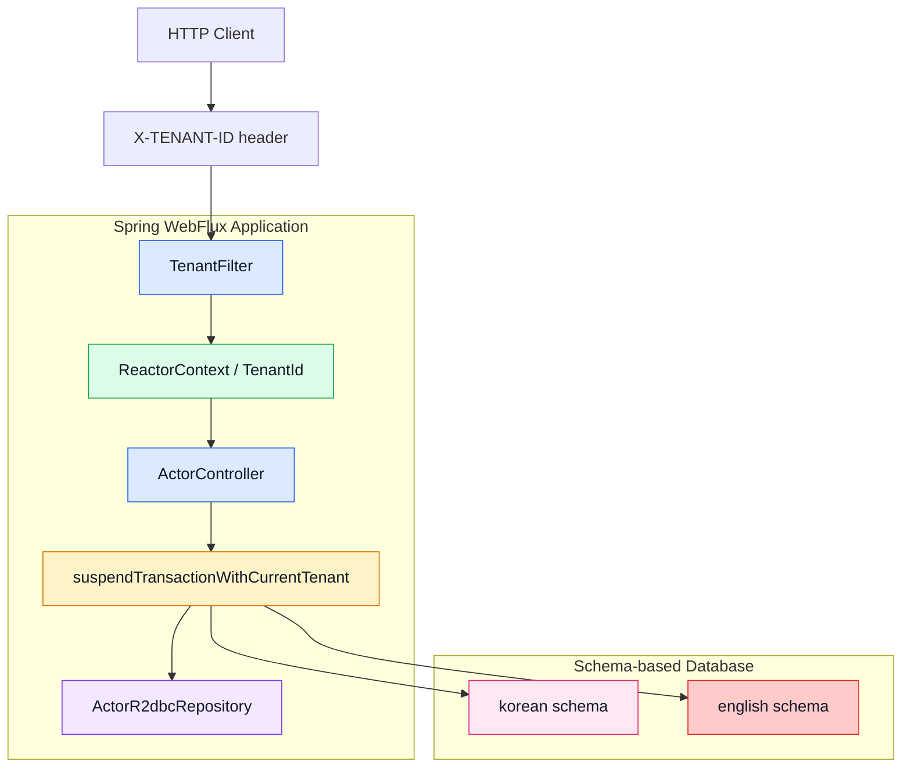
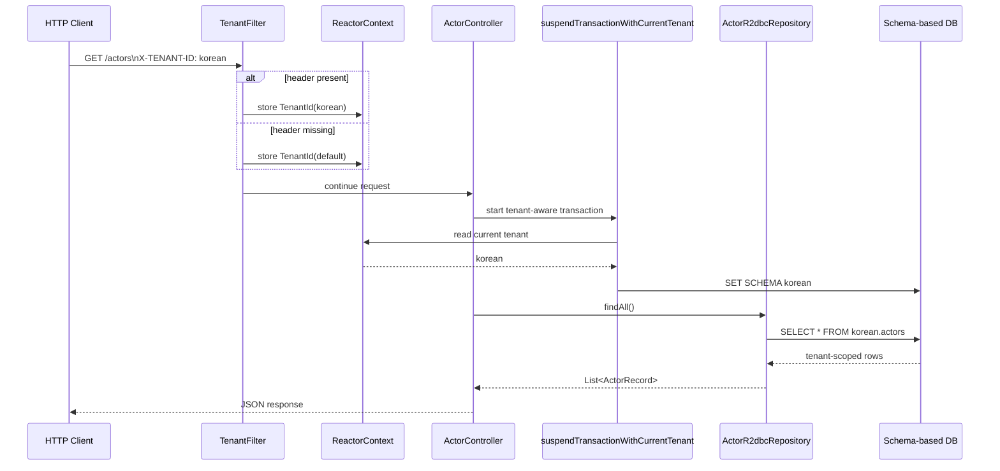
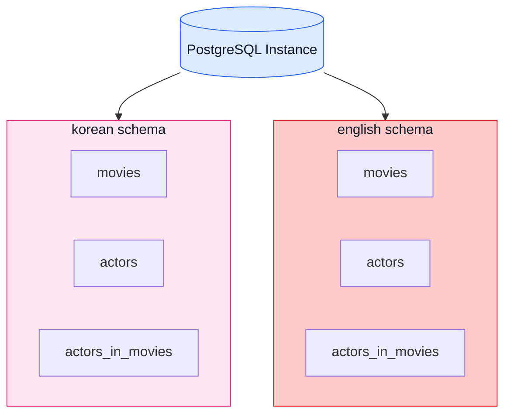

# multitenant-spring-webflux README Diagram Refresh Implementation Plan

> **For agentic workers:** REQUIRED SUB-SKILL: Use superpowers:subagent-driven-development (recommended) or superpowers:executing-plans to implement this plan task-by-task. Steps use checkbox (`- [ ]`) syntax for tracking.

**Goal:** `10-multi-tenant/03-multitenant-spring-webflux/README.md`의 Mermaid 다이어그램을 개선해 테넌트 전파 흐름과 schema-based 격리 구조를 더 읽기 쉽게 만든다.

**Architecture:** README는 GitHub 렌더링 호환성을 위해 Mermaid만 사용한다. 기술 스택 다음에 아키텍처 개요를 추가하고, 기존 sequenceDiagram은 tenant propagation 중심으로 정리하며, schema-based isolation ASCII 블록은 Mermaid flowchart로 치환한다.

**Tech Stack:** Markdown, Mermaid (`flowchart`, `sequenceDiagram`), GitHub README rendering

---

## File Map

- Modify: `10-multi-tenant/03-multitenant-spring-webflux/README.md`
- Reference: `docs/superpowers/specs/2026-04-13-multitenant-spring-webflux-readme-diagrams-design.md`

## Task 1: 아키텍처 개요 섹션 추가

**Files:**
- Modify: `10-multi-tenant/03-multitenant-spring-webflux/README.md`

- [ ] **Step 1: 기술 스택 다음 삽입 위치를 확인한다**

대상 위치:

```md
## 기술 스택
...
> 참고

## 프로젝트 구조
```

- [ ] **Step 2: `## 아키텍처 개요` 제목과 설명 문장을 추가한다**

삽입할 문구:

```md
## 아키텍처 개요

이 모듈은 `X-TENANT-ID` 헤더를 기준으로 현재 tenant를 식별하고, `TenantFilter`가 ReactorContext에 tenant 정보를 저장한 뒤 `suspendTransactionWithCurrentTenant`가 올바른 schema로 트랜잭션을 전환합니다. 같은 애플리케이션과 DB 인스턴스를 사용하더라도 조회/저장 시점에는 tenant별 schema 경계가 유지됩니다.
```

- [ ] **Step 3: architecture Mermaid flowchart를 추가한다**



- [ ] **Step 4: 아키텍처 다이어그램 아래 짧은 설명을 추가한다**

```md
핵심은 tenant 식별과 schema 전환이 Controller 바깥이 아니라 요청 컨텍스트와 트랜잭션 경계 안에서 이뤄진다는 점입니다. 따라서 같은 Repository 코드를 사용해도 현재 tenant에 따라 서로 다른 schema를 조회하게 됩니다.
```

## Task 2: 멀티테넌시 요청 흐름 sequenceDiagram 개선

**Files:**
- Modify: `10-multi-tenant/03-multitenant-spring-webflux/README.md`

- [ ] **Step 1: 기존 `### 멀티테넌시 요청 흐름` 섹션을 유지한다**

유지 대상:

```md
### 멀티테넌시 요청 흐름
```

- [ ] **Step 2: sequenceDiagram을 더 명확한 tenant propagation 버전으로 교체한다**



- [ ] **Step 3: sequenceDiagram 아래 설명 문장을 추가한다**

```md
요청마다 tenant는 헤더에서 한 번 결정되고, 이후에는 `ReactorContext`와 트랜잭션 경계를 통해 전파됩니다. Controller와 Repository는 현재 tenant를 직접 계산하지 않고, tenant-aware transaction이 선택한 schema를 그대로 사용합니다.
```

## Task 3: Schema-based 격리 구조 Mermaid로 교체

**Files:**
- Modify: `10-multi-tenant/03-multitenant-spring-webflux/README.md`

- [ ] **Step 1: `### 1. Schema-based (이 예제)` 아래의 ASCII 블록 위치를 확인한다**

대상 블록:

```text
PostgreSQL Instance
├── Schema: korean
│   ├── movies
│   ├── actors
│   └── actors_in_movies
└── Schema: english
    ├── movies
    ├── actors
    └── actors_in_movies
```

- [ ] **Step 2: 위 ASCII 블록을 Mermaid flowchart로 교체한다**



- [ ] **Step 3: Mermaid 아래 짧은 설명을 추가한다**

```md
Schema-based 방식에서는 하나의 DB 인스턴스를 공유하지만, tenant마다 별도 schema를 사용해 테이블 집합을 완전히 분리합니다. 따라서 테이블 이름은 같아도 실제 조회 대상은 현재 tenant가 선택한 schema에 따라 달라집니다.
```

## Task 4: 문서 검토 및 범위 확인

**Files:**
- Modify: `10-multi-tenant/03-multitenant-spring-webflux/README.md`

- [ ] **Step 1: README 흐름이 기술 스택 → 아키텍처 개요 → 요청 흐름 → 테넌트 정의 → schema-based 구조 순인지 확인한다**

- [ ] **Step 2: Mermaid fenced block 문법과 node id 중복 여부를 확인한다**

체크 포인트:
- `flowchart TD` / `sequenceDiagram` 블록이 올바르게 닫혔는지
- `subgraph` 이름과 node id 충돌이 없는지
- `List<ActorRecord>` 같은 표기가 Mermaid에서 문제를 일으키지 않는지 필요 시 escape 또는 대체 텍스트로 바꾼다

- [ ] **Step 3: 변경 범위가 README.md 한 파일에 한정되는지 확인한다**

- [ ] **Step 4: 문서 전용 변경이므로 테스트 환경 제약 여부와 함께 최종 보고 문구를 준비한다**

예시 문구:

```text
문서 전용 변경이며 코드/테스트는 수정하지 않았다. 필요 시 모듈 테스트는 Docker/Testcontainers 환경에서 별도 확인해야 한다.
```

---

## Self-Review

### Spec coverage
- architecture diagram 추가: Task 1
- 요청 흐름 sequenceDiagram 개선: Task 2
- schema-based 구조 Mermaid 시각화: Task 3
- 문서 범위 검토: Task 4

### Placeholder scan
- 모든 수정 단계에 실제 삽입 문구와 Mermaid 예시를 포함했다.
- TODO / TBD 없음

### Type consistency
- 대상 파일은 일관되게 `10-multi-tenant/03-multitenant-spring-webflux/README.md`
- 핵심 용어는 `TenantFilter`, `ReactorContext`, `TenantId`, `suspendTransactionWithCurrentTenant`, `schema-based`로 통일
